# 导读与学习路线

> 预计阅读：15 分钟 | 前置知识：无

---

## 1. 为什么学习无人机通信？

无人机（Unmanned Aerial Vehicle, UAV）系统的核心不仅在于飞行控制，更在于**可靠的通信链路**。一架无人机如果失去通信能力，就如同失去了"眼睛"和"耳朵"——地面操作员无法获取遥测数据，也无法发送控制指令。

无人机通信涉及的关键问题：

| 问题领域 | 具体挑战 | 技术方向 |
|---------|---------|---------|
| **可靠性** | 链路中断导致失控 | 冗余链路、自动返航 |
| **实时性** | 控制指令延迟 < 50ms | 低延迟编码、5G URLLC |
| **带宽** | 高清视频 + 遥测数据 | OFDM、MIMO、5G eMBB |
| **距离** | 超视距飞行（BVLOS） | 中继、蜂窝网络 |
| **安全** | 防劫持、防干扰 | 加密、跳频、签名 |
| **多机** | 集群编队协同 | Mesh 网络、TDMA |

---

## 2. 知识体系总览

本文档体系覆盖无人机通信的完整技术栈：

```mermaid
graph TD
    A[无人机通信知识体系] --> B[通信基础理论]
    A --> C[MAVLink 协议]
    A --> D[数据链设计]
    A --> E[遥测与可视化]
    A --> F[4G/5G 网联无人机]
    A --> G[论文导读与前沿]

    B --> B1[无线传播]
    B --> B2[调制编码]
    B --> B3[天线射频]
    B --> B4[协议栈]
    B --> B5[频谱管理]

    C --> C1[协议架构]
    C --> C2[消息类型]
    C --> C3[编程实现]
    C --> C4[任务/参数协议]
    C --> C5[安全与扩展]

    D --> D1[数据链架构]
    D --> D2[数传电台]
    D --> D3[图传系统]
    D --> D4[天线优化]
    D --> D5[多机通信]

    E --> E1[QGroundControl]
    E --> E2[MAVSDK]
    E --> E3[MissionPlanner]
    E --> E4[自定义 GCS]
    E --> E5[数据分析]

    F --> F1[蜂窝网络]
    F --> F2[LTE 链路]
    F --> F3[5G NR]
    F --> F4[边缘计算]
    F --> F5[物联网集群]

    style A fill:#e1f5fe
    style B fill:#fff3e0
    style C fill:#e8f5e9
    style D fill:#fce4ec
    style E fill:#f3e5f5
    style F fill:#e0f2f1
    style G fill:#fffde7
```



---

## 3. 学习路线建议

### 3.1 零基础路线（10 周）

适合：无通信工程背景的飞控方向学生

| 周次 | 学习内容 | 产出 |
|------|---------|------|
| 第 1 周 | 通信基础理论（01章全部） | 链路预算计算笔记 |
| 第 2 周 | [MAVLink 协议架构](./02-MAVLink协议/01-MAVLink协议架构.md) + [核心消息](./02-MAVLink协议/02-核心消息类型.md) | 能读懂 MAVLink 报文 |
| 第 3 周 | [MAVLink 编程](./02-MAVLink协议/03-MAVLink通信编程.md) + 任务协议 | Python 通信程序 |
| 第 4 周 | [数据链架构](./03-数据链设计/01-数据链架构.md) + [数传电台](./03-数据链设计/02-数传电台选型.md) | 数传电台配置文档 |
| 第 5 周 | 图传系统 + 天线优化 | 链路设计方案 |
| 第 6 周 | [QGroundControl](./04-遥测与可视化/01-QGroundControl深度使用.md) + [MAVSDK](./04-遥测与可视化/02-MAVSDK开发.md) | 自动飞行脚本 |
| 第 7 周 | [MissionPlanner](./04-遥测与可视化/03-MissionPlanner高级功能.md) + 数据分析 | 飞行日志分析报告 |
| 第 8 周 | [蜂窝网络](./05-4G-5G与网联无人机/01-蜂窝网络与无人机.md) + LTE 链路 | LTE 遥测 Demo |
| 第 9 周 | [5G NR](./05-4G-5G与网联无人机/03-5G-NR与URLLC.md) + 边缘计算 | 技术调研报告 |
| 第 10 周 | 论文导读 + 综合项目 | 项目文档 |

### 3.2 快速上手路线（4 周）

适合：有通信基础，需要快速掌握 MAVLink 和数据链

| 周次 | 学习内容 | 产出 |
|------|---------|------|
| 第 1 周 | [MAVLink 协议](./02-MAVLink协议/01-MAVLink协议架构.md)全部（02章） | MAVLink 编程能力 |
| 第 2 周 | [数据链设计](./03-数据链设计/01-数据链架构.md)（03章） | 数据链选型方案 |
| 第 3 周 | [遥测与可视化](./04-遥测与可视化/01-QGroundControl深度使用.md)（04章） | 地面站使用能力 |
| 第 4 周 | 综合项目实践 | 完整通信链路 Demo |

### 3.3 研究生深入路线（8 周）

适合：需要深入通信理论和前沿研究

| 周次 | 学习内容 | 产出 |
|------|---------|------|
| 第 1-2 周 | 通信基础理论深度学习 | 理论笔记 |
| 第 3 周 | [MAVLink 协议](./02-MAVLink协议/01-MAVLink协议架构.md) + [编程](./02-MAVLink协议/03-MAVLink通信编程.md) | 协议实现代码 |
| 第 4-5 周 | [数据链设计](./03-数据链设计/01-数据链架构.md) + 多机通信 | 系统设计方案 |
| 第 6 周 | [蜂窝网络](./05-4G-5G与网联无人机/01-蜂窝网络与无人机.md) + [5G NR](./05-4G-5G与网联无人机/03-5G-NR与URLLC.md) | 技术对比报告 |
| 第 7-8 周 | 论文导读 + 复现实验 | 论文复现代码 |

---

## 4. 开发环境搭建

### 4.1 必备软件

| 软件 | 用途 | 下载地址 |
|------|------|---------|
| Python 3.8+ | MAVLink 编程 | https://www.python.org/ |
| VS Code | 代码编辑 + 文档阅读 | https://code.visualstudio.com/ |
| QGroundControl | 地面站软件 | https://qgroundcontrol.com/ |
| Git | 版本控制 | https://git-scm.com/ |

### 4.2 Python 依赖安装

```bash
# 创建虚拟环境
python -m venv uav-comm-env
source uav-comm-env/bin/activate  # Linux/Mac
# uav-comm-env\Scripts\activate   # Windows

# 安装核心依赖
pip install pymavlink        # MAVLink Python 库
pip install mavsdk           # MAVSDK Python 绑定
pip install pyserial          # 串口通信
pip install matplotlib        # 数据可视化
pip install pandas            # 数据分析
pip install numpy             # 数值计算
```

### 4.3 硬件准备（可选）

```
基础套件（约 ¥500-1000）：
├── USB-TTL 串口模块 × 2        — 用于 MAVLink 通信测试
├── SiK 数传电台 × 2            — 无线遥测链路
├── ESP32 开发板 × 2            — Mesh 网络实验
└── 2.4GHz 全向天线 × 2         — 天线实验

进阶套件（约 ¥2000-5000）：
├── Pixhawk 飞控（或仿真器）     — 完整飞控系统
├── RFD900x 数传电台             — 长距离遥测
├── 4G LTE 模块（SIM7600）       — 蜂窝遥测
└── RTL-SDR 接收器               — 频谱分析
```

### 4.4 仿真环境（推荐）

如果没有硬件，可以使用仿真器进行学习：

```bash
# ArduPilot SITL（软件在环仿真）
git clone https://github.com/ArduPilot/ardupilot.git
cd ardupilot
Tools/environment_install/install-prereqs-ubuntu.sh -y
./waf configure --board sitl
./waf copter
sim_vehicle.py -v ArduCopter --console --map

# PX4 SITL
git clone https://github.com/PX4/PX4-Autopilot.git --recursive
cd PX4-Autopilot
make px4_sitl gz_x500
```

---

## 5. 学习方法建议

### 5.1 费曼学习法

```
学习步骤：
1. 阅读文档，理解概念
2. 尝试用自己的话解释给别人听
3. 发现解释不清的地方，回去重学
4. 简化语言，用类比帮助理解
```

### 5.2 项目驱动学习

每个章节都设计了动手项目，建议按以下流程：


### 5.3 技术笔记模板

每学完一章，建议用以下模板整理笔记：

```markdown
# [章节标题] 学习笔记

## 核心概念
- 概念1：一句话定义
- 概念2：一句话定义

## 关键公式
- 公式1：适用场景

## 实践记录
- 实验内容：xxx
- 观察结果：xxx
- 遇到问题：xxx

## 疑问与思考
- 问题1：xxx
- 问题2：xxx
```

---

## 6. 常见问题

### Q1：没有硬件可以学吗？

完全可以。本文档大部分内容可以使用仿真器（SITL）完成。推荐使用 ArduPilot SITL + MAVProxy + QGroundControl 的组合。

### Q2：需要什么编程语言？

主要使用 **Python**（pymavlink 库），部分底层内容涉及 **C/C++**。如果你熟悉其中一种即可开始学习。

### Q3：学完能达到什么水平？

- 能独立设计和配置无人机数据链
- 能使用 MAVLink 协议编写通信程序
- 能使用 QGroundControl/MissionPlanner 进行任务规划
- 能分析和优化通信链路性能
- 了解 4G/5G 网联无人机的前沿技术

### Q4：如何验证学习效果？

每章结尾的思考题是验证学习效果的好方法。此外，建议尝试以下综合项目：

| 项目 | 难度 | 涉及章节 |
|------|------|---------|
| [MAVLink 串口通信程序](./02-MAVLink协议/03-MAVLink通信编程.md) | ★★☆ | 第 2 章 |
| 双电台遥测链路搭建 | ★★★ | [第 2](./02-MAVLink协议/01-MAVLink协议架构.md) - [3 章](./03-数据链设计/01-数据链架构.md) |
| [自定义 QGroundControl 仪表盘](./04-遥测与可视化/01-QGroundControl深度使用.md) | ★★★ | 第 4 章 |
| [LTE 超视距遥测系统](./05-4G-5G与网联无人机/01-蜂窝网络与无人机.md) | ★★★★ | 第 3, 5 章 |
| 多机 Mesh 通信网络 | ★★★★★ | 第 3, 5 章 |

---

## 思考题

1. **无人机通信与普通无线通信（如 Wi-Fi）的主要区别是什么？请从距离、移动性、可靠性三个维度分析。**

2. **如果你要设计一个视距 10km 的无人机数据链，你会优先考虑哪些技术参数？为什么？**

3. **MAVLink 协议为什么选择 UDP 而不是 TCP 作为主要传输协议？这对无人机通信有什么影响？**

4. **5G 网联无人机相比传统数传电台方案，优势和劣势分别是什么？**

<details>
<summary>参考答案</summary>

**1. 无人机通信 vs 普通无线通信：**

- **距离：** Wi-Fi 通常覆盖 100m 以内，无人机数据链需要 1-40km 甚至更远
- **移动性：** Wi-Fi 设备相对固定，无人机高速移动（>100km/h）且存在多普勒效应
- **可靠性：** Wi-Fi 允许一定丢包，无人机控制链路要求极高可靠性（特别是安全关键指令）

**2. 10km 数据链设计考虑：**

- 工作频率（900MHz 穿透性好，2.4GHz 带宽大）
- 发射功率（受法规限制）
- 天线增益（地面站用定向天线）
- 接收灵敏度
- 链路余量（至少 10-15dB 裕量）

**3. MAVLink 选择 UDP 的原因：**

- 实时性：TCP 的重传机制会引入延迟，无人机控制需要低延迟
- 轻量：UDP 头部开销小，适合嵌入式系统
- 应用层补偿：MAVLink 自带序列号和 CRC 校验，可以在应用层处理丢包
- 影响：需要应用层实现可靠性保障

**4. 5G 网联无人机优劣势：**

- 优势：覆盖范围广（利用现有基站）、高带宽（视频回传）、低延迟（URLLC）、无需自建基础设施
- 劣势：依赖运营商网络、存在盲区、月租费用、上行带宽受限、网络切换可能导致短暂中断

</details>
