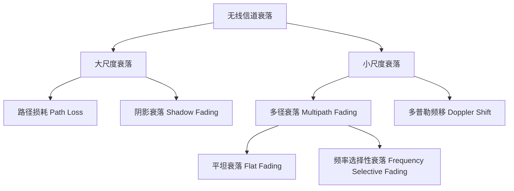
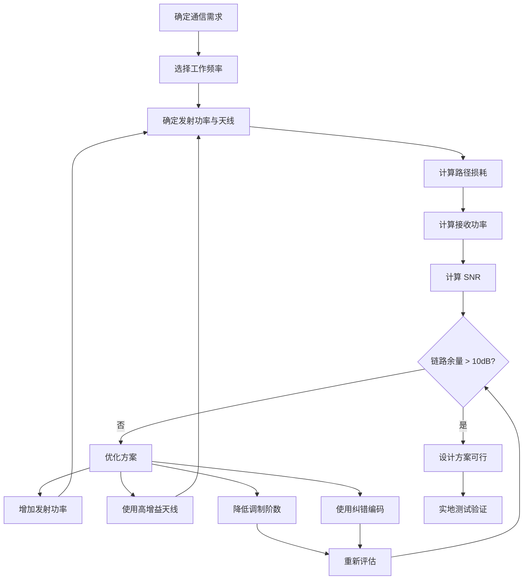

# 无线通信基础

> 预计阅读：25 分钟 | 前置知识：基本电路概念、高中物理电磁波

---

## 1. 电磁波与频谱

### 1.1 电磁波基础

电磁波是无人机通信的物理载体。根据麦克斯韦方程组，变化的电场产生磁场，变化的磁场产生电场，二者交替产生形成电磁波。

**基本关系：**

$$c = \lambda \cdot f$$

其中：
- $c = 3 \times 10^8$ m/s（光速）
- $\lambda$ — 波长（m）
- $f$ — 频率（Hz）

### 1.2 无人机通信常用频段

| 频段 | 频率范围 | 波长 | 典型应用 | 特点 |
|------|---------|------|---------|------|
| **UHF** | 300MHz-3GHz | 1m-10cm | 数传电台（900MHz）、4G LTE | 穿透性好，绕射能力强 |
| **S 波段** | 2-4GHz | 15-7.5cm | 2.4GHz 遥控器、Wi-Fi | 平衡的带宽与传播特性 |
| **C 波段** | 4-8GHz | 7.5-3.75cm | 5.8GHz 图传 | 带宽较大，雨衰较小 |
| **Ku 波段** | 12-18GHz | 2.5-1.67cm | 卫星通信 | 高带宽，雨衰明显 |
| **mmWave** | 24-100GHz | 12.5-3mm | 5G NR（28/39GHz） | 超大带宽，传播距离短 |

### 1.3 频谱分配示意

```
频率 (Hz)
  |
  |  300M    1G     2G     3G     5G     10G    28G    39G
  |   |       |      |      |      |       |      |      |
  |   |       |      |      |      |       |      |      |
  |   |  900MHz     2.4GHz      5.8GHz           5G NR
  |   |  数传电台   遥控/Wi-Fi   图传            毫米波
  |   |       |      |      |      |       |      |      |
  +---+-------+------+------+------+-------+------+-------> 频率
      UHF         S波段        C波段           Ka波段
```

---

## 2. 无线传播模型

### 2.1 自由空间路径损耗（FSPL）

电磁波在自由空间中传播时，功率密度随距离的平方衰减：

$$FSPL(dB) = 20\log_{10}(d) + 20\log_{10}(f) + 20\log_{10}\left(\frac{4\pi}{c}\right)$$

简化为：

$$FSPL(dB) = 20\log_{10}(d) + 20\log_{10}(f) + 32.44$$

其中 $d$ 单位为 km，$f$ 单位为 MHz。

**示例计算：**

```
场景：900MHz 数传电台，距离 10km

FSPL = 20×log10(10) + 20×log10(900) + 32.44
     = 20×1 + 20×2.954 + 32.44
     = 20 + 59.08 + 32.44
     = 111.52 dB

场景：2.4GHz 图传，距离 5km

FSPL = 20×log10(5) + 20×log10(2400) + 32.44
     = 20×0.699 + 20×3.380 + 32.44
     = 13.98 + 67.60 + 32.44
     = 114.02 dB
```

### 2.2 地面反射模型（Two-Ray Ground）

当无人机飞行高度较低时，地面反射路径与直射路径叠加，形成双径模型：

```
  UAV (高度 h₁)
   *  ──────────────────── * 地面站 (高度 h₂)
   |    直射路径 d₁         |
   |                        |
   * ─ ─ ─ ─ ─ ─ ─ ─ ─ ─ * 反射路径 d₂
   ───────────────────────── 地面
```

**接收功率：**

$$P_r = P_t G_t G_r \left(\frac{h_t h_r}{d^2}\right)^2$$

**关键结论：**
- 近距离（$d < \frac{4\pi h_t h_r}{\lambda}$）：遵循自由空间衰减（$d^{-2}$）
- 远距离：遵循双径衰减（$d^{-4}$）
- 交叉距离称为 **Fresnel 区突破距离**

### 2.3 经验传播模型

| 模型 | 适用场景 | 核心公式 | 特点 |
|------|---------|---------|------|
| **Okumura-Hata** | 城市宏蜂窝 | 基于实测数据的曲线拟合 | 150-1500MHz |
| **COST-231 Hata** | 城市微蜂窝 | Hata 模型扩展 | 1500-2000MHz |
| **ITU-R P.452** | 视距/超视距 | 考虑大气折射 | 适合空对地 |
| **Air-to-Ground (ATG)** | 无人机通信 | 概率视距模型 | 专门针对无人机 |

### 2.4 无人机空地传播模型

无人机通信的特殊性在于：发射端在空中，接收端在地面，传播环境随飞行高度变化。

**概率视距（LoS）模型：**

$$P_{LoS} = \frac{1}{1 + a \cdot \exp(-b \cdot (\theta - a))}$$

其中 $\theta$ 为仰角（度），$a$、$b$ 为环境参数。

| 环境类型 | a | b |
|---------|---|---|
| 郊区 | 4.88 | 0.43 |
| 城市 | 12.08 | 0.11 |
| 密集城市 | 27.26 | 0.08 |

**平均路径损耗：**

$$L = FSPL \cdot (P_{LoS} \cdot \eta_{LoS} + (1-P_{LoS}) \cdot \eta_{NLoS})$$

其中 $\eta_{LoS}$ 和 $\eta_{NLoS}$ 分别为视距和非视距的额外损耗因子。

---

## 3. 信道衰落

### 3.1 衰落分类



### 3.2 大尺度衰落

**路径损耗：** 如前述公式，随距离增加而增大。

**阴影衰落：** 由建筑物、地形等障碍物遮挡引起，服从对数正态分布：

$$PL(d) = \overline{PL}(d) + X_\sigma$$

其中 $X_\sigma \sim N(0, \sigma^2)$，$\sigma$ 典型值 4-10 dB。

### 3.3 小尺度衰落

**多径效应：** 信号通过不同路径到达接收端，叠加后产生衰落。

```
发射信号 ──→ 直射路径 ──→ 接收信号（幅度 A₁，相位 φ₁）
         ──→ 地面反射 ──→ 接收信号（幅度 A₂，相位 φ₂）
         ──→ 建筑物反射 ──→ 接收信号（幅度 A₃，相位 φ₃）
         ──→ ...         ──→ ...
```

**Rayleigh 衰落：** 无视距分量时，接收信号包络服从 Rayleigh 分布：

$$f(r) = \frac{r}{\sigma^2} \exp\left(-\frac{r^2}{2\sigma^2}\right)$$

**Rician 衰落：** 有视距分量时，接收信号包络服从 Rician 分布：

$$f(r) = \frac{r}{\sigma^2} \exp\left(-\frac{r^2 + A^2}{2\sigma^2}\right) I_0\left(\frac{rA}{\sigma^2}\right)$$

其中 $K = \frac{A^2}{2\sigma^2}$ 为 Rician 因子，$K \to 0$ 时退化为 Rayleigh 分布。

### 3.4 多普勒效应

无人机高速移动导致载波频率偏移：

$$f_d = \frac{v}{\lambda} \cos(\theta) = \frac{v \cdot f_c}{c} \cos(\theta)$$

其中 $v$ 为相对速度，$\theta$ 为运动方向与信号方向的夹角。

**示例：**

```
场景：无人机速度 60 km/h = 16.67 m/s，工作频率 2.4 GHz

最大多普勒频移 = v × f / c
              = 16.67 × 2.4×10⁹ / 3×10⁸
              = 133.3 Hz

相干时间 ≈ 0.423 / f_d = 0.423 / 133.3 ≈ 3.17 ms
```

这意味着信道在约 3ms 内保持相关，通信系统需要在此时间内完成信道估计。

---

## 4. 信噪比与链路预算

### 4.1 信噪比（SNR）

$$SNR = \frac{P_{signal}}{P_{noise}} = P_{signal}(dBm) - P_{noise}(dBm)$$

**热噪声功率：**

$$P_{noise} = k \cdot T \cdot B = -174 + 10\log_{10}(B) \quad (dBm)$$

其中：
- $k = 1.38 \times 10^{-23}$ J/K（玻尔兹曼常数）
- $T = 290$ K（标准温度）
- $B$ 为信号带宽（Hz）

**不同带宽的热噪声：**

| 带宽 | 热噪声功率 |
|------|----------|
| 12.5 kHz（窄带数传） | -123 dBm |
| 200 kHz（LTE 子载波） | -117 dBm |
| 10 MHz（LTE 10MHz） | -104 dBm |
| 20 MHz（5G NR） | -101 dBm |

### 4.2 链路预算分析

链路预算是评估通信系统性能的核心工具。

**链路预算公式：**

$$P_{rx} = P_{tx} + G_{tx} - L_{tx} - FSPL - L_{misc} + G_{rx} - L_{rx}$$

**完整链路预算示例：**

```
场景：900MHz 数传电台，距离 10km，郊区环境

发射端：
  发射功率 (P_tx)          = 30 dBm (1W)
  发射天线增益 (G_tx)      = 3 dBi (全向天线)
  发射馈线损耗 (L_tx)      = 1 dB
                            ─────────
  EIRP                    = 32 dBm

传播损耗：
  自由空间路径损耗 (FSPL)  = 111.5 dB (10km, 900MHz)
  阴影衰落余量             = 6 dB
  大气吸收                 = 0.5 dB
  附加损耗（建筑物等）      = 3 dB
                            ─────────
  总传播损耗              = 121.0 dB

接收端：
  接收天线增益 (G_rx)      = 10 dBi (定向天线)
  接收馈线损耗 (L_rx)      = 1 dB
                            ─────────
  接收信号功率 (P_rx)      = 32 - 121 + 10 - 1 = -80 dBm

系统参数：
  接收机噪声系数 (NF)      = 3 dB
  热噪声 (12.5kHz 带宽)    = -123 dBm
  等效噪声功率             = -123 + 3 = -120 dBm

性能指标：
  信噪比 SNR              = -80 - (-120) = 40 dB
  所需 SNR（GFSK 调制）    = 10 dB
  链路余量                = 40 - 10 = 30 dB ✓
```

### 4.3 链路预算计算工具（Python）

```python
import math

def fspl_km_mhz(d_km, f_mhz):
    """自由空间路径损耗 (dB)，d 单位 km，f 单位 MHz"""
    return 20 * math.log10(d_km) + 20 * math.log10(f_mhz) + 32.44

def thermal_noise_dbm(bandwidth_hz):
    """热噪声功率 (dBm)"""
    return -174 + 10 * math.log10(bandwidth_hz)

def link_budget(
    tx_power_dbm, tx_gain_dbi, tx_loss_db,
    distance_km, freq_mhz, shadow_margin_db, extra_loss_db,
    rx_gain_dbi, rx_loss_db,
    noise_figure_db, bandwidth_hz,
    required_snr_db
):
    """链路预算计算"""
    # EIRP
    eirp = tx_power_dbm + tx_gain_dbi - tx_loss_db

    # 路径损耗
    fspl = fspl_km_mhz(distance_km, freq_mhz)
    total_loss = fspl + shadow_margin_db + extra_loss_db

    # 接收功率
    rx_power = eirp - total_loss + rx_gain_dbi - rx_loss_db

    # 噪声
    noise = thermal_noise_dbm(bandwidth_hz) + noise_figure_db

    # SNR
    snr = rx_power - noise

    # 链路余量
    margin = snr - required_snr_db

    return {
        "EIRP (dBm)": eirp,
        "FSPL (dB)": fspl,
        "接收功率 (dBm)": rx_power,
        "噪声功率 (dBm)": noise,
        "SNR (dB)": snr,
        "链路余量 (dB)": margin,
        "链路是否可行": "是" if margin > 0 else "否"
    }

# 使用示例
result = link_budget(
    tx_power_dbm=30,      # 1W
    tx_gain_dbi=3,        # 全向天线
    tx_loss_db=1,         # 馈线损耗
    distance_km=10,       # 10km
    freq_mhz=900,         # 900MHz
    shadow_margin_db=6,   # 阴影衰落余量
    extra_loss_db=3.5,    # 附加损耗
    rx_gain_dbi=10,       # 定向天线
    rx_loss_db=1,         # 馈线损耗
    noise_figure_db=3,    # 接收机噪声系数
    bandwidth_hz=12500,   # 12.5kHz
    required_snr_db=10    # 所需 SNR
)

for k, v in result.items():
    if isinstance(v, float):
        print(f"{k}: {v:.1f}")
    else:
        print(f"{k}: {v}")
```

---

## 5. 无人机通信的特殊挑战

### 5.1 三维移动性

与地面通信不同，无人机在三维空间中运动，信道特性随高度显著变化：

| 飞行高度 | 主要传播特征 | 典型附加损耗 |
|---------|------------|------------|
| < 30m | 地面反射主导，多径严重 | 10-20 dB |
| 30-120m | 视距概率增加，多径减少 | 5-10 dB |
| > 120m | 近似自由空间，但地面覆盖角度小 | 0-3 dB |

### 5.2 天线指向变化

无人机在飞行过程中姿态不断变化，导致天线指向也随之改变：

```
  俯仰 (Pitch)        横滚 (Roll)         偏航 (Yaw)
      ↑                    ↗
      |   __              /   /
      |  /  \            /   /
      +------→          +---+              北
      |                  |   |              ↑
      |                  |   |         西←─+─→东
                                            ↓
                                           南
```

**影响：**
- 全向天线：增益随角度变化 3-6 dB
- 定向天线：需要自动跟踪或波束成形
- 实际方案：地面站使用高增益定向天线 + 自动跟踪

### 5.3 电磁干扰环境

无人机工作环境中的干扰源：

| 干扰源 | 频段 | 影响 | 缓解措施 |
|-------|------|------|---------|
| Wi-Fi 路由器 | 2.4/5.8 GHz | 同频干扰 | 频率规划、跳频 |
| 4G/5G 基站 | 多频段 | 带外干扰 | 滤波器 |
| 其他无人机 | 同频段 | 同频干扰 | 时分复用、编码 |
| 高压线 | 宽频 | 电磁噪声 | 远离、屏蔽 |
| 太阳活动 | 宽频 | 大气噪声 | 链路余量设计 |

### 5.4 大气效应

| 效应 | 频率范围 | 影响程度 | 说明 |
|------|---------|---------|------|
| 氧气吸收 | 60 GHz, 118 GHz | 极高 | 毫米波通信需考虑 |
| 水汽吸收 | 22 GHz, 183 GHz | 高 | 雨天显著增加 |
| 雨衰 | > 10 GHz | 中-高 | Ku/Ka 波段显著 |
| 云雾衰减 | > 30 GHz | 中 | 毫米波通信影响 |
| 对流层闪烁 | > 10 GHz | 低-中 | 信号幅度波动 |

---

## 6. 实际案例：链路设计流程

### 6.1 设计流程图



### 6.2 设计检查清单

```
□ 通信距离需求明确（最大/典型/最小）
□ 工作频率选择合理（考虑传播特性、法规、干扰）
□ 发射功率符合法规要求
□ 天线增益与指向性满足需求
□ 路径损耗计算包含所有损耗因素
□ 链路余量 ≥ 10 dB（建议 15-20 dB）
□ 调制方式与 SNR 匹配
□ 纠错编码提供足够编码增益
□ 多径衰落余量已考虑
□ 干扰环境已评估
□ 大气效应已考虑（如适用）
□ 实地测试方案已制定
```

---

## 思考题

1. **自由空间路径损耗公式中，为什么频率每增加一倍，路径损耗增加约 6 dB？从物理角度解释。**

2. **一架无人机在 100m 高度飞行，使用 2.4GHz 频段与地面站通信。请估算在 1km 和 5km 处的路径损耗差异，并解释为什么近处的损耗增速比远处快。**

3. **为什么无人机通信中 Rician 衰落比 Rayleigh 衰落更常见？在什么情况下 Rayleigh 衰落会成为主导？**

4. **设计一个 5km 距离的 900MHz 遥测链路，发射功率 20dBm，发射天线 2dBi，接收天线 8dBi，要求链路余量至少 15dB。接收机灵敏度至少需要多少 dBm？**

<details>
<summary>参考答案</summary>

**1. 频率翻倍，路径损耗增加 6 dB 的原因：**

FSPL 公式中 $20\log_{10}(f)$ 项，当 $f$ 变为 $2f$ 时：
$$\Delta = 20\log_{10}(2f) - 20\log_{10}(f) = 20\log_{10}(2) = 6.02 \text{ dB}$$

物理角度：天线的有效孔径 $A_e = \frac{\lambda^2}{4\pi}$，频率翻倍则波长减半，有效孔径减为 1/4，接收功率相应减小。

**2. 路径损耗计算：**

- 1km 处：FSPL = 20×log10(1) + 20×log10(2400) + 32.44 = 0 + 67.6 + 32.44 = 100.0 dB
- 5km 处：FSPL = 20×log10(5) + 20×log10(2400) + 32.44 = 14.0 + 67.6 + 32.44 = 114.0 dB
- 差异：14 dB

近处损耗增速快是因为在双径模型下，近区遵循 $d^{-2}$ 衰减，远区遵循 $d^{-4}$ 衰减。

**3. Rician vs Rayleigh：**

无人机到地面站通常存在视距（LoS）路径，因此信号包含稳定的直射分量 + 随机散射分量，符合 Rician 分布。当无人机在密集城市环境中飞行，LoS 被建筑物遮挡时，只有散射分量，退化为 Rayleigh 衰落。

**4. 接收机灵敏度计算：**

- EIRP = 20 + 2 = 22 dBm
- FSPL = 20×log10(5) + 20×log10(900) + 32.44 = 14.0 + 59.1 + 32.44 = 105.5 dB
- 附加损耗（阴影+大气）≈ 9.5 dB
- 接收功率 = 22 - 105.5 - 9.5 + 8 = -85 dBm
- 链路余量 15 dB → 接收机灵敏度 ≤ -85 - 15 = -100 dBm

</details>
