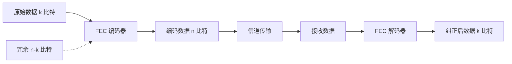
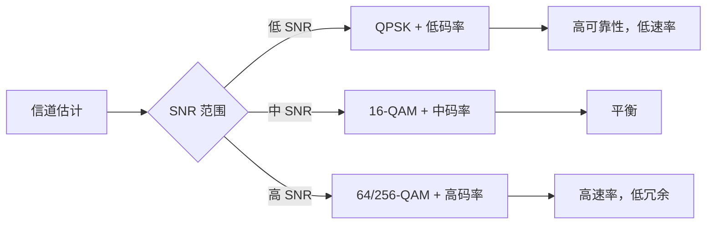
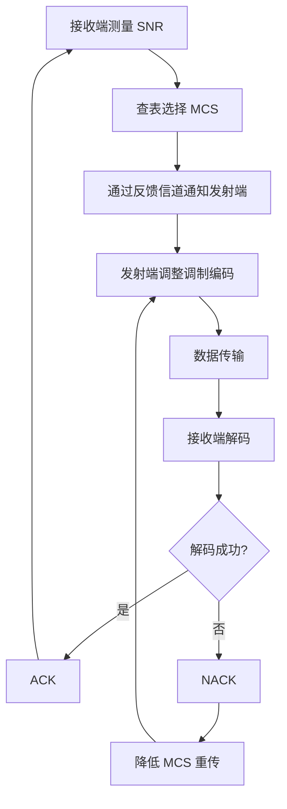

# 调制与编码技术

> 预计阅读：30 分钟 | 前置知识：信号与系统基础、傅里叶变换概念

---

## 1. 数字调制基础

### 1.1 调制的目的

调制是将数字信息映射到射频载波上的过程。无人机通信中调制的核心目标：

| 目标 | 说明 | 典型权衡 |
|------|------|---------|
| **频谱效率** | 单位带宽传输更多数据 | 高阶调制 → 更高误码率 |
| **功率效率** | 低 SNR 下可靠传输 | 低阶调制 → 更低数据率 |
| **抗干扰能力** | 在复杂电磁环境中工作 | 扩频 → 牺牲带宽 |
| **实现复杂度** | 嵌入式系统资源受限 | 简单调制 → 性能有限 |

### 1.2 基本调制方式

#### 幅移键控（ASK）

```
比特流:  1  0  1  1  0  0  1
         ┌─┐  ┌─┬─┐     ┌─┐
信号:    │ │  │ │ │     │ │
         │ │  │ │ │     │ │
         └─┘  └─┴─┘     └─┘
         高 低 高 高 低 低 高
```

#### 频移键控（FSK）

```
比特流:  1  0  1  1  0  0  1
         ∿∿∿∿∿∿∿∿∿∿∿∿∿∿∿∿∿∿∿∿
信号:    高频 低频 高频 低频
```

**GFSK（高斯频移键控）：** SiK 数传电台使用的调制方式，通过高斯滤波平滑频率跳变，减少带外辐射。

#### 相移键控（PSK）

```
QPSK 星座图:

        Q
        ↑
   10   |   00
        |
  ──────+──────→ I
        |
   11   |   01
```

#### 运行示例：QPSK 星座图与 BER 仿真

```python
import numpy as np
import matplotlib.pyplot as plt

# QPSK Constellation
bits = np.random.randint(0, 4, 1000)
symbols = np.exp(1j * np.pi/2 * bits + 1j * np.pi/4)
noise = 0.1 * (np.random.randn(1000) + 1j * np.random.randn(1000))
received = symbols + noise
plt.scatter(received.real, received.imag, alpha=0.5, s=10)
plt.title('QPSK Constellation with AWGN')
plt.xlabel('In-Phase'); plt.ylabel('Quadrature')
plt.grid(True); plt.axis('equal')
plt.savefig('qpsk_constellation.png')
```

### 1.3 正交幅度调制（QAM）

QAM 同时调制幅度和相位，是现代通信系统的核心调制方式。

```
16-QAM 星座图:              64-QAM 星座图:

     Q                          Q
      ↑                          ↑
  ●   ●   ●   ●              ● ● ● ● ● ● ● ●
      |                          |
  ●   ●   ●   ●              ● ● ● ● ● ● ● ●
      |                          |
  ●   ●   ●   ●              ● ● ● ● ● ● ● ●
      |                          |
  ●   ●   ●   ●              ● ● ● ● ● ● ● ●
  ───────────→ I              ────────────────→ I

  每符号 4 bit                每符号 6 bit
```

| 调制方式 | 每符号比特数 | 理论频谱效率 | 所需 SNR (BER=10⁻³) | 典型应用 |
|---------|------------|------------|-------------------|---------|
| BPSK | 1 | 1 bit/s/Hz | 6.8 dB | 低速率控制链路 |
| QPSK | 2 | 2 bit/s/Hz | 9.8 dB | 数传电台 |
| 16-QAM | 4 | 4 bit/s/Hz | 16.5 dB | LTE 下行 |
| 64-QAM | 6 | 6 bit/s/Hz | 22.7 dB | Wi-Fi、5G |
| 256-QAM | 8 | 8 bit/s/Hz | 28.5 dB | 5G NR |

---

## 2. OFDM 技术

### 2.1 OFDM 基本原理

正交频分复用（Orthogonal Frequency Division Multiplexing, OFDM）是 4G/5G 和 Wi-Fi 的核心技术。

**传统 FDM vs OFDM：**

```
传统 FDM:
频率 ↑
     |  子载波1  保护  子载波2  保护  子载波3
     |  ██████  间隔  ██████  间隔  ██████
     |  ██████        ██████        ██████
     +──────────────────────────────────────→

OFDM:
频率 ↑
     |  子载波1  子载波2  子载波3  子载波4
     |  ██████  ██████  ██████  ██████
     |  ██████  ██████  ██████  ██████
     +──────────────────────────────────────→
     子载波正交，频谱重叠但不干扰
```

### 2.2 OFDM 系统结构


### 2.3 循环前缀（CP）

循环前缀是 OFDM 的关键设计，用于消除多径干扰导致的符号间干扰（ISI）。

```
OFDM 符号结构:

|←── 循环前缀 (CP) ──→|←──── 有效符号 ────→|
|  符号尾部的复制  |     OFDM 数据符号     |
|                  |                        |
|  T_cp            |     T_sym              |
```

**CP 长度设计准则：**

$$T_{cp} > \tau_{max}$$

其中 $\tau_{max}$ 为最大多径时延扩展。

| 环境 | 最大时延扩展 | 推荐 CP 长度 |
|------|------------|------------|
| 室内 | 50-200 ns | 0.8 μs |
| 郊区 | 0.5-2 μs | 4.4 μs |
| 城市 | 1-5 μs | 4.7 μs（LTE Normal CP） |

### 2.4 OFDM 参数设计

| 参数 | 公式 | LTE 示例（15kHz 子载波间隔） |
|------|------|--------------------------|
| 子载波间隔 $\Delta f$ | $1/T_{sym}$ | 15 kHz |
| 符号时间 $T_{sym}$ | $1/\Delta f$ | 66.7 μs |
| CP 长度 $T_{cp}$ | $> \tau_{max}$ | 4.69 μs（Normal CP） |
| FFT 点数 $N$ | 带宽/$\Delta f$ | 2048（20MHz 带宽） |
| 有用子载波数 | $N_{used}$ | 1200（20MHz 带宽） |

### 2.5 OFDM 的优势与挑战

| 优势 | 挑战 |
|------|------|
| 抗多径衰落（CP 消除 ISI） | 对频率偏移敏感（多普勒效应） |
| 频谱效率高（子载波正交重叠） | 峰均功率比（PAPR）高 |
| 信道均衡简单（单抽头均衡） | 对定时同步要求高 |
| 支持自适应调制（每子载波独立调制） | 实现复杂度较高 |

---

## 3. 扩频通信

### 3.1 直接序列扩频（DSSS）

DSSS 通过将窄带信号扩展到宽带来实现抗干扰和低截获概率。

```
原始信号:     ─┐ ┌───┐ ┌──
              ─┘ └───┘ └──
              带宽 B_data

扩频码:       1011010011010110
              (码片速率远高于数据速率)

扩频后信号:   带宽 B_spread >> B_data
              处理增益 = B_spread / B_data
```

**处理增益：**

$$G_p = \frac{B_{spread}}{B_{data}} = \frac{R_{chip}}{R_{data}}$$

**抗干扰能力：**

$$SNR_{out} = SNR_{in} + G_p (dB)$$

### 3.2 跳频扩频（FHSS）

FHSS 通过在多个频率之间快速切换来实现抗干扰。

```
频率 ↑
     |  f₈ ─────────────────────────────────
     |  f₇ ────────────────────────────────
     |  f₆ ───────────────────────────────
     |  f₅ ──────────────────────────────
     |  f₄ ─────────────────────────────
     |  f₃ ────────────────────────────
     |  f₂ ───────────────────────────
     |  f₁ ──────────────────────────
     +────────────────────────────────────→ 时间
        t1  t2  t3  t4  t5  t6  t7  t8
        f3  f7  f1  f5  f8  f2  f6  f4
```

**慢跳频 vs 快跳频：**

| 类型 | 定义 | 特点 |
|------|------|------|
| 慢跳频 | 多个符号在一个跳频周期 | 实现简单，频率分集 |
| 快跳频 | 一个符号跨越多个跳频周期 | 更强抗干扰，实现复杂 |

### 3.3 LoRa 扩频调制

LoRa 是无人机远距离通信中常用的扩频技术。

**LoRa 调制参数：**

| 参数 | 符号 | 范围 | 说明 |
|------|------|------|------|
| 扩频因子 | SF | 7-12 | SF 越大，距离越远，速率越低 |
| 带宽 | BW | 125/250/500 kHz | 带宽越大，速率越高 |
| 编码率 | CR | 4/5 - 4/8 | 纠错能力 |

**LoRa 数据率计算：**

$$R_b = SF \times \frac{BW}{2^{SF}} \times CR$$

| SF | BW (kHz) | 数据率 (kbps) | 灵敏度 (dBm) | 最大距离 |
|----|---------|--------------|-------------|---------|
| 7 | 125 | 5.47 | -123 | 2 km |
| 9 | 125 | 1.76 | -129 | 5 km |
| 12 | 125 | 0.29 | -137 | 15 km |

---

## 4. 前向纠错编码（FEC）

### 4.1 FEC 概述

前向纠错编码通过添加冗余信息，使接收端能够检测并纠正错误，无需重传。



**编码率 R = k/n：**

| 编码率 | 冗余比例 | 典型应用 |
|--------|---------|---------|
| 1/2 | 100% | 高可靠性链路 |
| 2/3 | 50% | LTE |
| 3/4 | 33% | 通用通信 |
| 7/8 | 14.3% | 高速率链路 |

### 4.2 卷积码

卷积码是无人机通信中最常用的 FEC 方式之一。

**编码器结构（约束长度 K=7，编码率 1/2）：**

```
输入 ──┬──→ [D] ──→ [D] ──→ [D] ──→ [D] ──→ [D] ──→ [D] ──┬── 输出1
       │                                                      │
       ├──→ (⊕) ──────────────────────────────────────────────┘
       │
       └──→ (⊕) ──→ (⊕) ───────────────────────────────────── 输出2
```

**Viterbi 解码：** 卷积码通常使用 Viterbi 算法进行最大似然解码。

**编码增益：**

| 编码率 | 约束长度 | 编码增益 (dB) @BER=10⁻⁵ |
|--------|---------|------------------------|
| 1/2 | K=7 | 5.1 dB |
| 1/2 | K=9 | 5.8 dB |
| 2/3 | K=7 | 3.6 dB |
| 3/4 | K=7 | 2.8 dB |

### 4.3 Turbo 码

Turbo 码通过两个并行级联的卷积编码器和迭代解码实现接近香农极限的性能。

```
Turbo 编码器:

输入 ──→ [RSC 编码器1] ──→ 输出1 (系统位 + 校验位1)
  │           ↑
  │      [交织器]
  │           ↓
  └──→ [RSC 编码器2] ──→ 输出2 (校验位2)
```

**性能：** 在 BER = 10⁻⁵ 时，Turbo 码距离香农极限仅 0.7 dB。

### 4.4 LDPC 码

低密度奇偶校验码（Low-Density Parity-Check, LDPC）是 5G NR 和 Wi-Fi 6 的标准编码方式。

**特点：**
- 并行解码，适合高速实现
- 性能接近香农极限（0.01-0.1 dB）
- 支持灵活的码率和码长

### 4.5 自适应编码调制（AMC）

根据信道条件动态调整编码率和调制阶数，最大化吞吐量。

```
SNR (dB)     调制方式      编码率      频谱效率
───────────────────────────────────────────────
< 0          QPSK         1/8        0.25
0 ~ 5        QPSK         1/2        1.0
5 ~ 10       QPSK         3/4        1.5
10 ~ 15      16-QAM       1/2        2.0
15 ~ 20      16-QAM       3/4        3.0
20 ~ 25      64-QAM       2/3        4.0
25 ~ 30      64-QAM       3/4        4.5
> 30         256-QAM      3/4        6.0
```



---

## 5. 无人机通信中的调制编码选择

### 5.1 不同场景的调制编码方案

| 应用场景 | 推荐调制 | 推荐 FEC | 说明 |
|---------|---------|---------|------|
| 遥控链路（安全关键） | GFSK/BPSK | 卷积码 1/2 | 可靠性优先 |
| 遥测数据 | QPSK | Turbo/LDPC 3/4 | 平衡速率与可靠性 |
| 高清图传 | 16/64-QAM | LDPC 2/3 | 速率优先 |
| 4G LTE 遥测 | QAM（自适应） | Turbo | 自适应编码调制 |
| 5G NR | QAM（自适应） | LDPC | 自适应，支持 URLLC |
| LoRa 远距离 | CSS 扩频 | Hamming | 超远距离，低速率 |

### 5.2 链路自适应流程



---

## 思考题

1. **OFDM 为什么能有效对抗多径衰落？请从循环前缀（CP）的作用机制解释。**

2. **LoRa 的扩频因子 SF 从 7 增加到 12 时，数据率下降了多少倍？灵敏度提升了多少 dB？这说明了什么？**

3. **在无人机遥测链路中，为什么通常选择 QPSK + Turbo 码 3/4 而不是 64-QAM + LDPC 7/8？请从链路余量和可靠性角度分析。**

4. **自适应编码调制（AMC）在无人机通信中面临什么特殊挑战？（提示：考虑信道变化速度和反馈延迟）**

5. **比较 DSSS 和 FHSS 在无人机通信中的优缺点。哪种更适合抗人为干扰？**

<details>
<summary>参考答案</summary>

**1. OFDM 对抗多径衰落的机制：**

多径效应导致信号通过不同路径到达接收端，产生时延扩展。在 OFDM 中，通过在每个符号前添加循环前缀（CP），只要 CP 长度大于最大时延扩展，就能将线性卷积转化为循环卷积，从而在频域实现简单的单抽头均衡。CP 将多径干扰转化为子载波间的正交性保持问题，避免了符号间干扰（ISI）。

**2. LoRa SF 变化分析：**

- 数据率变化：$R \propto \frac{SF}{2^{SF}}$
- SF=7: $7/128 = 0.0547$
- SF=12: $12/4096 = 0.00293$
- 比值：$0.0547/0.00293 = 18.7$ 倍（下降约 18.7 倍）
- 灵敏度提升：约 $137 - 123 = 14$ dB

这说明 LoRa 通过牺牲数据率换取更远的通信距离和更低的接收灵敏度，体现了通信系统中速率-距离的基本权衡。

**3. 遥测链路选择 QPSK+Turbo 3/4 的原因：**

- 64-QAM 需要 SNR > 22 dB，而 QPSK 只需约 10 dB
- 无人机信道变化快（移动性、姿态变化），SNR 波动大
- 链路余量：低阶调制提供更多余量应对衰落
- 遥测数据量相对较小，不需要极高速率
- 可靠性：控制链路中断可能导致坠机，可靠性优先

**4. AMC 在无人机通信中的挑战：**

- 信道变化快：多普勒效应导致信道相干时间短（ms 级）
- 反馈延迟：AMC 需要接收端反馈信道状态，往返延迟可能超过相干时间
- 姿态变化：无人机翻滚/俯仰导致天线增益快速变化
- 解决方案：预测性 AMC、开环 AMC、保守的 MCS 选择

**5. DSSS vs FHSS：**

- DSSS 优势：隐蔽性好、抗窄带干扰、支持多址（CDMA）；劣势：对远近效应敏感
- FHSS 优势：抗跟踪干扰、抗窄带干扰、实现简单；劣势：需要频率同步
- 抗人为干扰：FHSS 更优，因为跳频图案难以预测和跟踪

</details>
