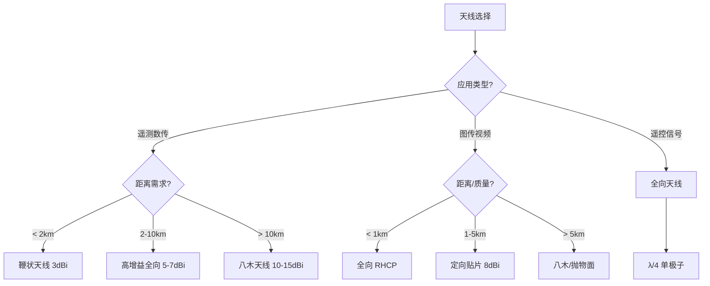

# 天线与射频基础

> 预计阅读：25 分钟 | 前置知识：电磁波基础、麦克斯韦方程概念

---

## 1. 天线基本参数

### 1.1 天线增益

天线增益描述天线将能量集中到特定方向的能力。

$$G = \eta \cdot \frac{4\pi A_e}{\lambda^2}$$

其中 $\eta$ 为天线效率，$A_e$ 为有效孔径，$\lambda$ 为波长。

**常用天线增益：**

| 天线类型 | 增益 (dBi) | 典型应用 |
|---------|-----------|---------|
| 短偶极子 | 2.15 | 无人机机载全向天线 |
| 1/4 波长单极子 | 2.15 | 数传电台天线 |
| 鞭状天线 | 3-5 | 地面站全向天线 |
| 八木天线 | 7-15 | 地面站定向天线 |
| 抛物面天线 | 20-40 | 远距离地面站 |
| 微带贴片天线 | 5-8 | 无人机机载天线 |
| 相控阵天线 | 10-30 | 5G 基站、高端地面站 |

### 1.2 方向图（Radiation Pattern）

天线方向图描述天线在不同方向上的辐射强度。

```
全向天线方向图:                定向天线方向图:

      0°                              0°
      |                                |
  270°─┼─90°                     270°──┼──90°
      |                                |
     180°                             180°

  （圆形，各方向均匀）          （有主瓣和旁瓣）
```

**三维方向图示意：**

```
         主瓣
          ╱╲
         ╱  ╲
        ╱    ╲
       ╱      ╲
      ╱   ┌─┐  ╲
     ╱    │ │    ╲
    ╱     │ │     ╲
   ╱──────┴┴──────╲
   ╲      ││      ╱
    ╲     ││     ╱
     ╲    ││    ╱
      ╲   ││   ╱
       ╲  ││  ╱
        ╲ ││ ╱
         ╲││╱
          后瓣
```

**关键参数：**

| 参数 | 定义 | 典型值 |
|------|------|--------|
| 半功率波束宽度（HPBW） | 增益下降 3dB 的角度范围 | 30°-120° |
| 前后比（F/B） | 主瓣最大增益 / 后瓣最大增益 | 15-30 dB |
| 旁瓣电平 | 第一旁瓣增益 / 主瓣增益 | -13 to -25 dB |

### 1.3 极化（Polarization）

极化描述电场矢量的方向随时间变化的轨迹。

```
线极化:                    圆极化:
                          ↗
E ↑                      ↗  ↘
  │  ╱╲  ╱╲  ╱╲        ↗    ↘
  │ ╱  ╲╱  ╲╱  ╲      ↗   →   ↘
  └─────────────→ t    ↗    ↗
                        ↗  ↗
垂直极化                  左旋圆极化 (LHCP)
```

| 极化类型 | 特点 | 无人机应用 |
|---------|------|----------|
| 垂直线极化 | 简单，对地面反射不敏感 | 数传电台 |
| 水平线极化 | 地面反射特性好 | 部分图传 |
| 右旋圆极化（RHCP） | 抗多径，不需对齐 | FPV 图传 |
| 左旋圆极化（LHCP） | 与 RHCP 正交 | FPV 图传（与 RHCP 配对使用） |

**极化失配损耗：**

$$L_{pol} = -20\log_{10}(\cos(\theta_{pol}))$$

其中 $\theta_{pol}$ 为发射和接收天线极化方向的夹角。圆极化天线之间无极化失配损耗。

---

## 2. 无人机常用天线类型

### 2.1 全向天线

**鞭状天线（Whip Antenna）：**

```
      ┌─── 辐射体（λ/4 或 λ/2）
      │
      │    长度：λ/4 = 7500/f(MHz) cm
      │
      │    例如 900MHz: 8.3 cm
      │    例如 2.4GHz: 3.1 cm
      │
      ├─── 馈电点
      │
      └─── 地平面 / 同轴线缆
```

**增益提升方案：**

| 天线 | 增益 | 结构 | 适用场景 |
|------|------|------|---------|
| λ/4 单极子 | 2.15 dBi | 最简单 | 近距遥测 |
| 5/8 波长单极子 | 3.5 dBi | 加匹配网络 | 通用 |
| 共线阵列 | 5-7 dBi | 多段串联 | 地面站全向 |
| 交叉偶极子 | 2.15 dBi | 圆极化 | FPV |

### 2.2 定向天线

**八木天线（Yagi-Uda Antenna）：**

```
                    导向器    激励振子    反射器
                    (短)      (λ/2)      (长)
                      │         │         │
                      │    ┌────┼────┐    │
                      │    │    │    │    │
    ──────────────────┼────┼────┼────┼────┼─── 支撑杆
                      │    │    │    │    │
                      │    └────┼────┘    │
                      │         │         │
                                    ↑
                                  馈电点

    辐射方向 →

    增益 = 7-15 dBi（取决于单元数量）
    波束宽度 = 30°-60°
```

**微带贴片天线（Patch Antenna）：**

```
    ┌─────────────────────────┐
    │                         │
    │      辐射贴片            │  ← 介质基板
    │      (矩形/圆形)         │
    │                         │
    ├─────────────────────────┤
    │      接地平面            │  ← 金属地
    └─────────────────────────┘
         ↑
       馈电点（同轴/微带线）

    增益 = 5-8 dBi
    优点：低剖面、轻量、易集成
    无人机常用：5.8GHz 圆极化贴片
```

### 2.3 天线选择指南



---

## 3. 射频前端

### 3.1 射频前端架构

```
发射链路:
┌─────────┐    ┌─────────┐    ┌─────────┐    ┌─────────┐    ┌────────┐
│ 基带    │───→│ DAC     │───→│ 上变频  │───→│ 功放    │───→│ 天线   │
│ 处理器  │    │ 数模转换 │    │ 混频器  │    │ PA     │    │        │
└─────────┘    └─────────┘    └─────────┘    └─────────┘    └────────┘

接收链路:
┌────────┐    ┌─────────┐    ┌─────────┐    ┌─────────┐    ┌─────────┐
│ 天线   │───→│ LNA     │───→│ 下变频  │───→│ ADC     │───→│ 基带    │
│        │    │ 低噪放  │    │ 混频器  │    │ 模数转换 │    │ 处理器  │
└────────┘    └─────────┘    └─────────┘    └─────────┘    └─────────┘
```

### 3.2 关键射频器件

#### 低噪声放大器（LNA）

LNA 是接收链路的第一级有源器件，其噪声系数直接决定接收机灵敏度。

$$NF_{system} = NF_1 + \frac{NF_2 - 1}{G_1} + \frac{NF_3 - 1}{G_1 G_2} + ...$$

| 参数 | 典型值 | 说明 |
|------|--------|------|
| 噪声系数（NF） | 0.5-2 dB | 越低越好 |
| 增益 | 10-20 dB | 过高会导致后级饱和 |
| P1dB | -10 to 0 dBm | 1dB 压缩点 |
| 工作频率 | 取决于芯片 | 需覆盖工作频段 |

**常用 LNA 芯片：**

| 芯片 | 频率范围 | NF | 增益 | 应用 |
|------|---------|-----|------|------|
| BGA2800 | 400-2700 MHz | 0.8 dB | 15 dB | 900MHz/2.4GHz 数传 |
| MAX2659 | 1575-1610 MHz | 0.8 dB | 19 dB | GPS |
| SKY67151 | 0.7-3.8 GHz | 0.7 dB | 17 dB | 多频段 |

#### 功率放大器（PA）

| 参数 | 定义 | 说明 |
|------|------|------|
| 输出功率 | P1dB 或 Psat | 决定发射距离 |
| 效率（PAE） | 射频输出功率 / 直流输入功率 | 影响电池续航 |
| 线性度 | ACPR、EVM | 影响信号质量 |
| 增益平坦度 | 带内增益变化 | 影响调制质量 |

### 3.3 频率合成器

本振（Local Oscillator, LO）用于上下变频。

```
锁相环（PLL）频率合成器:

参考频率     ┌─────────┐     ┌─────────┐     VCO 输出
f_ref ────→│ 相位    │───→│ 环路    │───→ f_out
            │ 检测器  │     │ 滤波器  │
            └────┬────┘     └─────────┘
                 ↑                │
                 │    ┌────────┐  │
                 └────│ 分频器 │←─┘
                      │ ÷N    │
                      └────────┘

    f_out = N × f_ref
```

### 3.4 射频链路预算（含器件损耗）

```
发射端完整链路:
┌──────────┐   ┌──────────┐   ┌──────────┐   ┌──────────┐
│ DAC 输出 │──→│ 上变频   │──→│ 滤波器   │──→│ PA       │──→ 天线
│ -10 dBm  │   │ -6 dB    │   │ -2 dB    │   │ +30 dB   │
└──────────┘   └──────────┘   └──────────┘   └──────────┘
                                    发射功率 = -10 - 6 - 2 + 30 = 12 dBm

接收端完整链路:
天线 ──→┌──────────┐   ┌──────────┐   ┌──────────┐   ┌──────────┐
        │ 滤波器   │──→│ LNA      │──→│ 下变频   │──→│ ADC 输入 │
        │ -2 dB    │   │ +15 dB   │   │ -6 dB    │   │          │
        └──────────┘   └──────────┘   └──────────┘   └──────────┘
        NF = 2 dB      NF = 1 dB      NF = 8 dB

系统噪声系数 = 2 + (1-1)/1 + (8-1)/(1×10^1.5)
            = 2 + 0 + 0.22 = 2.22 dB
```

---

## 4. 射频设计注意事项

### 4.1 阻抗匹配

天线与射频链路的阻抗匹配至关重要，标准射频阻抗为 50Ω。

**回波损耗与驻波比（VSWR）：**

$$VSWR = \frac{1 + |\Gamma|}{1 - |\Gamma|}$$

$$Return Loss (dB) = -20\log_{10}|\Gamma|$$

| VSWR | 回波损耗 | 反射功率 | 匹配质量 |
|------|---------|---------|---------|
| 1.0 | ∞ | 0% | 完美匹配 |
| 1.5 | 14 dB | 4% | 优秀 |
| 2.0 | 9.6 dB | 11% | 良好 |
| 3.0 | 6.0 dB | 25% | 一般 |
| > 3.0 | < 6 dB | > 25% | 差 |

#### 运行示例：Smith 圆图可视化

```python
import numpy as np
import matplotlib.pyplot as plt

# Smith 圆图基础绘制
fig, ax = plt.subplots(1, 1, figsize=(6, 6))

# 外圆 (|Gamma| = 1)
theta = np.linspace(0, 2*np.pi, 500)
ax.plot(np.cos(theta), np.sin(theta), 'k-', linewidth=1.5)

# 等电阻圆 (r = 0.2, 0.5, 1, 2, 5)
for r in [0.2, 0.5, 1.0, 2.0, 5.0]:
    cx = r / (1 + r)
    cy = 0
    radius = 1 / (1 + r)
    circle_theta = np.linspace(0, 2*np.pi, 300)
    ax.plot(cx + radius * np.cos(circle_theta),
            cy + radius * np.sin(circle_theta), 'b-', linewidth=0.8)

# 等电抗圆 (x = 0.2, 0.5, 1, 2, 5)
for x in [0.2, 0.5, 1.0, 2.0, 5.0]:
    cx = 1
    cy = 1 / x
    radius = 1 / x
    arc_theta = np.linspace(np.pi, 2*np.pi, 200)
    ax.plot(cx + radius * np.cos(arc_theta),
            cy + radius * np.sin(arc_theta), 'r-', linewidth=0.8)
    # 负电抗
    ax.plot(cx + radius * np.cos(-arc_theta),
            cy + radius * np.sin(-arc_theta), 'r-', linewidth=0.8)

# 示例阻抗点: Z = 50 + j25 ohm (归一化 z = 1 + j0.5)
z_norm = complex(1.0, 0.5)
gamma = (z_norm - 1) / (z_norm + 1)
ax.plot(gamma.real, gamma.imag, 'go', markersize=10, label=f'Z=50+j25 ohm')

ax.set_aspect('equal')
ax.set_title('Smith Chart (Normalized to 50 ohm)')
ax.set_xlabel('Real'); ax.set_ylabel('Imaginary')
ax.legend()
ax.grid(True, alpha=0.3)
plt.savefig('smith_chart.png')
```

### 4.2 电磁兼容（EMC）

无人机上的电磁兼容设计：

| 问题 | 原因 | 解决方案 |
|------|------|---------|
| 数字电路辐射 | 时钟谐波 | 屏蔽、滤波 |
| 电机干扰 | 电刷火花 | 去耦电容、屏蔽线 |
| 天线耦合 | 多天线近距离 | 频率隔离、物理隔离 |
| 电源噪声 | DC-DC 开关纹波 | LDO 供电、π 型滤波 |

### 4.3 PCB 射频设计要点

```
射频 PCB 布局原则:

    ┌─────────────────────────────────────────┐
    │                                         │
    │   ┌─────────┐                           │
    │   │ RF 芯片 │→ 50Ω 微带线 → 天线连接器  │
    │   └─────────┘     │                     │
    │                   │                     │
    │   ┌─────────┐     │                     │
    │   │ 数字电路 │←── 隔离带 ──→ RF 区域     │
    │   └─────────┘     │                     │
    │                   │                     │
    │   接地平面（完整，无分割）                │
    │                                         │
    └─────────────────────────────────────────┘

要点:
1. RF 信号线阻抗控制（50Ω 微带线）
2. 完整接地平面，避免地平面开槽
3. RF 区域与数字区域物理隔离
4. 去耦电容紧靠芯片电源引脚
5. 过孔阵列作为隔离墙
```

### 4.4 射频连接器

| 连接器 | 频率范围 | 损耗 | 典型应用 |
|--------|---------|------|---------|
| SMA | DC-18 GHz | < 0.1 dB | 数传电台、测试设备 |
| U.FL/IPEX | DC-6 GHz | < 0.2 dB | 无人机机载（小型化） |
| MCX | DC-6 GHz | < 0.15 dB | 小型设备 |
| N 型 | DC-11 GHz | < 0.1 dB | 地面站 |
| BNC | DC-4 GHz | < 0.2 dB | 测试设备 |

---

## 5. 天线测量与调试

### 5.1 驻波比测量

使用矢量网络分析仪（VNA）测量天线的 S11 参数：

```
S11 (dB) vs 频率:

  0 ─┬─────────────────────────────────
     │
 -10 ─┤
     │         ╱╲
 -20 ─┤        ╱  ╲
     │       ╱    ╲
 -30 ─┤      ╱      ╲
     │     ╱        ╲
 -40 ─┤────╱──────────╲──────────────
     │
     └──┬──────┬──────┬──────┬──────→ f
      850    900    950   1000  MHz

     谐振点：S11 最低处（900MHz 处约 -25dB）
     带宽：S11 < -10dB 的频率范围
```

### 5.2 增益测量方法

| 方法 | 精度 | 设备需求 | 适用场景 |
|------|------|---------|---------|
| 对比法 | ±1 dB | 已知增益天线、频谱仪 | 快速测量 |
| 三天线法 | ±0.5 dB | 三副相同天线 | 精确测量 |
| 远场测量 | ±0.3 dB | 暗室/开阔场地 | 标准测量 |
| 近场测量 | ±0.5 dB | 近场扫描系统 | 大型天线 |

---

## 思考题

1. **为什么无人机机载天线通常使用圆极化而不是线极化？请从极化失配和多径效应两个角度分析。**

2. **一个 900MHz 的鞭状天线，理论长度应为多少？实际制作时为什么通常会缩短 5%？**

3. **在接收机设计中，为什么 LNA 要放在接收链路的最前端？如果把 LNA 放在滤波器后面会有什么影响？**

4. **设计一个 10km 的 2.4GHz 数传链路，地面站使用八木天线（增益 12dBi），机载使用鞭状天线（增益 2dBi）。请计算链路预算，判断是否可行。**

<details>
<summary>参考答案</summary>

**1. 圆极化在无人机中的优势：**

- 极化失配：无人机飞行过程中姿态不断变化，线极化天线之间的极化角持续改变，导致 0-3dB 的增益波动。圆极化天线之间不存在极化失配损耗（理想情况下）。
- 多径效应：地面反射会导致极化翻转（RHCP→LHCP），圆极化天线可以有效抑制反射信号，减少多径衰落。

**2. 天线长度计算与缩短：**

- 理论长度：λ/4 = c/(4f) = 3×10⁸/(4×900×10⁶) = 0.0833 m = 8.33 cm
- 缩短原因：实际天线存在"端部效应"，电流在天线末端不为零而是有"额外"的分布电容，等效于天线变长。缩短 5% 可以补偿此效应，使天线在目标频率谐振。

**3. LNA 位置的重要性：**

根据 Friis 噪声公式，系统噪声系数主要由第一级决定。如果 LNA 放在滤波器后面，滤波器的插入损耗（如 2dB）会直接加到系统噪声系数上，而 LNA 的增益无法补偿这部分损耗。将 LNA 放在最前端，其增益可以"淹没"后级器件的噪声贡献。

**4. 10km 2.4GHz 链路预算：**

- EIRP = 20 dBm + 2 dBi = 22 dBm（假设发射功率 20dBm）
- FSPL = 20×log10(10) + 20×log10(2400) + 32.44 = 20 + 67.6 + 32.44 = 120 dB
- 附加损耗 ≈ 10 dB（阴影衰落 + 大气）
- 接收功率 = 22 - 120 - 10 + 12 = -96 dBm
- 热噪声（200kHz）= -117 dBm，假设 NF=3dB → -114 dBm
- SNR = -96 - (-114) = 18 dB
- 对于 QPSK + 1/2 编码（需要约 5 dB），链路余量 = 13 dB → 可行

</details>
