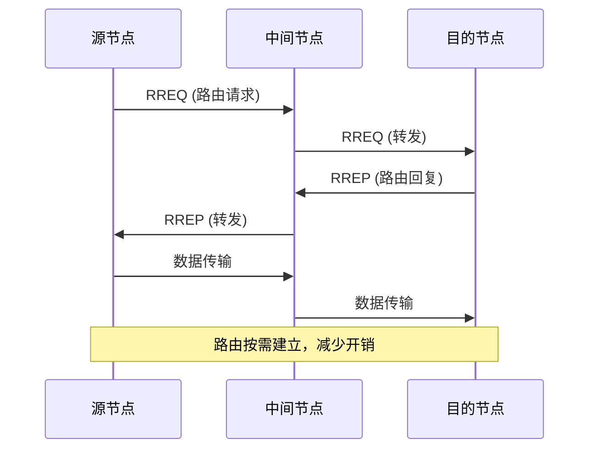
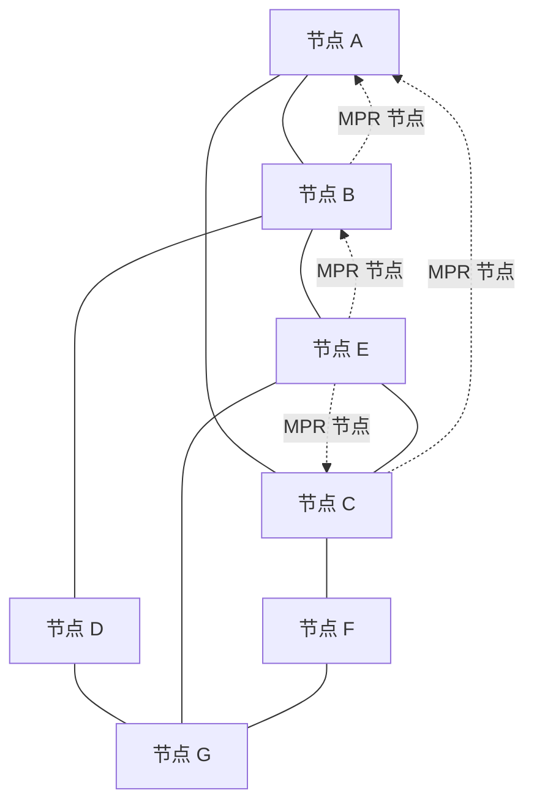
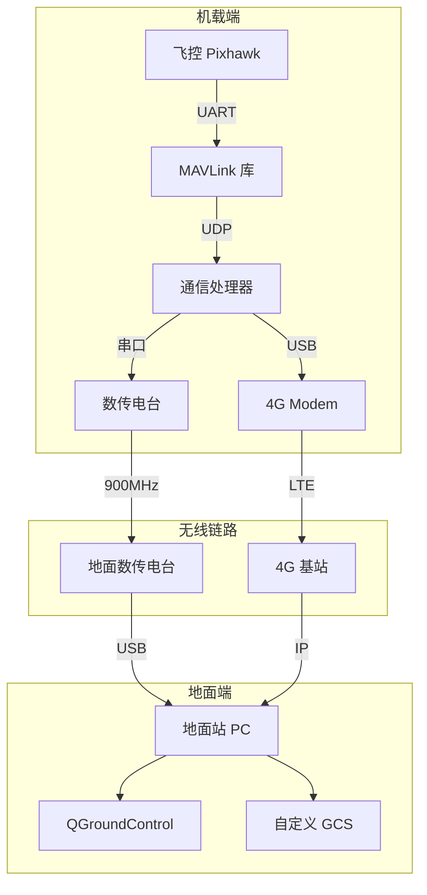

# 通信协议栈

> 预计阅读：25 分钟 | 前置知识：计算机网络基础、OSI 七层模型

---

## 1. 无人机通信协议栈概述

### 1.1 OSI 模型在无人机通信中的映射

```
OSI 七层模型          无人机通信实现
─────────────────────────────────────────────────────────
应用层 (7)           MAVLink 协议、任务规划
                     ├── Heartbeat
                     ├── Command_long
                     ├── Mission_item
                     └── Param_value

表示层 (6)           MAVLink 消息序列化/反序列化
                     ├── CRC 校验
                     └── 消息签名

会话层 (5)           MAVLink 会话管理
                     ├── 系统 ID / 组件 ID
                     └── 序列号管理

传输层 (4)           UDP / TCP / Serial
                     ├── UDP: 实时遥测（低延迟）
                     ├── TCP: 任务上传（可靠性）
                     └── Serial: 直连数传

网络层 (3)           IP / Mesh Routing
                     ├── 4G/5G: IP 网络
                     ├── Mesh: 自组织路由
                     └── 点对点: 无网络层

数据链路层 (2)       HDLC / PPP / 802.11
                     ├── 数传电台: HDLC
                     ├── LTE: PDCP/RLC/MAC
                     └── Wi-Fi: 802.11 MAC

物理层 (1)           RF 调制解调
                     ├── GFSK (数传电台)
                     ├── OFDM (LTE/5G)
                     └── DSSS (扩频)
```

### 1.2 协议栈对比

| 通信方式 | 物理层 | 数据链路层 | 网络层 | 传输层 | 应用层 |
|---------|--------|-----------|--------|--------|--------|
| 数传电台 | GFSK/FSK | SiK Protocol | — | — | MAVLink |
| Wi-Fi | OFDM | 802.11 | IP | UDP | MAVLink |
| 4G LTE | OFDMA | LTE MAC | IP | UDP | MAVLink |
| 5G NR | CP-OFDM | NR MAC | IP | UDP | MAVLink |
| Mesh 网络 | 各种 | Mesh MAC | 自组织路由 | — | MAVLink |
| 卫星 | 各种 | 卫星链路 | IP/专有 | TCP/UDP | MAVLink |

---

## 2. 数据链路层

### 2.1 HDLC 协议

高级数据链路控制（High-Level Data Link Control, HDLC）是数传电台常用的链路层协议。

**HDLC 帧结构：**

```
┌───────┬──────────┬──────────┬────────────┬───────┐
│ Flag  │ Address  │ Control  │  Info      │  FCS  │
│ 0x7E  │ 8 bit    │ 8 bit    │ 可变长度   │ 16bit │
└───────┴──────────┴──────────┴────────────┴───────┘
  01111110                                CRC-16

Flag: 帧起始/结束标志 (0x7E)
Address: 目的地址
Control: 帧类型（I帧/S帧/U帧）
Info: 数据载荷
FCS: 帧校验序列
```

**零比特填充：**

HDLC 使用零比特填充确保数据中不出现 Flag 字段：

```
原始数据:  01111110  (出现 Flag 模式)
填充后:    011111010  (第 5 个 1 后插入 0)
接收端去除插入的 0，恢复原始数据
```

### 2.2 SiK Radio 协议

SiK Radio 是 ArduPilot 生态中最常用的数传电台固件。

**SiK 帧格式：**

```
┌──────────┬──────────┬──────────┬──────────┐
│ Header   │ Length   │ Payload  │ CRC      │
│ 1 byte   │ 1 byte   │ N bytes  │ 2 bytes  │
└──────────┴──────────┴──────────┴──────────┘

Header 字段:
  Bit 7-4: 固定值 0x1 (MAVLink v1) 或 0xFD (MAVLink v2)
  Bit 3-0: 载荷长度
```

**SiK Radio 关键参数：**

| 参数 | 默认值 | 范围 | 说明 |
|------|--------|------|------|
| 频率 | 433/915 MHz | 可配置 | 工作频率 |
| 空中速率 | 64 kbps | 2-250 kbps | 数据速率 |
| 发射功率 | 20 dBm | 0-30 dBm | 发射功率 |
| 信道带宽 | 125 kHz | 可配置 | 信道带宽 |
| ECC | 开启 | 开/关 | 前向纠错 |
| 跳频 | 开启 | 开/关 | 跳频模式 |
| 跳频信道数 | 可配置 | 1-50 | 跳频信道数 |

### 2.3 802.11 MAC 层

Wi-Fi 的 MAC 层使用 CSMA/CA（载波侦听多路访问/冲突避免）：

```
CSMA/CA 工作流程:

发送端:
  ┌──────┐    ┌──────────┐    ┌──────────┐    ┌──────────┐
  │ 待发 │───→│ 载波侦听 │───→│ 随机退避 │───→│ 发送数据 │
  │ 数据 │    │ (CCA)    │    │ (Backoff)│    │          │
  └──────┘    └────┬─────┘    └──────────┘    └──────────┘
                   │
              信道忙?
                   │
              ┌────┴────┐
              │是       │否
              ↓         ↓
         等待空闲   开始退避
              ↓         ↓
         DIFS 时间   随机时隙
              ↓         ↓
         重新侦听   退避计数→0→发送

接收端:
  接收数据 → CRC 校验 → 发送 ACK (SIFS 时间后)
```

**Wi-Fi 在无人机中的问题：**

| 问题 | 原因 | 影响 |
|------|------|------|
| 高延迟 | CSMA/CA 退避 | 控制指令延迟不确定 |
| 距离受限 | 功率限制、灵敏度 | 通常 < 1km |
| 干扰严重 | 2.4GHz 频段拥挤 | 丢包率高 |
| 切换延迟 | AP 切换 | 移动性支持差 |

---

## 3. 网络层

### 3.1 IP 网络（4G/5G 场景）

4G/5G 网联无人机使用标准 IP 协议栈：

```
4G/5G 网联无人机 IP 协议栈:

  无人机端                    基站                    核心网
┌──────────┐            ┌──────────┐            ┌──────────┐
│ MAVLink  │            │          │            │ MAVLink  │
├──────────┤            │          │            ├──────────┤
│ UDP      │            │          │            │ UDP      │
├──────────┤            │          │            ├──────────┤
│ IPv4/IPv6│◄──────────►│ 中继     │◄──────────►│ IPv4/IPv6│
├──────────┤            │          │            ├──────────┤
│ PDCP     │            │ PDCP     │            │          │
├──────────┤            ├──────────┤            │          │
│ RLC      │            │ RLC      │            │          │
├──────────┤            ├──────────┤            │          │
│ MAC      │            │ MAC      │            │          │
├──────────┤            ├──────────┤            │          │
│ PHY      │            │ PHY      │            │          │
└──────────┘            └──────────┘            └──────────┘
```

### 3.2 自组织网络路由

无人机集群通信需要自组织网络（Ad-hoc Network）路由协议。

**AODV（Ad-hoc On-demand Distance Vector）：**



**OLSR（Optimized Link State Routing）：**



**MPR（MultiPoint Relay）机制：** OLSR 通过选择 MPR 节点减少广播开销，只有 MPR 节点转发广播消息。

### 3.3 路由协议对比

| 协议 | 类型 | 特点 | 适用场景 |
|------|------|------|---------|
| AODV | 按需路由 | 路由按需建立，开销低 | 节点移动频繁 |
| OLSR | 表驱动路由 | 始终维护路由表，延迟低 | 稳定拓扑 |
| DSR | 源路由 | 完整路径存在包头 | 小规模网络 |
| DSDV | 表驱动路由 | 无环路，收敛慢 | 低移动性 |
| B.A.T.M.A.N. | 混合路由 | 分布式，去中心化 | 无人机集群 |

---

## 4. 传输层

### 4.1 UDP vs TCP 在无人机通信中的选择

```
UDP 适用场景:                    TCP 适用场景:
┌─────────────────────┐         ┌─────────────────────┐
│ 遥测数据流          │         │ 任务上传/下载       │
│ ├── GPS 位置        │         │ ├── 航点文件        │
│ ├── 姿态数据        │         │ ├── 参数读写        │
│ ├── 电池状态        │         │ ├── 固件更新        │
│ └── 系统状态        │         │ └── FTP 传输        │
│                     │         │                     │
│ 特点:               │         │ 特点:               │
│ - 低延迟            │         │ - 可靠传输          │
│ - 允许少量丢包      │         │ - 流量控制          │
│ - 无连接建立开销    │         │ - 有序到达          │
└─────────────────────┘         └─────────────────────┘
```

### 4.2 MAVLink over UDP

```python
# MAVLink UDP 通信示例
import socket
from pymavlink import mavutil

# 创建 UDP 连接
# 方式1: pymavlink 内置
conn = mavutil.mavlink_connection('udp:127.0.0.1:14550')

# 方式2: 原生 socket
sock = socket.socket(socket.AF_INET, socket.SOCK_DGRAM)
sock.bind(('0.0.0.0', 14550))

while True:
    data, addr = sock.recvfrom(1024)
    # 解析 MAVLink 消息
    msg = conn.recv_msg()
    if msg:
        print(f"Received: {msg.get_type()}")
```

### 4.3 可靠 UDP（RUDP）

在需要可靠性但又不能承受 TCP 延迟的场景，可以使用可靠 UDP：

```
标准 UDP:              可靠 UDP:
发送 → 丢失 → 无感知    发送 → 丢失 → 重传
                       发送 → ACK → 确认

可靠 UDP 头部:
┌──────────┬──────────┬──────────┬──────────┐
│ Seq Num  │ ACK Num  │ Checksum │ Window   │
│ 16 bit   │ 16 bit   │ 16 bit   │ 16 bit   │
└──────────┴──────────┴──────────┴──────────┘
```

---

## 5. MAC 层多址接入

### 5.1 TDMA（时分多址）

TDMA 将时间划分为固定时隙，每个节点分配专用时隙。

```
TDMA 帧结构（4 个节点）:

时间 →
┌──────┬──────┬──────┬──────┬──────┬──────┬──────┬──────┐
│Slot 1│Slot 2│Slot 3│Slot 4│Slot 1│Slot 2│Slot 3│Slot 4│
│ 节点A│ 节点B│ 节点C│ 节点D│ 节点A│ 节点B│ 节点C│ 节点D│
└──────┴──────┴──────┴──────┴──────┴──────┴──────┴──────┘
|←───────── TDMA 帧 ─────────→|

优点: 无冲突、延迟确定、带宽保证
缺点: 需要同步、时隙浪费
```

### 5.2 CSMA/CA（载波侦听多路访问/冲突避免）

```
CSMA/CA 流程:

节点A:  ──侦听──→ 空闲 ──DIFS──→ 退避 ──→ 发送 ──→ 等待ACK
节点B:  ──侦听──→ 忙 ──→ 等待 ──→ 退避 ──→ 发送 ──→ 等待ACK
节点C:  ──侦听──→ 忙 ──→ 等待 ──→ 退避 ──→ 发送 ──→ 等待ACK

退避算法:
Backoff = Random(0, CW) × SlotTime
CW (竞争窗口): 初始 CW_min，冲突后翻倍直到 CW_max
```

### 5.3 FDMA（频分多址）

```
FDMA 频率分配:

频率 ↑
     │
f4 ──┤  ──────── 节点D ────────
     │
f3 ──┤  ──────── 节点C ────────
     │
f2 ──┤  ──────── 节点B ────────
     │
f1 ──┤  ──────── 节点A ────────
     │
     └─────────────────────────→ 时间

优点: 无冲突、实现简单
缺点: 频谱利用率低、需要滤波器
```

### 5.4 CDMA（码分多址）

```
CDMA 原理:

节点A 码片: [1, -1, 1, -1, 1, -1, 1, -1]
节点B 码片: [1, 1, -1, -1, 1, 1, -1, -1]
节点C 码片: [1, -1, -1, 1, 1, -1, -1, 1]

发送数据:
节点A 发送 1: [1, -1, 1, -1, 1, -1, 1, -1]
节点B 发送 0: [-1, -1, 1, 1, -1, -1, 1, 1]
节点C 发送 1: [1, -1, -1, 1, 1, -1, -1, 1]

叠加信号: [1, -3, 1, -1, 1, -3, 1, -1]

接收端用节点A的码片解码:
(1×1 + -3×-1 + 1×1 + -1×-1 + 1×1 + -3×-1 + 1×1 + -1×-1) / 8
= (1 + 3 + 1 + 1 + 1 + 3 + 1 + 1) / 8 = 12/8 = 1.5 → 解码为 1 ✓
```

---

## 6. 无人机通信协议栈设计实例

### 6.1 典型系统架构



### 6.2 协议栈选择指南

| 需求 | 推荐方案 | 理由 |
|------|---------|------|
| 近距遥测（<5km） | 数传电台 + MAVLink over Serial | 简单可靠 |
| 中距遥测（5-20km） | 高功率数传 + 定向天线 | 链路余量大 |
| 超视距（>20km） | 4G LTE + MAVLink over UDP | 利用蜂窝网络 |
| 低延迟控制 | 直连 RF + TDMA | 延迟确定 |
| 多机协同 | Mesh 网络 + CSMA/CA | 自组织、可扩展 |
| 高带宽图传 | 专用图传 + 数传分离 | 避免互相干扰 |

---

## 思考题

1. **为什么 MAVLink 协议选择使用 UDP 而不是 TCP？在哪些场景下 TCP 会更适合？**

2. **在无人机集群通信中，TDMA 和 CSMA/CA 各有什么优缺点？请设计一个混合 MAC 方案。**

3. **解释 AODV 和 OLSR 路由协议的区别。在什么网络拓扑下，AODV 比 OLSR 更高效？**

4. **如果要在 900MHz 数传电台上实现可靠的数据传输，你会在链路层添加哪些机制？**

5. **比较 CDMA 和 TDMA 在无人机集群通信中的适用性。哪种更适合高动态拓扑？**

<details>
<summary>参考答案</summary>

**1. MAVLink 选择 UDP 的原因：**

- 实时性：UDP 无连接建立和拥塞控制，延迟更低
- 轻量：头部开销小（8字节 vs TCP 20字节），适合嵌入式
- 应用层补偿：MAVLink 自带序列号和 CRC，可在应用层处理可靠性
- TCP 适合的场景：任务文件传输、参数读写、固件更新等需要可靠性的场景

**2. 混合 MAC 方案设计：**

- 控制链路（安全关键）：使用 TDMA，为每个无人机分配固定时隙，保证延迟确定
- 数据链路（遥测、视频）：使用 CSMA/CA，按需竞争，提高带宽利用率
- 广播/组播：使用专用广播时隙，确保所有节点收到

**3. AODV vs OLSR：**

- AODV：按需路由，路由发现时有延迟，但维护开销低
- OLSR：表驱动，始终维护路由表，延迟低但开销高
- AODV 更适合：节点移动频繁、通信不连续的场景（如侦察无人机）
- OLSR 更适合：稳定拓扑、需要低延迟通信的场景（如编队飞行）

**4. 数传电台可靠传输机制：**

- CRC 校验：检测比特错误
- ACK/NACK：确认/重传机制
- 序列号：检测丢包和乱序
- ARQ（自动重传请求）：选择性重传
- FEC（前向纠错）：减少重传次数

**5. CDMA vs TDMA：**

- CDMA 优势：无需时隙同步、天然抗干扰、软容量
- CDMA 劣势：远近效应、需要功率控制
- TDMA 优势：延迟确定、无远近效应
- TDMA 劣势：需要精确同步、节点数增加时时隙变短
- 高动态拓扑：CDMA 更适合，因为不需要频繁重新分配时隙

</details>
