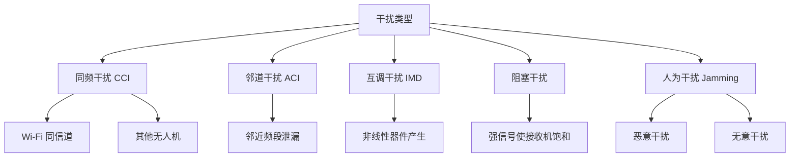
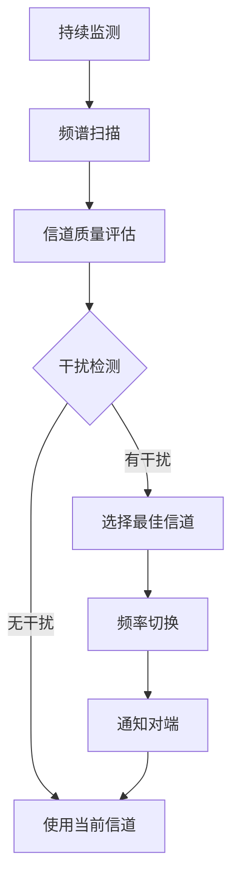
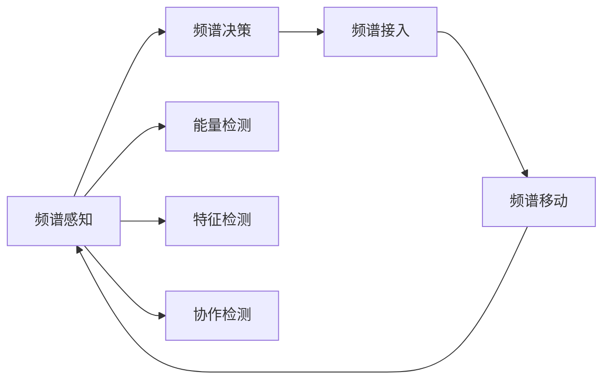

# 频谱管理与干扰

> 预计阅读：25 分钟 | 前置知识：无线通信基础、调制技术

---

## 1. 频谱分配与管理

### 1.1 无人机通信频段概览

| 频段 | 频率范围 | 功率限制 | 典型应用 | 监管要求 |
|------|---------|---------|---------|---------|
| **ISM 433MHz** | 433.05-434.79 MHz | 10 mW ERP | 近距遥控 | 无需许可 |
| **ISM 915MHz** | 902-928 MHz | 1W EIRP | 数传电台 | 无需许可（美国） |
| **SRD 868MHz** | 868-870 MHz | 25 mW ERP | 数传电台 | 无需许可（欧洲） |
| **ISM 2.4GHz** | 2.4-2.4835 GHz | 1W EIRP | 遥控器、图传 | 无需许可 |
| **ISM 5.8GHz** | 5.725-5.875 GHz | 1W EIRP | 图传 | 无需许可 |
| **Licensed** | 各国不同 | 按许可 | 专业无人机 | 需频谱许可 |
| **5G NR** | Sub-6/mmWave | 按运营商 | 网联无人机 | 运营商管理 |

### 1.2 各国频谱法规

| 国家/地区 | 无人机常用频段 | 最大功率 | 特殊要求 |
|----------|--------------|---------|---------|
| 中国 | 2.4GHz, 5.8GHz | 100mW-1W | SRRC 认证 |
| 美国 | 915MHz, 2.4GHz, 5.8GHz | 1W | FCC Part 15 |
| 欧洲 | 868MHz, 2.4GHz, 5.8GHz | 25mW-1W | CE 认证 |
| 日本 | 920MHz, 2.4GHz, 5.8GHz | 按频段 | TELEC 认证 |

### 1.3 ISM 频段特征

```
2.4 GHz ISM 频段使用情况:

频率 (MHz) →
2400    2425    2450    2475    2500
  |       |       |       |       |
  ├─── Wi-Fi Channel 1 ───┤
  │         ├─── Wi-Fi Channel 6 ───┤
  │         │         ├─── Wi-Fi Channel 11 ──┤
  ├─ Bluetooth ─┤
  │    ├─ ZigBee ─┤
  ├─ 微波炉 ─┤
  │              ├─ 无人机遥控 ─┤
  │    ├─── 数传电台 ───┤
```

---

## 2. 干扰类型与分析

### 2.1 干扰分类



### 2.2 同频干扰（Co-Channel Interference）

同频干扰是最常见的干扰类型，多个发射机使用相同频率。

**信干噪比（SINR）：**

$$SINR = \frac{P_{signal}}{P_{noise} + \sum P_{interferer}}$$

**同频干扰示例：**

```
场景：两架无人机使用相同频率

无人机 A ──── 信号 ────→ 地面站
                        ↑
无人机 B ──── 干扰 ─────┘

SINR = P_A / (P_noise + P_B)

如果 P_A = -80 dBm, P_B = -85 dBm, P_noise = -100 dBm:
SINR = -80 / (10^(-100/10) + 10^(-85/10))
     = 10^(-80/10) / (10^(-100/10) + 10^(-85/10))
     = 10^-8 / (10^-10 + 10^-8.5)
     = 10^-8 / (10^-10 + 3.16×10^-9)
     = 10^-8 / 3.26×10^-9
     = 3.07 = 4.9 dB
```

### 2.3 邻道干扰（Adjacent Channel Interference）

邻道干扰来自使用相邻频率的发射机。

**邻道选择性（ACS）：**

$$ACS = \frac{P_{adjacent}}{P_{desired}} \quad (\text{导致性能下降 3dB})$$

| 设备类型 | ACS 典型值 | 说明 |
|---------|-----------|------|
| 数传电台 | 30-40 dB | 滤波器选择性好 |
| Wi-Fi | 20-30 dB | OFDM 子载波泄漏 |
| LTE | 25-33 dB | 标准化要求 |

### 2.4 互调干扰（Intermodulation Distortion）

当两个或多个信号通过非线性器件时，会产生新的频率分量。

**三阶互调：**

$$f_{IM3} = 2f_1 - f_2 \quad \text{或} \quad 2f_2 - f_1$$

```
互调产物示意:

功率 ↑
     │
     │    f₁           f₂
     │    │            │
     │    ▼            ▼
     │    ┌┐          ┌┐
     │    ││    IM3   ││    IM3
     │    ││   ┌┐┌┐   ││   ┌┐┌┐
     │    ││   ││││   ││   ││││
     └────┴┴───┴┴┴┴───┴┴───┴┴┴┴──→ 频率
           │    ││     │    ││
           │  2f₁-f₂  │  2f₂-f₁
```

**三阶截断点（IP3）：**

$$IP3 = P_{in} + \frac{IMD_{suppression}}{2}$$

IP3 越高，线性度越好，互调干扰越小。

### 2.5 阻塞干扰

强干扰信号使接收机前端饱和，导致无法接收有用信号。

**动态范围：**

$$DR = P_{1dB} - MDS$$

其中：
- $P_{1dB}$：1dB 压缩点（接收机饱和功率）
- $MDS$：最小可检测信号（灵敏度）

---

## 3. 干扰缓解技术

### 3.1 频率规划

**信道分配策略：**

```
2.4GHz Wi-Fi 信道规划（3 不重叠信道）:

信道:  1    2    3    4    5    6    7    8    9   10   11
       │    │    │    │    │    │    │    │    │    │    │
频宽:  ├──────────────┤
       │              ├──────────────┤
       │              │              ├──────────────┤
       CH1            CH6            CH11

无人机使用 CH1，Wi-Fi 使用 CH6 和 CH11
```

### 3.2 跳频技术

跳频扩频（FHSS）通过快速切换频率来规避干扰。

```
跳频图案示例（10 个信道）:

频率 ↑
f10  ────────────────────────────────────────
f9   ────────────────────────────────●───────
f8   ────────────────────────●───────────────
f7   ────────────────●───────────────────────
f6   ────────●───────────────────────────────
f5   ────────────────────────────────────────
f4   ─●─────────────────────────────────────
f3   ────────────────────────────────●───────
f2   ────────────────●───────────────────────
f1   ────────────────────────────────●───────
     └────┬────┬────┬────┬────┬────┬────┬────→ 时间
          t1   t2   t3   t4   t5   t6   t7   t8

自适应跳频：检测到干扰信道后，将其从跳频图案中排除
```

### 3.3 自适应频率选择



### 3.4 功率控制

自适应功率控制可以减少对他人的干扰，同时节省功耗。

```
功率控制策略:

场景                    发射功率        理由
──────────────────────────────────────────────────
近距离 (< 1km)         低功率 (10dBm)  减少干扰，节省功耗
中距离 (1-5km)         中功率 (20dBm)  平衡
远距离 (5-10km)        高功率 (27dBm)  保证链路质量
超视距 (> 10km)        最大功率 (30dBm) 最大化距离
```

### 3.5 空间滤波

使用定向天线将信号能量集中到目标方向，减少对其他方向的干扰。

```
全向天线:                    定向天线:

      ╱╲                        │
     ╱  ╲                       │
    ╱    ╲                      │
   ╱      ╲                 ────┼────
  ╱ 干扰区域╲                    │
 ╱──────────╲               干扰区域小
 ╲          ╱
  ╲        ╱
   ╲      ╱
    ╲    ╱
     ╲  ╱
      ╲╱
```

### 3.6 纠错编码

FEC 可以在一定程度上抵抗干扰，提高链路的鲁棒性。

| 编码方式 | 编码增益 | 抗干扰能力 | 开销 |
|---------|---------|-----------|------|
| 卷积码 1/2 | 5 dB | 中 | 100% |
| Turbo 码 1/3 | 8 dB | 强 | 200% |
| LDPC 1/2 | 7 dB | 强 | 100% |
| RS + 卷积级联 | 6 dB | 强 | 中 |

---

## 4. 动态频谱接入

### 4.1 认知无线电概念

认知无线电（Cognitive Radio, CR）通过感知频谱环境，动态接入空闲频段。



### 4.2 频谱感知技术

| 技术 | 原理 | 优点 | 缺点 |
|------|------|------|------|
| 能量检测 | 测量频段能量 | 简单，无需先验知识 | 门限敏感，无法区分信号类型 |
| 匹配滤波 | 与已知信号匹配 | 最优检测性能 | 需要先验知识 |
| 循环平稳检测 | 利用信号周期性 | 抗噪声能力强 | 计算复杂 |
| 协作检测 | 多节点联合判断 | 检测概率高 | 需要通信开销 |

### 4.3 动态频谱接入策略

```
频谱接入策略:

1. Underlay（底层接入）:
   - 与主用户同时使用频谱
   - 控制发射功率，使干扰低于门限
   - 适合扩频通信

2. Overlay（叠加接入）:
   - 利用主用户未使用的频谱资源
   - 需要频谱感知
   - 适合突发数据传输

3. Interweave（交织接入）:
   - 检测空闲频谱，伺机接入
   - 类似"频谱空洞"利用
   - 适合低优先级数据
```

---

## 5. 无人机电磁兼容（EMC）

### 5.1 无人机上的干扰源

| 干扰源 | 频率范围 | 干扰类型 | 影响范围 |
|--------|---------|---------|---------|
| 无刷电机 | 宽频 | 电磁噪声 | 全频段 |
| 电调（ESC） | 开关频率谐波 | 脉冲干扰 | 特定频率 |
| 数字电路 | 时钟谐波 | 窄带干扰 | 时钟倍频 |
| GPS L1 | 1575.42 MHz | 自身信号 | GPS 频段 |
| 遥控接收 | 2.4 GHz | 互调 | 2.4GHz 频段 |

### 5.2 EMC 设计措施

```
无人机 EMC 设计清单:

□ 电机线使用屏蔽线或双绞线
□ ESC 电源端加 π 型滤波器
□ 数字电路与 RF 电路物理隔离
□ RF 线缆使用屏蔽同轴线
□ 天线馈点使用共模扼流圈
□ PCB 接地平面完整，无开槽
□ 电源去耦电容紧靠芯片
□ 金属外壳良好接地
□ 天线间距 ≥ λ/2
□ 使用不同极化天线减少耦合
```

### 5.3 天线隔离度

多天线系统中，天线之间的隔离度至关重要。

$$Isolation (dB) = P_{tx} - P_{coupled}$$

**提高隔离度的方法：**

| 方法 | 隔离度提升 | 实现难度 |
|------|-----------|---------|
| 增加天线间距 | 6 dB / 距离翻倍 | 简单 |
| 正交极化 | 20-30 dB | 中等 |
| 金属隔离墙 | 10-20 dB | 中等 |
| 频率隔离 | 取决于滤波器 | 简单 |
| 时间隔离（TDMA） | 完全隔离 | 复杂 |

---

## 6. 频谱监测与管理工具

### 6.1 频谱分析仪

```
频谱分析仪显示:

功率 (dBm)
  |
 0┤
  │
-20┤                    ┌┐
  │                    ││
-40┤         ┌┐        ││
  │         ││        ││
-60┤    ┌┐   ││   ┌┐   ││
  │    ││   ││   ││   ││
-80┤    ││   ││   ││   ││
  │    ││   ││   ││   ││
-100┤───┴┴───┴┴───┴┴───┴┴────
  │
  └──┬───┬───┬───┬───┬───→ 频率
    2.4  2.42 2.44 2.46 2.48 GHz

    ↑    ↑         ↑    ↑
   CH1  CH6       CH11  无人机
```

### 6.2 RTL-SDR 频谱监测

RTL-SDR 是低成本的软件定义无线电接收器，可用于频谱监测。

```python
# 使用 RTL-SDR 进行频谱扫描
import numpy as np
from rtlsdr import RtlSdr

# 初始化 SDR
sdr = RtlSdr()
sdr.sample_rate = 2.4e6      # 采样率 2.4MHz
sdr.center_freq = 2.44e9     # 中心频率 2.44GHz
sdr.gain = 40                # 增益 40dB

# 采集数据
samples = sdr.read_samples(256*1024)

# 计算功率谱
fft_size = 1024
spectrum = np.abs(np.fft.fftshift(np.fft.fft(samples[:fft_size])))**2
spectrum_db = 10 * np.log10(spectrum + 1e-12)

# 检测干扰
threshold = np.mean(spectrum_db) + 10  # 阈值：均值 + 10dB
interferers = np.where(spectrum_db > threshold)[0]
print(f"检测到 {len(interferers)} 个干扰信号")

sdr.close()
```

---

## 思考题

1. **在 2.4GHz ISM 频段中，无人机通信面临哪些主要干扰源？如何通过频率规划减少干扰？**

2. **解释同频干扰和邻道干扰的区别，并分别给出一个无人机通信中的实际场景。**

3. **自适应跳频技术如何检测和规避干扰？请描述完整的干扰检测和频率切换流程。**

4. **如果两架无人机使用相同频率的数传电台，且距离较近，会出现什么问题？如何解决？**

5. **认知无线电技术在无人机通信中的应用前景如何？面临哪些技术和法规挑战？**

<details>
<summary>参考答案</summary>

**1. 2.4GHz 频段干扰源及规避：**

主要干扰源：
- Wi-Fi 路由器（最常见，带宽 20-40MHz）
- 蓝牙设备（跳频，干扰时间短）
- 微波炉（2.45GHz，功率大）
- 其他无人机遥控器

频率规划：
- 使用 5.8GHz 频段避让
- 选择 Wi-Fi 未使用的信道
- 使用跳频技术
- 采用扩频调制提高抗干扰能力

**2. 同频干扰 vs 邻道干扰：**

- 同频干扰：两个信号使用完全相同的频率，接收机无法区分。场景：两架无人机使用相同的 900MHz 数传电台频率。
- 邻道干扰：一个信号泄漏到相邻信道。场景：Wi-Fi 信号泄漏到无人机使用的相邻频段。

**3. 自适应跳频流程：**

1. 频谱扫描：周期性扫描所有可用信道
2. 干扰检测：测量每个信道的信号强度和误码率
3. 质量评估：为每个信道评分
4. 信道选择：从无干扰信道中选择质量最好的
5. 跳频图案更新：将干扰信道从图案中移除
6. 同步通知：将新图案通知对端
7. 切换执行：在当前时隙结束后切换

**4. 同频近距离干扰问题及解决：**

问题：
- 信号互相干扰，误码率急剧上升
- 可能导致通信完全中断
- 近端信号压制远端信号（远近效应）

解决方案：
- 使用不同频率
- 使用不同极化
- TDMA 时分复用
- CDMA 码分复用
- 降低发射功率

**5. 认知无线电在无人机中的前景与挑战：**

前景：
- 提高频谱利用率
- 自适应规避干扰
- 支持多无人机共存

挑战：
- 频谱感知精度要求高
- 快速频谱切换能力
- 法规限制（许多国家不允许动态频谱接入）
- 安全性（防止恶意节点伪装）

</details>
