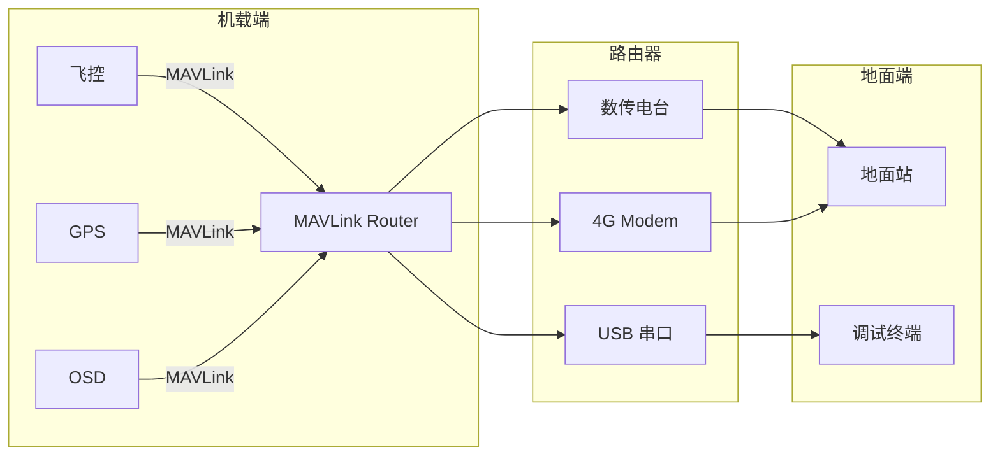

# MAVLink 协议架构

> 预计阅读：30 分钟 | 前置知识：通信协议栈基础、二进制数据处理

---

## 1. MAVLink 协议概述

### 1.1 什么是 MAVLink？

MAVLink（Micro Air Vehicle Link）是一种轻量级的通信协议，专为无人机与地面站之间的通信设计。由 Lorenz Meier 于 2009 年在 ETH Zurich 开发，现已成为开源无人机生态的事实标准。

**MAVLink 的核心特点：**

| 特性 | 说明 | 优势 |
|------|------|------|
| 轻量级 | 头部开销最小仅 8 字节 | 适合低带宽链路 |
| 可靠 | CRC 校验 + 可选签名 | 防止数据损坏 |
| 灵活 | 支持消息扩展和方言 | 适应不同飞控 |
| 跨平台 | C/Python/C++/Java 等 | 广泛支持 |
| 无状态 | 协议本身无连接概念 | 实现简单 |

### 1.2 MAVLink 版本对比

| 特性 | MAVLink v1 | MAVLink v2 |
|------|-----------|-----------|
| 发布年份 | 2009 | 2013 |
| 最小头部 | 8 字节 | 10 字节 |
| 最大消息 ID | 255 | 16,777,216 |
| CRC 校验 | 有 | 有（含签名） |
| 消息签名 | 无 | 有（可选） |
| 消息扩展 | 无 | 有 |
| 兼容性 | 向后兼容 | 向后兼容 v1 |

**推荐使用 MAVLink v2**，除非需要与仅支持 v1 的旧设备通信。

> **相关文档：** [MAVLink 通信编程](./03-MAVLink通信编程.md) | [数据链架构](../03-数据链设计/01-数据链架构.md)

---

## 2. MAVLink 消息格式

### 2.1 MAVLink v1 帧格式

```
MAVLink v1 帧结构:

┌─────────┬──────────┬──────────┬──────────────────┬──────────┐
│ STX     │ LEN      │ SEQ      │ SYS ID │ COMP ID │ MSG ID   │
│ 0xFE    │ 1 byte   │ 1 byte   │ 1 byte │ 1 byte  │ 1 byte   │
├─────────┴──────────┴──────────┴────────┴─────────┴──────────┤
│                                                              │
│                    PAYLOAD (0-255 bytes)                      │
│                                                              │
├──────────────────────────────────────────────────────────────┤
│ CRC (2 bytes)                                                │
└──────────────────────────────────────────────────────────────┘

STX: 起始标记 (0xFE = 254)
LEN: 载荷长度 (0-255)
SEQ: 序列号 (0-255, 用于检测丢包)
SYS ID: 系统 ID (1-255, 通常为飞控 ID)
COMP ID: 组件 ID (1-255, 如飞控=1, GPS=2)
MSG ID: 消息 ID (0-255)
PAYLOAD: 消息数据
CRC: CRC-16/MCRF4XX 校验
```

### 2.2 MAVLink v2 帧格式

```
MAVLink v2 帧结构:

┌─────────┬──────────┬──────────┬────────┬─────────┬──────────────────┐
│ STX     │ LEN      │ SEQ      │ SYS ID │ COMP ID │ MSG ID (3 bytes) │
│ 0xFD    │ 1 byte   │ 1 byte   │ 1 byte │ 1 byte  │ 低-中-高 字节序  │
├─────────┴──────────┴──────────┴────────┴─────────┴──────────────────┤
│ Incompat Flags │ Compat Flags │                                    │
│ 1 byte         │ 1 byte       │                                    │
├────────────────┴──────────────┴────────────────────────────────────┤
│                                                                    │
│                    PAYLOAD (0-255 bytes)                            │
│                                                                    │
│  [可选: 扩展字段 (Extension Fields)]                               │
│                                                                    │
├────────────────────────────────────────────────────────────────────┤
│ CRC (2 bytes)                                                      │
├────────────────────────────────────────────────────────────────────┤
│ SIGNATURE (13 bytes, 可选)                                         │
└────────────────────────────────────────────────────────────────────┘

STX: 起始标记 (0xFD = 253)
LEN: 载荷长度 (0-255)
SEQ: 序列号 (0-255)
SYS ID: 系统 ID
COMP ID: 组件 ID
MSG ID: 消息 ID (0-16,777,216, 3 字节)
Incompat Flags: 不兼容标志位
Compat Flags: 兼容标志位
PAYLOAD: 消息数据 + 可选扩展字段
CRC: CRC 校验（包含消息 ID 和载荷）
SIGNATURE: 可选消息签名
```

### 2.3 字节序

MAVLink 使用**小端序（Little-Endian）**，即低字节在前。

```
示例: 消息 ID = 30 (HEARTBEAT = 0x00001E)

小端序存储: 1E 00 00
            ↑  ↑  ↑
            低 中  高
```

---

## 3. CRC 校验机制

### 3.1 MAVLink CRC 算法

MAVLink 使用 CRC-16/MCRF4XX 算法，初始值为 0xFFFF。

```python
# MAVLink CRC-16 实现
def mavlink_crc(data, start=0xFFFF):
    """计算 MAVLink CRC-16"""
    crc = start
    for byte in data:
        crc ^= byte << 8
        for _ in range(8):
            if crc & 0x8000:
                crc = (crc << 1) ^ 0x1021
            else:
                crc <<= 1
            crc &= 0xFFFF
    return crc
```

### 3.2 CRC 计算过程

```
MAVLink v2 CRC 计算:

1. 初始化 CRC = 0xFFFF
2. 对以下字段计算 CRC:
   - LEN
   - SEQ
   - SYS ID
   - COMP ID
   - MSG ID (低字节、中字节、高字节)
   - Incompat Flags
   - Compat Flags
   - PAYLOAD（全部字节）
3. 再对 "CRC_EXTRA" 字节计算 CRC
4. 最终 CRC 用于校验

CRC_EXTRA: 每个消息类型有一个额外的 CRC 种子字节
用于防止消息 ID 冲突导致的错误解析
```

### 3.3 CRC_EXTRA 计算

CRC_EXTRA 是基于消息定义（名称、字段名、字段类型）计算的 CRC 值。

```python
def calculate_crc_extra(msg_name, fields):
    """计算消息的 CRC_EXTRA"""
    crc = 0xFFFF
    # 包含消息名称
    for char in msg_name:
        crc = mavlink_crc(bytes([ord(char)]), crc)
    # 包含字段类型和名称
    for field_type, field_name in fields:
        for char in field_type:
            crc = mavlink_crc(bytes([ord(char)]), crc)
        for char in field_name:
            crc = mavlink_crc(bytes([ord(char)]), crc)
    return crc & 0xFF
```

---

## 4. 系统 ID 与组件 ID

### 4.1 系统 ID（System ID）

系统 ID 标识一个独立的 MAVLink 系统（如一架无人机、一个地面站）。

| 系统 ID | 说明 |
|---------|------|
| 0 | 保留（GCS 通用） |
| 1-255 | 可用系统 ID |

### 4.2 组件 ID（Component ID）

组件 ID 标识系统内的不同组件。

| 组件 ID | 名称 | 说明 |
|---------|------|------|
| 0 | ALL | 广播 |
| 1 | AUTOPILOT1 | 飞控（主） |
| 100 | GCS | 地面站 |
| 158 | LOG | 日志系统 |
| 190 | OSD | OSD 叠加 |
| 191 | PERIPHERAL | 外设 |
| 200 | UDP_BRIDGE | UDP 桥接 |
| 220 | SYSTEM_CONTROL | 系统控制 |

### 4.3 多系统寻址

```
场景: 2 架无人机 + 1 个地面站

地面站 (SYS=1, COMP=100)
    │
    ├──── 发送到无人机1 (SYS=2, COMP=1)
    │         │
    │         └── 飞控: SYS=2, COMP=1
    │         └── GPS: SYS=2, COMP=2
    │         └── OSD: SYS=2, COMP=190
    │
    └──── 发送到无人机2 (SYS=3, COMP=1)
              │
              └── 飞控: SYS=3, COMP=1
              └── GPS: SYS=3, COMP=2
```

---

## 5. 消息类型分类

### 5.1 消息 ID 范围

| ID 范围 | 分类 | 说明 |
|---------|------|------|
| 0-99 | 通用消息 | HEARTBEAT, SYS_STATUS 等 |
| 100-299 | 飞行状态 | ATTITUDE, GPS, IMU 等 |
| 300-399 | 命令消息 | COMMAND_LONG, COMMAND_INT |
| 400-499 | 任务消息 | MISSION_ITEM, MISSION_REQUEST |
| 500-599 | 参数消息 | PARAM_REQUEST_READ, PARAM_VALUE |
| 600-699 | 文件传输 | FILE_TRANSFER_PROTOCOL |
| 1000-1099 | 遥控输入 | RC_CHANNELS_OVERRIDE |
| 2000-2999 | 高级功能 | 高级命令、扩展消息 |
| 30000-30999 | 自定义消息 | 用户自定义 |

### 5.2 常用消息分类

```mermaid
graph TD
    A[MAVLink 消息] --> B[系统消息]
    A --> C[飞行数据]
    A --> D[命令消息]
    A --> E[任务消息]
    A --> F[参数消息]
    A --> G[调试消息]

    B --> B1[HEARTBEAT]
    B --> B2[SYS_STATUS]
    B --> B3[PROTOCOL_VERSION]

    C --> C1[ATTITUDE]
    C --> C2[GPS_RAW_INT]
    C --> C3[GLOBAL_POSITION_INT]
    C --> C4[RC_CHANNELS]
    C --> C5[BATTERY_STATUS]

    D --> D1[COMMAND_LONG]
    D --> D2[COMMAND_INT]
    D --> D3[COMMAND_ACK]

    E --> E1[MISSION_ITEM]
    E --> E2[MISSION_REQUEST]
    E --> E3[MISSION_ACK]

    F --> F1[PARAM_REQUEST_READ]
    F --> F2[PARAM_VALUE]
    F --> F3[PARAM_SET]

    G --> G1[STATUSTEXT]
    G --> G2[DEBUG]
```



---

## 6. 方言（Dialects）

### 6.1 方言概念

方言是基于 MAVLink 标准消息定义的扩展，允许不同飞控添加自定义消息。

```
MAVLink 消息定义层次:

common.xml          ← 通用消息（所有实现必须支持）
    │
    ├── ardupilotmega.xml   ← ArduPilot 扩展消息
    │       │
    │       └── development.xml  ← ArduPilot 开发中消息
    │
    ├── standard.xml         ← MAVLink 标准扩展
    │
    └── uAvionix.xml         ← uAvionix 设备消息
```

### 6.2 ArduPilot 方言示例

```xml
<!-- ardupilotmega.xml 消息定义示例 -->
<message id="11000" name="SENSOR_OFFSETS">
  <description>Offsets and calibrations for the sensors</description>
  <field type="float" name="mag_ofs_x">Magnetometer X offset</field>
  <field type="float" name="mag_ofs_y">Magnetometer Y offset</field>
  <field type="float" name="mag_ofs_z">Magnetometer Z offset</field>
  <field type="float" name="mag_declination">Magnetic declination</field>
  <field type="uint32_t" name="raw_press">Raw pressure from barometer</field>
  <field type="int32_t" name="raw_temp">Raw temperature from barometer</field>
</message>
```

### 6.3 方言兼容性

```
兼容性矩阵:

GCS (common)  ←──→  飞控 (ardupilotmega)
    │                    │
    ├─ 可解析 common 消息   ├─ 可解析 common 消息
    ├─ 忽略未知消息         ├─ 发送 ardupilotmega 消息
    └─ 向后兼容             └─ 向后兼容

问题: GCS 收到未知消息时如何处理？
方案: 忽略未知消息，不报错
```

---

## 7. 消息路由与转发

### 7.1 MAVLink 路由器

MAVLink 路由器（Router）负责在多个 MAVLink 链路之间转发消息。



### 7.2 路由规则

```
MAVLink 路由规则:

1. 系统内路由: SYS ID 相同的消息在系统内部转发
2. 系统间路由: 不同 SYS ID 的消息转发到外部链路
3. 广播消息: SYS ID = 0 的消息广播到所有链路
4. 心跳转发: HEARTBEAT 消息特殊处理，用于发现

路由表:
┌──────────┬──────────┬──────────┐
│ SYS ID   │ COMP ID  │ 链路     │
├──────────┼──────────┼──────────┤
│ 1        │ *        │ 串口1    │
│ 2        │ *        │ UDP      │
│ 0        │ *        │ 全部     │
└──────────┴──────────┴──────────┘
```

---

## 8. 协议性能分析

### 8.1 带宽需求计算

```
场景: 1Hz HEARTBEAT + 10Hz ATTITUDE + 10Hz GPS_RAW_INT

HEARTBEAT (id=0):
  Payload: 9 bytes
  v2 帧总长: 10 + 9 + 2 + 13 = 34 bytes (含签名)
  1Hz → 34 bytes/s = 272 bits/s

ATTITUDE (id=30):
  Payload: 28 bytes
  v2 帧总长: 10 + 28 + 2 = 40 bytes
  10Hz → 400 bytes/s = 3200 bits/s

GPS_RAW_INT (id=24):
  Payload: 30 bytes
  v2 帧总长: 10 + 30 + 2 = 42 bytes
  10Hz → 420 bytes/s = 3360 bits/s

总带宽需求: 272 + 3200 + 3360 = 6832 bits/s ≈ 7 kbps

考虑重传和开销: 建议预留 15-20 kbps
```

### 8.2 延迟分析

| 链路类型 | 典型延迟 | 主要延迟来源 |
|---------|---------|------------|
| USB 串口 | < 1 ms | 串口波特率 |
| 数传电台（SiK） | 10-50 ms | 空中传输 + 纠错 |
| Wi-Fi | 1-10 ms | CSMA/CA + 协议栈 |
| 4G LTE | 20-100 ms | 网络传输 + 处理 |
| 5G URLLC | 1-10 ms | 网络传输 |

---

## 思考题

1. **MAVLink v2 相比 v1 增加了哪些关键特性？这些特性对无人机通信有什么实际意义？**

2. **为什么 MAVLink 使用 CRC_EXTRA 而不是简单的 CRC 校验？请举例说明 CRC_EXTRA 解决了什么问题。**

3. **设计一个包含 3 架无人机和 1 个地面站的系统，分配系统 ID 和组件 ID，并说明消息路由规则。**

4. **计算一个典型的无人机遥测数据流（包含 HEARTBEAT、ATTITUDE、GPS_RAW_INT、BATTERY_STATUS、RC_CHANNELS）的带宽需求。**

<details>
<summary>参考答案</summary>

**1. MAVLink v2 关键特性：**

- 消息 ID 扩展为 3 字节（最多 1600 万条消息），v1 只有 256 条
- 消息签名（13 字节），防止消息伪造
- 消息扩展字段，允许向现有消息添加新字段而不破坏兼容性
- 不兼容/兼容标志位，支持协议演进

意义：支持更复杂的飞控系统、增强安全性、保持向后兼容性。

**2. CRC_EXTRA 的作用：**

问题：不同消息可能有相同的消息 ID（如不同方言的扩展），或者消息定义变化导致相同 ID 的消息含义不同。

CRC_EXTRA 基于消息的完整定义（字段名、类型、顺序）计算，确保：
- 不同方言的同 ID 消息有不同的 CRC_EXTRA
- 消息定义变化后 CRC_EXTRA 也会变化
- 接收端可以验证消息定义是否匹配

**3. 系统 ID 分配：**

| 设备 | SYS ID | 组件 |
|------|--------|------|
| 地面站 | 255 | COMP=190 (GCS) |
| 无人机 1 | 1 | COMP=1 (飞控), COMP=100 (伴侣电脑) |
| 无人机 2 | 2 | COMP=1 (飞控), COMP=100 (伴侣电脑) |
| 无人机 3 | 3 | COMP=1 (飞控), COMP=100 (伴侣电脑) |

路由规则：地面站发出的消息根据目标 SYS ID 路由到对应无人机。

**4. 带宽计算：**

| 消息 | ID | 载荷 | 帧长 | 频率 | 带宽 |
|------|----|------|------|------|------|
| HEARTBEAT | 0 | 9B | 34B | 1Hz | 272 bps |
| ATTITUDE | 30 | 28B | 40B | 10Hz | 3200 bps |
| GPS_RAW_INT | 24 | 30B | 42B | 10Hz | 3360 bps |
| BATTERY_STATUS | 147 | 36B | 48B | 1Hz | 384 bps |
| RC_CHANNELS | 65 | 42B | 54B | 10Hz | 4320 bps |

总计：约 11.5 kbps，建议预留 20-25 kbps。

</details>
