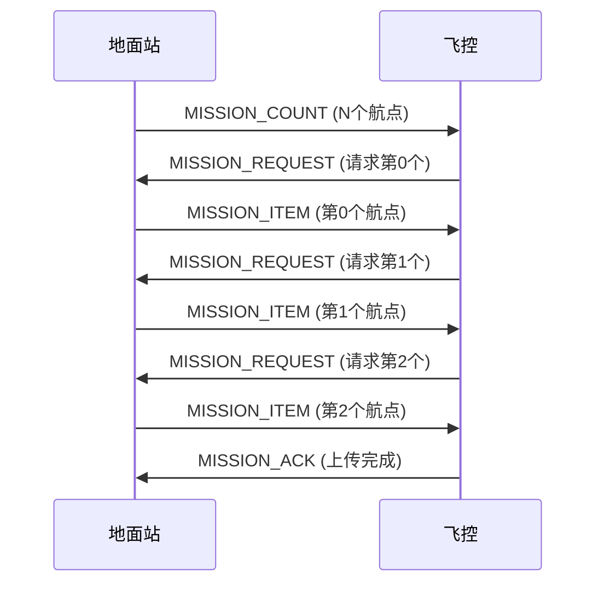
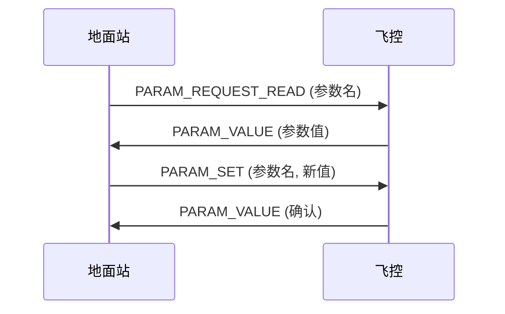

# 任务协议与参数协议

> 预计阅读：30 分钟 | 前置知识：MAVLink 消息类型、MAVLink 通信编程

---

## 1. 任务协议（Mission Protocol）

### 1.1 任务协议概述

任务协议用于上传、下载和管理飞行任务（航点序列）。



### 1.2 任务上传流程

```python
def upload_mission(conn, waypoints):
    """上传飞行任务"""
    
    # 1. 发送任务数量
    conn.mav.mission_count_send(
        conn.target_system,
        conn.target_component,
        len(waypoints)
    )
    
    # 2. 逐个发送航点
    for i, wp in enumerate(waypoints):
        # 等待请求
        req = conn.recv_match(type='MISSION_REQUEST', blocking=True, timeout=5)
        if not req:
            print(f"超时: 未收到航点 {i} 的请求")
            return False
        
        # 发送航点
        conn.mav.mission_item_send(
            conn.target_system,
            conn.target_component,
            i,                    # 序号
            0,                    # 坐标系 (MAV_FRAME)
            wp['command'],        # 命令 (MAV_CMD)
            0,                    # 当前航点
            1,                    # 自动继续
            wp.get('param1', 0),  # 参数1
            wp.get('param2', 0),  # 参数2
            wp.get('param3', 0),  # 参数3
            wp.get('param4', 0),  # 参数4
            wp['lat'],            # 纬度
            wp['lon'],            # 经度
            wp['alt']             # 高度
        )
    
    # 3. 等待确认
    ack = conn.recv_match(type='MISSION_ACK', blocking=True, timeout=5)
    if ack and ack.type == 0:  # MAV_MISSION_ACCEPTED
        print("任务上传成功!")
        return True
    else:
        print(f"任务上传失败: {ack.type if ack else '超时'}")
        return False

# 使用示例
waypoints = [
    {'command': 22, 'lat': 30.1234567, 'lon': 120.1234567, 'alt': 10},  # 起飞
    {'command': 16, 'lat': 30.1235000, 'lon': 120.1235000, 'alt': 20},  # 航点1
    {'command': 16, 'lat': 30.1236000, 'lon': 120.1236000, 'alt': 20},  # 航点2
    {'command': 21, 'lat': 30.1234567, 'lon': 120.1234567, 'alt': 0},   # 降落
]

upload_mission(conn, waypoints)
```

### 1.3 任务下载流程

```python
def download_mission(conn):
    """下载飞行任务"""
    
    # 1. 请求任务列表
    conn.mav.mission_request_list_send(
        conn.target_system,
        conn.target_component
    )
    
    # 2. 获取任务数量
    count_msg = conn.recv_match(type='MISSION_COUNT', blocking=True, timeout=5)
    if not count_msg:
        print("超时: 未收到任务数量")
        return []
    
    count = count_msg.count
    print(f"任务包含 {count} 个航点")
    
    waypoints = []
    
    # 3. 逐个请求航点
    for i in range(count):
        conn.mav.mission_request_send(
            conn.target_system,
            conn.target_component,
            i
        )
        
        item = conn.recv_match(type='MISSION_ITEM', blocking=True, timeout=5)
        if not item:
            print(f"超时: 未收到航点 {i}")
            return waypoints
        
        waypoints.append({
            'seq': item.seq,
            'command': item.command,
            'lat': item.x,
            'lon': item.y,
            'alt': item.z,
            'param1': item.param1,
            'param2': item.param2,
        })
    
    # 4. 发送确认
    conn.mav.mission_ack_send(
        conn.target_system,
        conn.target_component,
        0  # MAV_MISSION_ACCEPTED
    )
    
    print(f"下载完成: {len(waypoints)} 个航点")
    return waypoints
```

### 1.4 常用任务命令

| 命令 ID | 名称 | 说明 | 参数 |
|---------|------|------|------|
| 16 | NAV_WAYPOINT | 飞往航点 | p5=lat, p6=lon, p7=alt |
| 17 | NAV_LOITER_UNLIM | 无限盘旋 | p5=lat, p6=lon, p7=alt |
| 18 | NAV_LOITER_TURNS | 盘旋N圈 | p1=圈数 |
| 19 | NAV_LOITER_TIME | 盘旋N秒 | p1=秒数 |
| 20 | NAV_RETURN_TO_LAUNCH | 返航 | — |
| 21 | NAV_LAND | 降落 | p5=lat, p6=lon |
| 22 | NAV_TAKEOFF | 起飞 | p7=高度 |
| 80 | NAV_LOITER_TO_ALT | 盘旋到高度 | p7=目标高度 |
| 82 | NAV_SPLINE_WAYPOINT | 样条航点 | 平滑曲线 |
| 93 | NAV_DELAY | 延时 | p1=秒数 |
| 112 | NAV_CONDITION_YAW | 设置航向 | p1=角度 |
| 115 | CONDITION_CHANGE_ALT | 改变高度 | p1=高度 |
| 178 | DO_CHANGE_SPEED | 改变速度 | p1=类型, p2=速度 |
| 183 | DO_SET_SERVO | 设置舵机 | p1=通道, p2=PWM |
| 201 | DO_DIGICAM_CONTROL | 相机控制 | — |
| 206 | DO_SET_CAM_TRIGG_DIST | 相机触发距离 | p1=距离 |

### 1.5 任务坐标系

| 坐标系 | 常量 | 说明 |
|--------|------|------|
| MAV_FRAME_GLOBAL | 0 | 全球坐标（WGS84），海拔高度 |
| MAV_FRAME_LOCAL_NED | 1 | 本地 NED 坐标 |
| MAV_FRAME_MISSION | 2 | 任务坐标系 |
| MAV_FRAME_GLOBAL_RELATIVE_ALT | 3 | 全球坐标，相对高度 |
| MAV_FRAME_LOCAL_ENU | 4 | 本地 ENU 坐标 |
| MAV_FRAME_GLOBAL_INT | 5 | 全球坐标（整数） |
| MAV_FRAME_GLOBAL_RELATIVE_ALT_INT | 6 | 全球相对高度（整数） |

---

## 2. 参数协议（Parameter Protocol）

### 2.1 参数协议概述

参数协议用于读取和修改飞控的配置参数。



### 2.2 参数读取

```python
def get_param(conn, param_name):
    """读取飞控参数"""
    conn.mav.param_request_read_send(
        conn.target_system,
        conn.target_component,
        param_name.encode('utf-8'),
        -1  # -1 表示按名称查找
    )
    
    msg = conn.recv_match(type='PARAM_VALUE', blocking=True, timeout=3)
    if msg:
        return msg.param_value
    return None

# 使用示例
altitude = get_param(conn, 'ALT_HOLD_RTL')
print(f"返航高度: {altitude}m")
```

### 2.3 参数设置

```python
def set_param(conn, param_name, value, param_type=None):
    """设置飞控参数"""
    if param_type is None:
        # 自动检测类型
        if isinstance(value, int):
            param_type = 6  # MAV_PARAM_TYPE_UINT32
        else:
            param_type = 9  # MAV_PARAM_TYPE_REAL32
    
    conn.mav.param_set_send(
        conn.target_system,
        conn.target_component,
        param_name.encode('utf-8'),
        float(value),
        param_type
    )
    
    # 等待确认
    msg = conn.recv_match(type='PARAM_VALUE', blocking=True, timeout=3)
    if msg:
        print(f"参数 {param_name} 已设置为 {msg.param_value}")
        return True
    return False

# 使用示例
set_param(conn, 'ALT_HOLD_RTL', 50.0)  # 设置返航高度为 50m
```

### 2.4 批量参数操作

```python
def get_all_params(conn):
    """获取所有参数"""
    conn.mav.param_request_list_send(
        conn.target_system,
        conn.target_component
    )
    
    params = {}
    while True:
        msg = conn.recv_match(type='PARAM_VALUE', blocking=True, timeout=5)
        if msg:
            params[msg.param_id] = msg.param_value
            # 检查是否接收完所有参数
            if len(params) >= msg.param_count:
                break
        else:
            break
    
    return params

# 使用示例
all_params = get_all_params(conn)
print(f"共 {len(all_params)} 个参数")
for name, value in sorted(all_params.items()):
    print(f"  {name} = {value}")
```

### 2.5 常用飞控参数

#### ArduCopter 参数

| 参数名 | 说明 | 默认值 | 范围 |
|--------|------|--------|------|
| ALT_HOLD_RTL | 返航高度 (m) | 15 | 2-1000 |
| RTL_SPEED | 返航速度 (m/s) | 5 | 1-20 |
| WPNAV_SPEED | 航点飞行速度 (cm/s) | 500 | 20-2000 |
| WPNAV_RADIUS | 航点接受半径 (cm) | 200 | 10-1000 |
| FENCE_ENABLE | 地理围栏使能 | 0 | 0/1 |
| FENCE_ALT_MAX | 围栏最大高度 (m) | 100 | 10-1000 |
| FENCE_RADIUS | 围栏半径 (m) | 300 | 30-10000 |
| BATT_LOW_VOLT | 低电压警告 (V) | 10.5 | 6-100 |
| BATT_CRT_VOLT | 临界电压 (V) | 10.0 | 6-100 |
| FS_THRTL_ENABLE | 油门失控保护 | 1 | 0/1 |

#### PX4 参数

| 参数名 | 说明 | 默认值 |
|--------|------|--------|
| RTL_RETURN_ALT | 返航高度 (m) | 60 |
| MIS_DIST_WPS | 航点接受半径 (m) | 900 |
| MPC_XY_CRUISE | 水平巡航速度 (m/s) | 5 |
| COM_RC_LOSS_T | 遥控丢失超时 (s) | 0.5 |
| NAV_GPSF_LT | GPS 失效超时 (s) | 30 |

---

## 3. FTP 协议（File Transfer Protocol）

### 3.1 MAVLink FTP 概述

MAVLink FTP 用于在地面站和飞控之间传输文件（如参数文件、日志文件）。

```python
# FTP 操作通过 FILE_TRANSFER_PROTOCOL 消息实现
FILE_TRANSFER_PROTOCOL = {
    "id": 110,
    "fields": [
        {"name": "target_network",   "type": "uint8_t"},
        {"name": "target_system",    "type": "uint8_t"},
        {"name": "target_component", "type": "uint8_t"},
        {"name": "payload",          "type": "uint8_t[251]"},
    ]
}
```

### 3.2 FTP 操作码

| 操作码 | 名称 | 说明 |
|--------|------|------|
| 0 | None | 空操作 |
| 1 | TerminateSession | 终止会话 |
| 2 | ResetSessions | 重置所有会话 |
| 3 | ListDirectory | 列出目录 |
| 4 | OpenFileRO | 只读打开文件 |
| 5 | ReadFile | 读取文件 |
| 6 | CreateFile | 创建文件 |
| 7 | WriteFile | 写入文件 |
| 8 | RemoveFile | 删除文件 |
| 9 | CreateDirectory | 创建目录 |
| 10 | RemoveDirectory | 删除目录 |
| 11 | OpenFileWO | 写打开文件 |
| 12 | TruncateFile | 截断文件 |
| 13 | Rename | 重命名 |
| 14 | CalcFileCRC32 | 计算 CRC32 |

### 3.3 FTP 使用示例

```python
# 使用 MAVProxy 的 FTP 功能
# 或使用 pymavlink 的 mavftp 模块

# 列出目录
def ftp_list_directory(conn, path):
    """列出飞控上的目录"""
    # 构造 FTP 请求
    payload = bytearray(251)
    payload[0] = 3  # ListDirectory
    payload[1] = 0  # session
    payload[2] = 0  # offset
    payload[3:3+len(path)] = path.encode()
    
    conn.mav.file_transfer_protocol_send(
        0,  # target_network
        conn.target_system,
        conn.target_component,
        payload
    )
    
    # 等待响应
    msg = conn.recv_match(type='FILE_TRANSFER_PROTOCOL', 
                         blocking=True, timeout=5)
    if msg:
        # 解析目录列表
        data = bytes(msg.payload)
        return parse_ftp_list(data)
    return None
```

---

## 4. 完整任务管理示例

### 4.1 任务管理类

```python
class MissionManager:
    """MAVLink 任务管理器"""
    
    def __init__(self, conn):
        self.conn = conn
    
    def upload(self, waypoints):
        """上传任务"""
        conn = self.conn
        
        # 发送任务数量
        conn.mav.mission_count_send(
            conn.target_system,
            conn.target_component,
            len(waypoints)
        )
        
        # 逐个发送
        for i, wp in enumerate(waypoints):
            req = conn.recv_match(type='MISSION_REQUEST', 
                                blocking=True, timeout=5)
            if not req:
                return False, f"航点 {i} 请求超时"
            
            conn.mav.mission_item_send(
                conn.target_system,
                conn.target_component,
                i, 0, wp['command'], 0, 1,
                wp.get('param1', 0),
                wp.get('param2', 0),
                wp.get('param3', 0),
                wp.get('param4', 0),
                wp['lat'], wp['lon'], wp['alt']
            )
        
        ack = conn.recv_match(type='MISSION_ACK', blocking=True, timeout=5)
        if ack and ack.type == 0:
            return True, "上传成功"
        return False, f"上传失败: {ack.type if ack else '超时'}"
    
    def download(self):
        """下载任务"""
        conn = self.conn
        
        conn.mav.mission_request_list_send(
            conn.target_system,
            conn.target_component
        )
        
        count_msg = conn.recv_match(type='MISSION_COUNT', 
                                   blocking=True, timeout=5)
        if not count_msg:
            return None, "获取任务数量超时"
        
        waypoints = []
        for i in range(count_msg.count):
            conn.mav.mission_request_send(
                conn.target_system,
                conn.target_component,
                i
            )
            
            item = conn.recv_match(type='MISSION_ITEM', 
                                  blocking=True, timeout=5)
            if not item:
                return waypoints, f"航点 {i} 下载超时"
            
            waypoints.append({
                'seq': item.seq,
                'command': item.command,
                'lat': item.x,
                'lon': item.y,
                'alt': item.z,
            })
        
        conn.mav.mission_ack_send(
            conn.target_system, conn.target_component, 0
        )
        
        return waypoints, "下载成功"
    
    def clear(self):
        """清除所有任务"""
        conn = self.conn
        conn.mav.mission_clear_all_send(
            conn.target_system,
            conn.target_component
        )
        
        ack = conn.recv_match(type='MISSION_ACK', blocking=True, timeout=5)
        if ack and ack.type == 0:
            return True, "清除成功"
        return False, "清除失败"
    
    def start(self):
        """开始执行任务"""
        conn = self.conn
        conn.mav.command_long_send(
            conn.target_system,
            conn.target_component,
            mavutil.mavlink.MAV_CMD_MISSION_START,
            0, 0, 0, 0, 0, 0, 0, 0
        )
    
    def set_current(self, seq):
        """设置当前航点"""
        conn = self.conn
        conn.mav.mission_set_current_send(
            conn.target_system,
            conn.target_component,
            seq
        )

# 使用示例
manager = MissionManager(conn)

# 上传任务
waypoints = [
    {'command': 22, 'lat': 30.123, 'lon': 120.456, 'alt': 10},
    {'command': 16, 'lat': 30.124, 'lon': 120.457, 'alt': 20},
    {'command': 16, 'lat': 30.125, 'lon': 120.458, 'alt': 20},
    {'command': 21, 'lat': 30.123, 'lon': 120.456, 'alt': 0},
]
success, msg = manager.upload(waypoints)
print(msg)

# 开始任务
manager.start()
```

---

## 思考题

1. **任务上传过程中，如果某个航点的 MISSION_REQUEST 超时，应该如何处理？设计一个重传机制。**

2. **参数协议中，为什么 PARAM_VALUE 消息需要包含 param_count 字段？**

3. **MAVLink FTP 与标准 FTP 协议有什么区别？为什么需要一个专门的文件传输协议？**

4. **编写一个程序，实现从飞控下载任务、修改某个航点的高度、重新上传的功能。**

5. **在什么情况下需要使用 MAV_FRAME_GLOBAL_RELATIVE_ALT 而不是 MAV_FRAME_GLOBAL？**

<details>
<summary>参考答案</summary>

**1. 航点请求超时处理：**

- 重试 3 次：每次超时后重新发送 MISSION_COUNT
- 指数退避：每次重试间隔加倍
- 最终失败：如果 3 次都失败，返回错误
- 记录日志：记录失败的航点编号

**2. param_count 的作用：**

- 接收端知道总共有多少个参数
- 可以计算接收进度（已接收/总数）
- 知道何时所有参数都接收完毕
- 支持进度条显示

**3. MAVLink FTP vs 标准 FTP：**

| 特性 | MAVLink FTP | 标准 FTP |
|------|------------|---------|
| 传输层 | MAVLink 消息 | TCP |
| 复杂度 | 简单 | 复杂 |
| 功能 | 基本文件操作 | 完整文件管理 |
| 适用场景 | 嵌入式系统 | 通用计算机 |
| 带宽 | 低 | 高 |
| 可靠性 | 应用层重传 | TCP 保证 |

**4. 修改航点高度程序：**

```python
manager = MissionManager(conn)
waypoints, msg = manager.download()
if waypoints:
    # 修改第二个航点高度
    waypoints[1]['alt'] = 30
    success, msg = manager.upload(waypoints)
    print(msg)
```

**5. RELATIVE_ALT 的使用场景：**

- 起飞点高度不确定时（如移动平台）
- 需要相对于起飞点飞行时
- 地形起伏较大时
- 避障需要相对高度时

绝对高度适合：跨区域飞行、需要精确海拔时。

</details>
