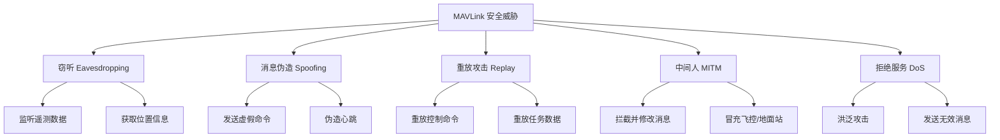
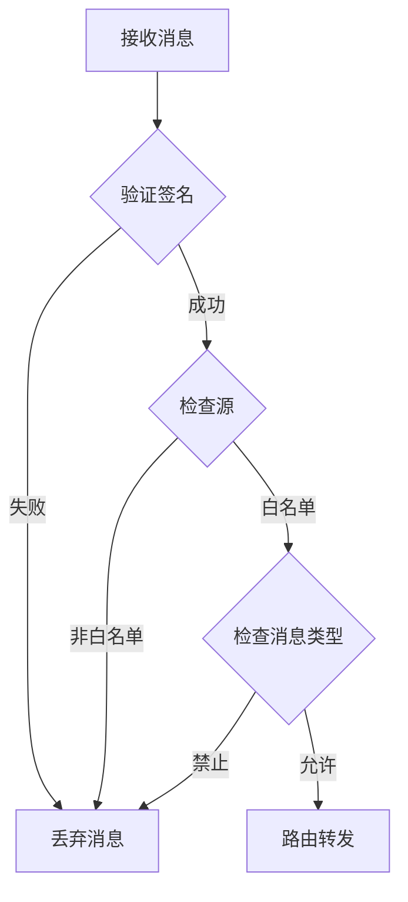

# MAVLink 安全与扩展

> 预计阅读：25 分钟 | 前置知识：MAVLink 协议架构、加密基础概念

---

## 1. MAVLink 安全威胁

### 1.1 安全威胁分类



### 1.2 攻击场景分析

| 攻击类型 | 风险等级 | 影响 | 防御难度 |
|---------|---------|------|---------|
| 窃听 | 中 | 信息泄露 | 低 |
| 消息伪造 | 高 | 失控、坠机 | 中 |
| 重放攻击 | 高 | 重复执行命令 | 中 |
| 中间人 | 高 | 数据篡改 | 高 |
| DoS | 中 | 通信中断 | 中 |

---

## 2. MAVLink 签名机制

### 2.1 签名概述

MAVLink v2 支持可选的消息签名（Signing），用于防止消息伪造和重放攻击。

```
MAVLink v2 签名字段（13 字节）:

┌─────────────────────────────────────────────────┐
│ LINK_ID │ TIMESTAMP │ SIGNATURE (6 bytes)       │
│ 1 byte  │ 6 bytes   │ HMAC-SHA256 (截断)        │
└─────────────────────────────────────────────────┘

LINK_ID: 链路标识符
TIMESTAMP: 时间戳（防止重放攻击）
SIGNATURE: HMAC-SHA256 签名（截断为 6 字节）
```

### 2.2 签名密钥

签名使用 32 字节的共享密钥（Secret Key）。

```python
# 签名密钥示例（32 字节）
SECRET_KEY = bytes([
    0x21, 0x45, 0x67, 0x89, 0xAB, 0xCD, 0xEF, 0x01,
    0x23, 0x45, 0x67, 0x89, 0xAB, 0xCD, 0xEF, 0x01,
    0x23, 0x45, 0x67, 0x89, 0xAB, 0xCD, 0xEF, 0x01,
    0x23, 0x45, 0x67, 0x89, 0xAB, 0xCD, 0xEF, 0x01
])
```

### 2.3 签名算法

```python
import hashlib
import hmac

def compute_signature(key, msg_bytes, link_id, timestamp):
    """计算 MAVLink 消息签名"""
    # 构造签名输入
    sig_input = bytearray()
    sig_input.append(link_id)
    sig_input.extend(timestamp.to_bytes(8, 'little'))
    sig_input.extend(msg_bytes)
    
    # HMAC-SHA256
    sig = hmac.new(key, sig_input, hashlib.sha256).digest()
    
    # 截断为 6 字节
    return sig[:6]

def verify_signature(key, msg_bytes, link_id, timestamp, signature):
    """验证 MAVLink 消息签名"""
    expected = compute_signature(key, msg_bytes, link_id, timestamp)
    return hmac.compare_digest(expected, signature)
```

### 2.4 时间戳机制

MAVLink 签名使用 48 位时间戳，单位为 10 微秒。

```python
import time

def get_timestamp():
    """获取 MAVLink 签名时间戳"""
    # 从某个固定时间点开始的 10 微秒数
    # 通常使用 Unix 时间戳 × 100
    return int(time.time() * 100000) & 0xFFFFFFFFFFFF  # 48 位

def check_timestamp(last_timestamp, current_timestamp, tolerance=10000):
    """检查时间戳是否在可接受范围内"""
    # tolerance: 10000 × 10μs = 100ms
    return abs(current_timestamp - last_timestamp) < tolerance
```

---

## 3. 签名实现

### 3.1 pymavlink 签名支持

```python
from pymavlink import mavutil

# 创建带签名的连接
conn = mavutil.mavlink_connection(
    'udp:127.0.0.1:14550',
    signing=True,
    secret_key=bytes(32)  # 32 字节密钥
)

# 发送带签名的消息
conn.mav.heartbeat_send(
    mavutil.mavlink.MAV_TYPE_QUADROTOR,
    mavutil.mavlink.MAV_AUTOPILOT_ARDUPILOTMEGA,
    0, 0, 0
)

# 接收并验证签名
msg = conn.recv_match(blocking=True, timeout=3)
if msg:
    if msg.get_signed():
        print("消息已签名")
        if msg.check_signature():
            print("签名验证通过")
        else:
            print("签名验证失败!")
    else:
        print("消息未签名")
```

### 3.2 签名配置

```python
# ArduPilot 签名参数
# 需要在飞控中设置以下参数：

# 启用签名
set_param(conn, 'MAV_SIGN_ENABLE', 1)

# 设置密钥（需要通过安全通道传输）
# 通常使用 MAV_CMD_SET_MESSAGE_INTERVAL 或专用命令

# 签名超时时间（秒）
set_param(conn, 'MAV_SIGN_TIMEOUT', 10)
```

---

## 4. 消息认证与完整性

### 4.1 CRC 完整性校验

MAVLink 的 CRC 校验提供基本的完整性保护。

```python
def verify_crc(msg_bytes):
    """验证 MAVLink 消息 CRC"""
    if len(msg_bytes) < 8:
        return False
    
    # 提取 CRC
    received_crc = msg_bytes[-2] | (msg_bytes[-1] << 8)
    
    # 计算 CRC
    computed_crc = mavlink_crc(msg_bytes[:-2])
    
    return received_crc == computed_crc
```

### 4.2 消息序列号检查

```python
class SequenceChecker:
    """消息序列号检查器"""
    
    def __init__(self):
        self.last_seq = {}
        self.lost_count = 0
        self.received_count = 0
    
    def check(self, sys_id, comp_id, seq):
        """检查序列号连续性"""
        key = (sys_id, comp_id)
        self.received_count += 1
        
        if key in self.last_seq:
            expected = (self.last_seq[key] + 1) % 256
            if seq != expected:
                gap = (seq - expected) % 256
                self.lost_count += gap
                print(f"序列号跳变: expected={expected}, got={seq}, gap={gap}")
        
        self.last_seq[key] = seq
    
    def get_loss_rate(self):
        """获取丢包率"""
        total = self.received_count + self.lost_count
        if total == 0:
            return 0.0
        return self.lost_count / total * 100
```

---

## 5. 自定义消息

### 5.1 自定义消息定义

MAVLink 支持用户自定义消息，用于扩展协议功能。

```xml
<!-- custom_dialect.xml -->
<?xml version="1.0"?>
<mavlink>
  <messages>
    <message id="60000" name="CUSTOM_BATTERY_INFO">
      <description>自定义电池信息</description>
      <field type="uint32_t" name="cell_count">电池节数</field>
      <field type="float" name="cell_voltage[6]">每节电压 (V)</field>
      <field type="float" name="temperature">温度 (°C)</field>
      <field type="uint32_t" name="cycle_count">充放电次数</field>
      <field type="float" name="capacity_remaining">剩余容量 (mAh)</field>
    </message>

    <message id="60001" name="CUSTOM_OBSTACLE">
      <description>障碍物检测信息</description>
      <field type="float" name="distance">距离 (m)</field>
      <field type="float" name="angle">角度 (rad)</field>
      <field type="uint8_t" name="type">障碍物类型</field>
      <field type="float" name="confidence">置信度 (0-1)</field>
    </message>

    <message id="60002" name="CUSTOM_SWARM_STATUS">
      <description>集群状态信息</description>
      <field type="uint8_t" name="swarm_id">集群 ID</field>
      <field type="uint8_t" name="node_count">节点数量</field>
      <field type="float" name="formation_x[10]">编队 X 坐标</field>
      <field type="float" name="formation_y[10]">编队 Y 坐标</field>
      <field type="float" name="formation_z[10]">编队 Z 坐标</field>
    </message>
  </messages>
</mavlink>
```

### 5.2 生成自定义消息库

```bash
# 使用 mavgenerate 工具生成 C/Python 库
python -m pymavlink.tools.mavgenerate \
    --lang=Python \
    --wire-protocol=2.0 \
    --output=custom_mavlink \
    custom_dialect.xml

# 或使用 mavlink 仓库的工具
cd mavlink
python -m pymavlink.tools.mavgen \
    --lang=Python \
    --wire-protocol=2.0 \
    --output=custom_mavlink \
    message_definitions/v1.0/custom_dialect.xml
```

### 5.3 使用自定义消息

```python
# 导入自定义消息库
from custom_mavlink import mavlink

# 发送自定义消息
def send_custom_battery_info(conn, cell_voltages, temperature):
    """发送自定义电池信息"""
    conn.mav.custom_battery_info_send(
        len(cell_voltages),           # cell_count
        cell_voltages + [0.0] * (6 - len(cell_voltages)),  # cell_voltage
        temperature,                   # temperature
        100,                          # cycle_count
        5000.0                        # capacity_remaining
    )

# 接收自定义消息
msg = conn.recv_match(type='CUSTOM_BATTERY_INFO', blocking=True)
if msg:
    print(f"电池节数: {msg.cell_count}")
    print(f"温度: {msg.temperature}°C")
```

---

## 6. MAVLink 路由与安全

### 6.1 安全路由策略



### 6.2 白名单机制

```python
class SecureRouter:
    """安全 MAVLink 路由器"""
    
    def __init__(self):
        # 允许的系统 ID
        self.allowed_systems = {1, 2, 3}  # 3 架无人机
        # 允许的消息类型
        self.allowed_messages = {
            'HEARTBEAT', 'ATTITUDE', 'GPS_RAW_INT',
            'BATTERY_STATUS', 'SYS_STATUS',
            'COMMAND_LONG', 'COMMAND_ACK',
            'MISSION_ITEM', 'MISSION_REQUEST',
        }
        # 禁止的消息类型（安全敏感）
        self.blocked_messages = {
            'RC_CHANNELS_OVERRIDE',  # 遥控覆盖
            'MANUAL_CONTROL',        # 手动控制
        }
    
    def should_forward(self, msg):
        """判断是否应该转发消息"""
        # 检查系统 ID
        if msg.get_srcSystem() not in self.allowed_systems:
            return False
        
        # 检查消息类型
        msg_type = msg.get_type()
        if msg_type in self.blocked_messages:
            return False
        
        if msg_type not in self.allowed_messages:
            return False
        
        return True
```

---

## 7. 安全最佳实践

### 7.1 安全检查清单

```
MAVLink 安全检查清单:

□ 启用消息签名（生产环境必选）
□ 使用强随机密钥（32 字节）
□ 密钥通过安全通道分发
□ 启用时间戳检查（防重放）
□ 设置合理的超时时间
□ 使用白名单限制消息类型
□ 限制系统 ID 访问权限
□ 监控异常消息模式
□ 定期轮换密钥
□ 记录安全事件日志
□ 测试故障恢复机制
```

### 7.2 密钥管理

```python
import os
import json

class KeyManager:
    """MAVLink 密钥管理器"""
    
    def __init__(self, key_file='mavlink_keys.json'):
        self.key_file = key_file
        self.keys = {}
    
    def generate_key(self):
        """生成随机密钥"""
        return os.urandom(32)
    
    def save_key(self, system_id, key):
        """保存密钥"""
        self.keys[system_id] = key.hex()
        with open(self.key_file, 'w') as f:
            json.dump(self.keys, f)
    
    def load_key(self, system_id):
        """加载密钥"""
        with open(self.key_file, 'r') as f:
            self.keys = json.load(f)
        return bytes.fromhex(self.keys[system_id])
    
    def rotate_keys(self):
        """轮换所有密钥"""
        for sys_id in self.keys:
            self.keys[sys_id] = self.generate_key().hex()
        with open(self.key_file, 'w') as f:
            json.dump(self.keys, f)

# 使用示例
km = KeyManager()
key = km.generate_key()
km.save_key(system_id=1, key=key)
```

### 7.3 异常检测

```python
class AnomalyDetector:
    """MAVLink 异常检测器"""
    
    def __init__(self):
        self.message_rates = {}
        self.last_check = time.time()
        self.alerts = []
    
    def check_rate(self, msg_type, max_rate):
        """检查消息频率"""
        now = time.time()
        if msg_type not in self.message_rates:
            self.message_rates[msg_type] = []
        
        self.message_rates[msg_type].append(now)
        
        # 清理旧记录
        cutoff = now - 1.0  # 1 秒窗口
        self.message_rates[msg_type] = [
            t for t in self.message_rates[msg_type] if t > cutoff
        ]
        
        current_rate = len(self.message_rates[msg_type])
        if current_rate > max_rate:
            alert = f"消息 {msg_type} 频率异常: {current_rate}/s > {max_rate}/s"
            self.alerts.append(alert)
            return False
        return True
    
    def check_sequence(self, sys_id, seq):
        """检查序列号异常"""
        # 实现序列号检查
        pass
    
    def check_signature(self, msg):
        """检查签名异常"""
        if msg.get_signed():
            if not msg.check_signature():
                self.alerts.append(f"签名验证失败: SYS={msg.get_srcSystem()}")
                return False
        return True
```

---

## 思考题

1. **MAVLink 签名机制如何防止重放攻击？时间戳的作用是什么？**

2. **为什么 MAVLink 签名使用 HMAC-SHA256 而不是 RSA 或 AES？**

3. **在无人机集群通信中，如何管理多个节点的签名密钥？设计一个密钥分发方案。**

4. **自定义消息的 ID 范围为什么是 60000-69999？这个设计有什么好处？**

5. **如果一个恶意节点发送大量 HEARTBEAT 消息，会对系统造成什么影响？如何防御？**

<details>
<summary>参考答案</summary>

**1. 签名防重放机制：**

- 时间戳：每个签名消息包含 48 位时间戳（10μs 精度）
- 接收端检查：收到消息后，检查时间戳是否在合理范围内
- 滑动窗口：维护最近的时间戳记录，拒绝重复的时间戳
- 超时丢弃：时间戳与当前时间差超过阈值的消息被丢弃

**2. 选择 HMAC-SHA256 的原因：**

- HMAC：基于哈希的消息认证码，计算效率高
- SHA256：安全性足够，抗碰撞性强
- 对称密钥：适合嵌入式系统（计算资源有限）
- 截断为 6 字节：平衡安全性和带宽开销

RSA/AES 的问题：
- RSA：非对称加密，计算量大，不适合实时通信
- AES：需要加密/解密，增加延迟和复杂度

**3. 集群密钥管理方案：**

- 预共享密钥：所有节点使用相同密钥（简单但不灵活）
- 分层密钥：集群主节点分发子密钥
- 动态密钥：通过安全通道（如蓝牙）交换密钥
- 证书机制：每个节点有数字证书，通过 CA 验证

**4. 自定义消息 ID 范围设计：**

- 60000-69999：避免与标准消息冲突
- 保留空间：为不同组织/项目保留独立的 ID 段
- 向后兼容：标准实现会忽略未知消息 ID
- 便于识别：一眼可以看出是自定义消息

**5. HEARTBEAT 洪泛攻击影响与防御：**

影响：
- 消耗带宽和处理资源
- 可能导致合法心跳被延迟
- 干扰系统状态判断

防御：
- 心跳频率限制（如每系统最多 2Hz）
- 系统 ID 白名单
- 异常检测（频率突增告警）
- 签名验证（拒绝未签名心跳）

</details>
