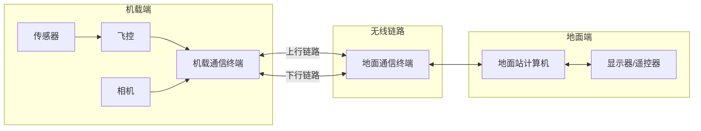
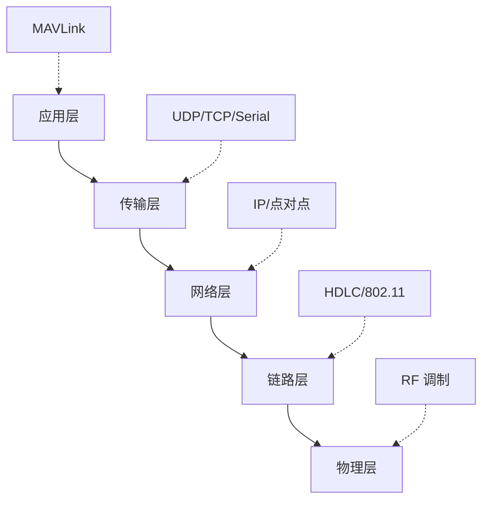
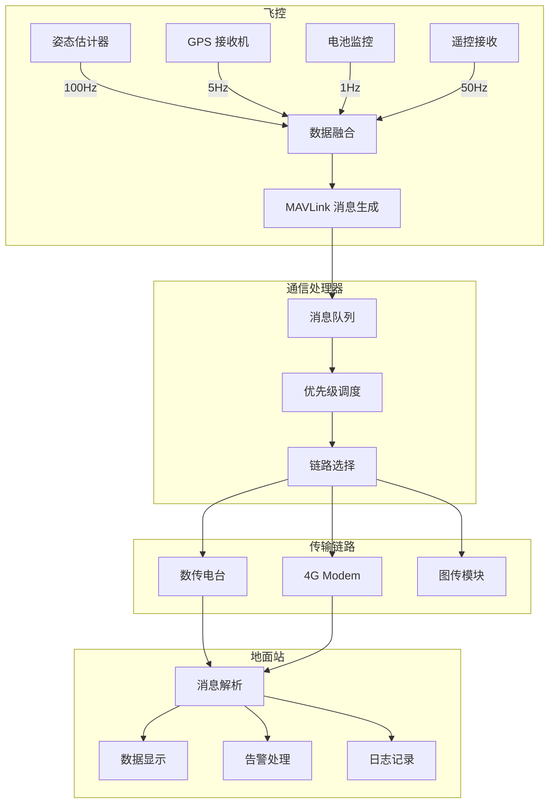
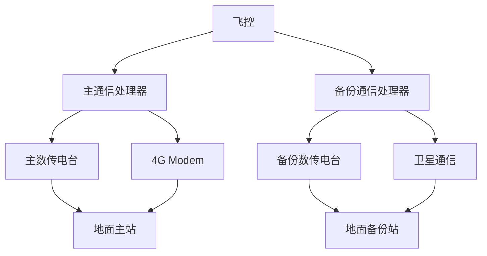
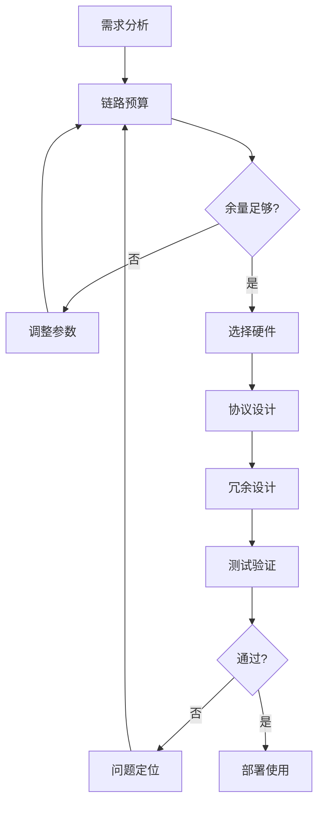

# 数据链架构

> 预计阅读：30 分钟 | 前置知识：通信基础理论、MAVLink 协议

> **相关文档：** [数传电台选型](./02-数传电台选型.md) | [MAVLink 协议架构](../02-MAVLink协议/01-MAVLink协议架构.md)

---

## 1. 数据链概述

### 1.1 什么是数据链

数据链（Data Link）是连接无人机与地面站的通信系统，负责传输控制指令、遥测数据和任务信息。



### 1.2 数据链功能

| 功能 | 方向 | 数据类型 | 典型速率 |
|------|------|---------|---------|
| 遥控指令 | 上行 | 控制命令 | 1-10 kbps |
| 任务上传 | 上行 | 航点、参数 | 1-50 kbps |
| 遥测数据 | 下行 | GPS、姿态、状态 | 5-50 kbps |
| 视频回传 | 下行 | 实时视频 | 1-20 Mbps |
| 文件传输 | 双向 | 日志、固件 | 可变 |

### 1.3 上行链路 vs 下行链路

```
上行链路（Uplink / Command Link）:
──────────────────────────────────────────
地面站 ──→ 无人机

数据内容:
├── 遥控指令（RC Override）
├── 飞行模式切换
├── 航点任务
├── 参数设置
└── 紧急命令（返航、降落）

特点:
├── 数据量小（几 kbps）
├── 实时性要求高（< 50ms）
├── 可靠性要求极高
└── 优先级高于下行


下行链路（Downlink / Telemetry Link）:
──────────────────────────────────────────
无人机 ──→ 地面站

数据内容:
├── GPS 位置
├── 姿态数据
├── 电池状态
├── 系统状态
├── 视频流
└── 调试信息

特点:
├── 数据量大（视频 Mbps 级）
├── 实时性要求中等
├── 可靠性要求高
└── 可容忍少量丢包
```

---

## 2. 数据链分层架构

### 2.1 五层数据链架构



### 2.2 各层详细设计

| 层次 | 功能 | 典型协议 | 设计考虑 |
|------|------|---------|---------|
| 应用层 | 消息格式、命令解析 | MAVLink | 轻量、可靠、可扩展 |
| 传输层 | 端到端传输 | UDP/TCP/Serial | 延迟、可靠性、流量控制 |
| 网络层 | 寻址、路由 | IP/点对点 | 多机寻址、路由效率 |
| 链路层 | 帧同步、差错控制 | HDLC/802.11 | 误码率、吞吐量 |
| 物理层 | 调制解调、射频 | GFSK/OFDM | 距离、带宽、功耗 |

### 2.3 协议栈实现示例

```
典型数传电台协议栈:

应用层:   MAVLink v2 (消息序列化)
          │
传输层:   无（直接映射到链路层）
          │
链路层:   SiK Radio Protocol (帧格式、CRC)
          │
物理层:   GFSK 调制, 900MHz, 跳频
          │
          ▼
       RF 信号


典型 4G 遥测协议栈:

应用层:   MAVLink v2
          │
传输层:   UDP
          │
网络层:   IPv4
          │
链路层:   LTE PDCP/RLC/MAC
          │
物理层:   OFDMA
          │
          ▼
       RF 信号
```

---

## 3. 遥测数据流设计

### 3.1 数据流架构



### 3.2 消息优先级

| 优先级 | 消息类型 | 发送频率 | 最大延迟 |
|--------|---------|---------|---------|
| 0（最高） | HEARTBEAT | 1 Hz | 1s |
| 1 | COMMAND_ACK | 按需 | 100ms |
| 2 | ATTITUDE | 10 Hz | 100ms |
| 2 | GPS_RAW_INT | 5 Hz | 200ms |
| 3 | SYS_STATUS | 1 Hz | 500ms |
| 3 | BATTERY_STATUS | 1 Hz | 500ms |
| 4 | RC_CHANNELS | 5 Hz | 200ms |
| 5 | STATUSTEXT | 按需 | 1s |
| 6 | 调试消息 | 按需 | 2s |

### 3.3 数据压缩

```python
# 姿态数据压缩示例
def compress_attitude(roll, pitch, yaw):
    """压缩姿态数据为 6 字节"""
    # 角度范围: -180 到 180 度
    # 精度: 0.01 度
    roll_int = int((roll + 180) * 100)  # 0-36000
    pitch_int = int((pitch + 180) * 100)
    yaw_int = int((yaw + 180) * 100)
    
    # 打包为 6 字节
    data = bytearray(6)
    data[0:2] = roll_int.to_bytes(2, 'little')
    data[2:4] = pitch_int.to_bytes(2, 'little')
    data[4:6] = yaw_int.to_bytes(2, 'little')
    
    return data

def decompress_attitude(data):
    """解压缩姿态数据"""
    roll_int = int.from_bytes(data[0:2], 'little')
    pitch_int = int.from_bytes(data[2:4], 'little')
    yaw_int = int.from_bytes(data[4:6], 'little')
    
    roll = roll_int / 100 - 180
    pitch = pitch_int / 100 - 180
    yaw = yaw_int / 100 - 180
    
    return roll, pitch, yaw
```

---

## 4. 冗余设计

### 4.1 链路冗余架构



### 4.2 冗余策略

| 策略 | 实现方式 | 切换时间 | 适用场景 |
|------|---------|---------|---------|
| 热备份 | 双链路同时工作 | 0ms | 高可靠性需求 |
| 温备份 | 备用链路待命 | < 1s | 一般可靠性需求 |
| 冷备份 | 备用链路按需启动 | 5-30s | 低可靠性需求 |
| 负载均衡 | 双链路分担负载 | N/A | 高带宽需求 |

### 4.3 链路切换逻辑

```python
class LinkManager:
    """链路管理器"""
    
    def __init__(self):
        self.primary_link = None
        self.backup_link = None
        self.active_link = None
        self.switch_threshold = 3  # 连续失败次数
    
    def update(self):
        """更新链路状态"""
        # 检查主链路
        if self.primary_link and self.primary_link.is_healthy():
            if self.active_link != self.primary_link:
                self.switch_to(self.primary_link)
            return
        
        # 主链路故障，切换到备份
        if self.backup_link and self.backup_link.is_healthy():
            if self.active_link != self.backup_link:
                self.switch_to(self.backup_link)
                print("切换到备份链路!")
    
    def switch_to(self, link):
        """切换到指定链路"""
        self.active_link = link
        # 重新配置路由
        self.reconfigure_routing()
    
    def reconfigure_routing(self):
        """重新配置消息路由"""
        # 将关键消息路由到活动链路
        pass
```

---

## 5. 数据链预算

### 5.1 链路预算计算

```python
def calculate_link_budget(
    tx_power_dbm,      # 发射功率
    tx_gain_dbi,       # 发射天线增益
    tx_loss_db,        # 发射端损耗
    distance_km,       # 距离
    freq_mhz,          # 频率
    extra_loss_db,     # 附加损耗
    rx_gain_dbi,       # 接收天线增益
    rx_loss_db,        # 接收端损耗
    noise_figure_db,   # 噪声系数
    bandwidth_khz,     # 带宽
    required_snr_db    # 所需 SNR
):
    """完整链路预算计算"""
    
    import math
    
    # EIRP
    eirp = tx_power_dbm + tx_gain_dbi - tx_loss_db
    
    # 自由空间路径损耗
    fspl = 20 * math.log10(distance_km) + 20 * math.log10(freq_mhz) + 32.44
    
    # 总损耗
    total_loss = fspl + extra_loss_db
    
    # 接收功率
    rx_power = eirp - total_loss + rx_gain_dbi - rx_loss_db
    
    # 热噪声
    thermal_noise = -174 + 10 * math.log10(bandwidth_khz * 1000)
    
    # 等效噪声
    noise = thermal_noise + noise_figure_db
    
    # SNR
    snr = rx_power - noise
    
    # 链路余量
    margin = snr - required_snr_db
    
    return {
        'EIRP_dBm': eirp,
        'FSPL_dB': fspl,
        'rx_power_dBm': rx_power,
        'noise_dBm': noise,
        'snr_dB': snr,
        'margin_dB': margin,
        'feasible': margin > 0
    }

# 示例计算
result = calculate_link_budget(
    tx_power_dbm=30,      # 1W
    tx_gain_dbi=3,        # 全向天线
    tx_loss_db=1,         # 馈线损耗
    distance_km=10,       # 10km
    freq_mhz=900,         # 900MHz
    extra_loss_db=10,     # 附加损耗
    rx_gain_dbi=10,       # 定向天线
    rx_loss_db=1,         # 馈线损耗
    noise_figure_db=3,    # 噪声系数
    bandwidth_khz=12.5,   # 12.5kHz
    required_snr_db=10    # 所需 SNR
)

print(f"链路余量: {result['margin_dB']:.1f} dB")
print(f"可行性: {'是' if result['feasible'] else '否'}")
```

#### 运行示例：简化链路预算计算器

```python
import numpy as np

def link_budget(tx_power_dBm, tx_gain_dBi, rx_gain_dBi, freq_MHz, distance_m, misc_loss_dB=3):
    wavelength = 300 / freq_MHz  # meters
    fspl = 20 * np.log10(4 * np.pi * distance_m / wavelength)
    rx_power = tx_power_dBm + tx_gain_dBi + rx_gain_dBi - fspl - misc_loss_dB
    return rx_power, fspl

# Example: 900MHz telemetry at 1km
rx, fspl = link_budget(tx_power_dBm=30, tx_gain_dBi=3, rx_gain_dBi=3, freq_MHz=900, distance_m=1000)
print(f"FSPL: {fspl:.1f} dB, Received power: {rx:.1f} dBm")
```

### 5.2 链路预算表

| 参数 | 数传电台 (900MHz) | 4G LTE | 5G NR |
|------|------------------|--------|-------|
| 发射功率 | 30 dBm | 23 dBm | 23 dBm |
| 发射天线 | 3 dBi | 0 dBi | 0 dBi |
| 距离 | 10 km | 5 km | 2 km |
| 路径损耗 | 111 dB | 116 dB | 122 dB |
| 接收天线 | 10 dBi | 10 dBi | 10 dBi |
| 接收功率 | -69 dBm | -83 dBm | -89 dBm |
| 噪声 | -120 dBm | -104 dBm | -101 dBm |
| SNR | 51 dB | 21 dB | 12 dB |
| 所需 SNR | 10 dB | 10 dB | 10 dB |
| 链路余量 | 41 dB | 11 dB | 2 dB |

---

## 6. 数据链设计流程

### 6.1 设计流程图



### 6.2 设计检查清单

```
数据链设计检查清单:

需求分析:
□ 最大通信距离
□ 数据速率需求
□ 延迟要求
□ 可靠性要求
□ 环境条件

链路预算:
□ 发射功率符合法规
□ 天线增益满足需求
□ 路径损耗计算完整
□ 链路余量 ≥ 15dB
□ 多径衰落余量已考虑

硬件选型:
□ 频率符合法规
□ 功率满足需求
□ 接口兼容
□ 环境适应性

协议设计:
□ 消息格式定义
□ 优先级机制
□ 错误处理
□ 流量控制

冗余设计:
□ 主备链路切换
□ 切换时间满足要求
□ 故障检测机制
□ 恢复机制
```

---

## 思考题

1. **为什么无人机数据链通常将上行链路和下行链路分开设计？这样做有什么好处？**

2. **设计一个支持 3 架无人机的数据链系统，说明如何实现多机寻址和消息路由。**

3. **在链路预算计算中，哪些参数对最终结果影响最大？如何优化这些参数？**

4. **比较热备份和温备份两种冗余策略的优缺点，各适用于什么场景？**

5. **如果数据链在 5km 处出现信号不稳定，应该如何排查和解决？**

<details>
<summary>参考答案</summary>

**1. 上下行分离的好处：**

- 频率分离：避免自干扰，上下行使用不同频率
- 带宽优化：下行（视频+遥测）需要更高带宽
- 优先级不同：上行（控制指令）优先级更高
- 硬件简化：发射和接收链路可以独立优化
- 故障隔离：一条链路故障不影响另一条

**2. 三机数据链设计：**

- 系统 ID：每架无人机分配唯一 SYS ID（1, 2, 3）
- 地面站：SYS ID = 255
- 路由规则：地面站根据目标 SYS ID 选择链路
- 广播：SYS ID = 0 的消息广播到所有链路
- 频率分配：每架无人机使用不同频率或时隙

**3. 链路预算敏感参数：**

影响最大的参数：
1. 距离：路径损耗与距离对数成正比
2. 频率：频率越高损耗越大
3. 发射功率：直接影响 EIRP
4. 天线增益：高增益天线显著提升链路余量

优化方法：
- 使用高增益定向天线（地面站）
- 选择较低频率（900MHz vs 2.4GHz）
- 增加发射功率（在法规允许范围内）
- 减少馈线损耗

**4. 热备份 vs 温备份：**

热备份：
- 优点：切换时间 0ms，无缝切换
- 缺点：资源占用高，成本高
- 适用：安全关键应用

温备份：
- 优点：资源占用适中，成本适中
- 缺点：切换时间 1-5s
- 适用：一般可靠性需求

**5. 5km 信号不稳定排查：**

1. 检查链路预算：确认是否有足够余量
2. 检查天线：指向、极化、VSWR
3. 检查干扰：频谱扫描
4. 检查硬件：连接器、馈线
5. 检查环境：障碍物、反射
6. 测试不同高度：确认是否为多径问题

</details>
