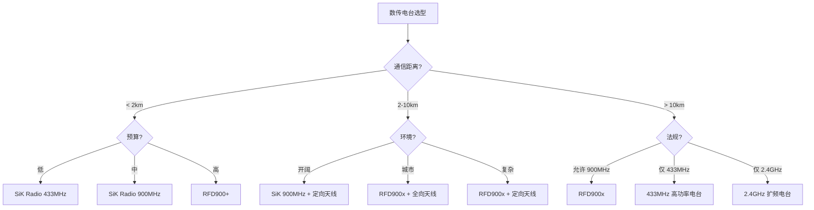

# 数传电台选型

> 预计阅读：30 分钟 | 前置知识：数据链架构、RF 基础

---

## 1. 数传电台概述

### 1.1 数传电台的功能

数传电台（Data Radio）是无人机数据链的核心组件，负责在飞控与地面站之间传输 MAVLink 数据。

```
数传电台工作原理:

飞控 (Pixhawk)              数传电台 (机载)              数传电台 (地面)
┌──────────┐    UART     ┌──────────────┐    RF     ┌──────────────┐
│ MAVLink  │────────────→│ 调制/编码    │─────────→│ 解调/解码    │
│ 输出     │             │ 功率放大     │          │ 低噪声放大   │
└──────────┘             └──────────────┘          └──────────────┘
                                                         │
                                                         ↓ USB
                                                    ┌──────────┐
                                                    │ 地面站   │
                                                    │ QGC      │
                                                    └──────────┘
```

### 1.2 主要参数指标

| 参数 | 说明 | 典型范围 |
|------|------|---------|
| 工作频率 | 射频工作频段 | 433/900/2400 MHz |
| 发射功率 | 最大输出功率 | 100mW-2W |
| 空中速率 | 数据传输速率 | 2-250 kbps |
| 灵敏度 | 最小可接收信号 | -100 to -120 dBm |
| 接口 | 与飞控连接方式 | UART/USB |
| 距离 | 最大通信距离 | 1-40 km |
| 功耗 | 发射/接收功耗 | 0.5-5W |
| 尺寸/重量 | 物理参数 | 取决于型号 |

---

## 2. 主流数传电台对比

### 2.1 SiK Radio

SiK Radio 是最常用的开源数传电台固件，支持多种硬件平台。

```
SiK Radio 硬件平台:

┌─────────────────────────────────────────────────┐
│           SiK Radio 支持的硬件                   │
├─────────────────────────────────────────────────┤
│ 1. HopeRF RFM22B/RFM23BP (433/868/915 MHz)     │
│ 2. RFD900/RFD900+/RFD900x (900 MHz)            │
│ 3. 3DR Radio (433/915 MHz)                      │
│ 4. JD-IOBoard (433 MHz)                         │
│ 5. 自定义 PCB 设计                              │
└─────────────────────────────────────────────────┘
```

**SiK Radio 参数表：**

| 参数 | 433MHz 版本 | 915MHz 版本 |
|------|------------|------------|
| 频率范围 | 433-434 MHz | 902-928 MHz |
| 发射功率 | 100mW (20dBm) | 1W (30dBm) |
| 空中速率 | 2-250 kbps | 2-250 kbps |
| 灵敏度 | -118 dBm | -118 dBm |
| 典型距离 | 1-2 km | 5-10 km |
| 接口 | UART 57600 | UART 57600 |
| 功耗 | 0.5W | 1.5W |
| 价格 | ¥50-100 | ¥100-200 |

### 2.2 RFD900x

RFD900x 是高性能 900MHz 数传电台，专为长距离无人机设计。

```
RFD900x 特性:

┌─────────────────────────────────────────────────┐
│ RFD900x                                         │
├─────────────────────────────────────────────────┤
│ 频率: 900-928 MHz                               │
│ 功率: 最高 1W (30dBm)                           │
│ 灵敏度: -121 dBm                                │
│ 速率: 最高 750 kbps                             │
│ 距离: 最远 40+ km (定向天线)                    │
│ 特性: MIMO, 自动功率控制, 跳频                  │
│ 接口: UART, USB                                 │
│ 尺寸: 50 × 30 × 10 mm                          │
│ 重量: 20g                                       │
│ 价格: ¥800-1200                                 │
└─────────────────────────────────────────────────┘
```

**RFD900x vs SiK Radio 对比：**

| 特性 | SiK Radio | RFD900x |
|------|-----------|---------|
| 发射功率 | 100mW-1W | 1W |
| 灵敏度 | -118 dBm | -121 dBm |
| 距离 | 5-10 km | 15-40 km |
| MIMO | 不支持 | 支持 |
| 自动功率 | 不支持 | 支持 |
| 跳频 | 支持 | 支持 |
| 价格 | ¥100-200 | ¥800-1200 |

### 2.3 其他数传电台

| 电台 | 频率 | 功率 | 距离 | 特点 | 价格 |
|------|------|------|------|------|------|
| 3DR Radio | 433/915 MHz | 100mW | 1-2 km | 开源，经典 | ¥100 |
| DragonLink | 433 MHz | 1W | 10-30 km | 长距离 | ¥500 |
| Microhard | 900 MHz | 1W | 15-30 km | 工业级 | ¥3000 |
| Digi XBee | 900 MHz | 1W | 10-15 km | 成熟生态 | ¥500 |
| Holybro SiK | 433/915 MHz | 100mW | 1-2 km | 性价比高 | ¥80 |

---

## 3. 频率选择

### 3.1 频段对比

| 频段 | 优势 | 劣势 | 适用场景 |
|------|------|------|---------|
| **433 MHz** | 穿透性好，绕射强 | 带宽小，天线大 | 近距，城市环境 |
| **900 MHz** | 平衡的穿透和带宽 | 部分国家限制 | 中远距，通用 |
| **2.4 GHz** | 带宽大，天线小 | 穿透差，干扰多 | 近距，高速数据 |

### 3.2 频率与距离关系

```
距离 (km) ↑
          │
40        │                    ● 900MHz (RFD900x)
          │
30        │               ●
          │
20        │          ● 900MHz (SiK)
          │
10        │     ● 433MHz (SiK)
          │
 5        │  ● 2.4GHz (Wi-Fi)
          │
 1        │● 2.4GHz (普通)
          └─────────────────────────────→
              低功率    中功率    高功率
```

### 3.3 各国频率法规

| 国家/地区 | 433 MHz | 868 MHz | 915 MHz | 2.4 GHz |
|----------|---------|---------|---------|---------|
| 中国 | 10 mW ERP | 不可用 | 不可用 | 100mW EIRP |
| 美国 | 不可用 | 不可用 | 1W EIRP | 1W EIRP |
| 欧洲 | 10 mW ERP | 25 mW ERP | 不可用 | 100mW EIRP |
| 日本 | 10 mW | 不可用 | 不可用 | 100mW EIRP |

**注意：** 中国可使用 433MHz（10mW）和 2.4GHz（100mW），900MHz 需要特殊许可。

---

## 4. SiK Radio 配置

### 4.1 固件烧录

```bash
# 克隆 SiK 固件
git clone https://github.com/ArduPilot/SiK.git
cd SiK

# 编译（需要 SDCC 编译器）
make

# 烧录到 RFM22B 模块
# 使用 FTDI 适配器连接模块
python uploader.py --port /dev/ttyUSB0 firmware.bin
```

### 4.2 参数配置

```python
# SiK Radio 配置参数
SIK_PARAMS = {
    'FORMAT': 25,        # 配置格式版本
    'SYSID': 255,        # 系统 ID
    'NODEID': 0,         # 节点 ID (0=主站, 1-255=远端)
    'NODEDEST': 0,       # 目标节点 ID
    'SYNCANY': 0,        # 同步任意节点
    'MAVLINK': 1,        # MAVLink 模式
    'OPPRESEND': 1,      # OPP 回复
    'MIN_FREQ': 915000,  # 最小频率 (kHz)
    'MAX_FREQ': 928000,  # 最大频率 (kHz)
    'NUM_CHANNELS': 20,  # 跳频信道数
    'DUTY_CYCLE': 100,   # 占空比 (%)
    'LBT_RSSI': 0,       # LBT RSSI 门限
    'MANCHESTER': 0,     # 曼彻斯特编码
    'RTSCTS': 0,         # RTS/CTS 流控
    'MAX_WINDOW': 131,   # 最大窗口大小
}

# 配置命令（通过 AT 命令）
def configure_sik(port, baud=57600):
    """配置 SiK Radio"""
    import serial
    ser = serial.Serial(port, baud, timeout=1)
    
    # 进入命令模式
    ser.write(b'+++')
    time.sleep(1)
    response = ser.read(100)
    print(f"响应: {response}")
    
    # 读取当前配置
    ser.write(b'ATI5\r')
    time.sleep(0.5)
    config = ser.read(1000)
    print(f"配置: {config}")
    
    # 设置参数
    ser.write(b'ATS1=115200\r')  # 设置波特率
    time.sleep(0.5)
    
    ser.write(b'ATS2=30\r')      # 设置功率 (30dBm)
    time.sleep(0.5)
    
    # 保存配置
    ser.write(b'AT&W\r')
    time.sleep(0.5)
    
    ser.close()
```

### 4.3 常用配置命令

| 命令 | 说明 | 示例 |
|------|------|------|
| ATI | 显示版本 | `ATI` |
| ATI5 | 显示所有参数 | `ATI5` |
| ATSn? | 读取参数 n | `ATS1?` |
| ATSn=X | 设置参数 n | `ATS1=115200` |
| ATRA | 设置远程地址 | `ATRA=255` |
| ATPW | 设置发射功率 | `ATPW=30` |
| ATPL | 设置功率级别 | `ATPL=3` |
| AT&T | RSSI 测试 | `AT&T` |
| AT&F | 恢复出厂设置 | `AT&F` |
| AT&W | 保存配置 | `AT&W` |
| ATZ | 重启 | `ATZ` |

---

## 5. 数传电台测试

### 5.1 距离测试方法

```python
#!/usr/bin/env python3
"""数传电台距离测试脚本"""

import time
from pymavlink import mavutil

def range_test(connection_string, test_duration=60):
    """距离测试"""
    conn = mavutil.mavlink_connection(connection_string)
    conn.wait_heartbeat()
    
    print(f"开始距离测试，持续 {test_duration} 秒...")
    
    received = 0
    lost = 0
    last_seq = None
    rssi_values = []
    
    start = time.time()
    while time.time() - start < test_duration:
        msg = conn.recv_match(blocking=True, timeout=0.1)
        if msg:
            received += 1
            seq = msg.get_seq()
            
            if last_seq is not None:
                gap = (seq - last_seq) % 256
                if gap > 1:
                    lost += gap - 1
            
            last_seq = seq
            
            # 记录 RSSI
            if hasattr(msg, 'rssi'):
                rssi_values.append(msg.rssi)
        else:
            lost += 1
    
    # 统计结果
    total = received + lost
    loss_rate = lost / total * 100 if total > 0 else 0
    avg_rssi = sum(rssi_values) / len(rssi_values) if rssi_values else 0
    
    print(f"\n测试结果:")
    print(f"  接收: {received}")
    print(f"  丢失: {lost}")
    print(f"  丢包率: {loss_rate:.2f}%")
    print(f"  平均 RSSI: {avg_rssi:.1f}")
    
    return {
        'received': received,
        'lost': lost,
        'loss_rate': loss_rate,
        'avg_rssi': avg_rssi
    }

if __name__ == '__main__':
    import sys
    conn = sys.argv[1] if len(sys.argv) > 1 else '/dev/ttyUSB0'
    range_test(conn)
```

### 5.2 测试检查清单

```
数传电台测试检查清单:

基本测试:
□ 通信距离测试（不同距离点）
□ 丢包率测试（连续 10 分钟）
□ RSSI 测试（记录信号强度）
□ 延迟测试（往返时间）

环境测试:
□ 室内环境
□ 室外开阔地
□ 有障碍物环境
□ 电磁干扰环境

边界测试:
□ 最大距离测试
□ 最大功率测试
□ 最低速率测试
□ 多电台干扰测试

可靠性测试:
□ 长时间运行（24 小时）
□ 温度变化测试
□ 振动测试
□ 电源波动测试
```

---

## 6. 选型指南

### 6.1 选型决策树



### 6.2 推荐方案

| 场景 | 推荐方案 | 预算 | 距离 |
|------|---------|------|------|
| 入门学习 | SiK Radio 433MHz | ¥100 | 1-2 km |
| 通用飞行 | SiK Radio 915MHz | ¥200 | 5-10 km |
| 远距离 | RFD900x | ¥1000 | 15-40 km |
| 工业级 | Microhard pDDL | ¥3000 | 30+ km |
| 城市环境 | 433MHz + LNA | ¥500 | 3-5 km |

---

## 思考题

1. **SiK Radio 的跳频机制是如何工作的？跳频对通信可靠性有什么影响？**

2. **在选择数传电台时，发射功率、灵敏度和天线增益哪个对距离影响最大？请用链路预算公式分析。**

3. **为什么 900MHz 频段比 2.4GHz 更适合长距离无人机通信？从传播特性和法规两个角度分析。**

4. **设计一个 10km 距离的数传电台系统，包括硬件选型、天线选择和配置参数。**

5. **如果在城市环境中数传距离只有 1km（预期 5km），可能的原因有哪些？如何排查？**

<details>
<summary>参考答案</summary>

**1. SiK 跳频机制：**

- 将频段划分为多个信道（如 20 个）
- 按照伪随机序列在信道间快速切换
- 每个数据包在一个信道上发送
- 跳频图案由密钥确定，接收端同步跟踪

影响：
- 抗干扰：干扰只影响部分信道
- 抗截获：难以跟踪跳频图案
- 分集增益：频率分集提高可靠性

**2. 参数对距离的影响：**

根据链路预算公式：
- 发射功率：每增加 6dB，距离翻倍
- 灵敏度：每改善 6dB，距离翻倍
- 天线增益（发射或接收）：每增加 6dB，距离翻倍

实际中，天线增益的提升最容易实现（如从 3dBi 到 12dBi），且不增加功耗。

**3. 900MHz vs 2.4GHz：**

传播特性：
- 900MHz 路径损耗更低（约 8dB 优势）
- 900MHz 绕射能力更强
- 900MHz 穿透障碍物能力更强

法规：
- 900MHz：美国允许 1W，欧洲 25mW
- 2.4GHz：全球通用，但干扰多

综合：900MHz 更适合长距离，2.4GHz 更通用。

**4. 10km 数传方案：**

- 电台：RFD900x（1W，-121dBm 灵敏度）
- 天线：地面站 12dBi 八木，机载 3dBi 全向
- 配置：空中速率 64kbps，跳频开启
- 链路预算：余量约 20dB

**5. 城市环境距离不足排查：**

1. 建筑物遮挡：检查视距是否受阻
2. 多径干扰：尝试改变天线位置
3. 同频干扰：频谱扫描，更换频率
4. 天线问题：检查 VSWR、极化
5. 硬件问题：检查连接器、馈线
6. 功率不足：确认发射功率设置

</details>
