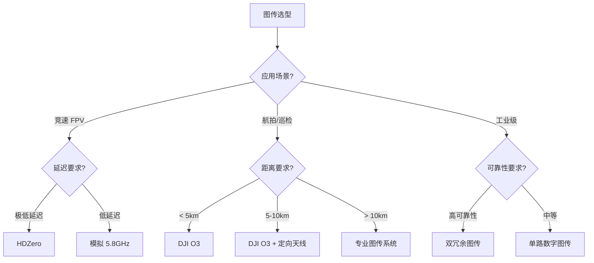

# 图传系统设计

> 预计阅读：30 分钟 | 前置知识：数据链架构、调制技术

---

## 1. 图传系统概述

### 1.1 图传的功能

图传（Video Transmission）系统负责将无人机摄像头拍摄的实时视频传输到地面站，为操作员提供第一人称视角（FPV）或任务监控画面。

```
图传系统架构:

无人机端:                    地面端:
┌──────────┐               ┌──────────┐
│ 摄像头   │               │ 接收机   │
│ CSI/HDMI │               │          │
└────┬─────┘               └────┬─────┘
     │                          │
     ↓                          ↓
┌──────────┐    RF 链路     ┌──────────┐
│ 编码器   │──────────────→│ 解码器   │
│ H.264/265│               │          │
└────┬─────┘               └────┬─────┘
     │                          │
     ↓                          ↓
┌──────────┐               ┌──────────┐
│ 发射机   │               │ 显示器   │
│ VTX      │               │ FPV 眼镜 │
└──────────┘               └──────────┘
```

### 1.2 模拟 vs 数字图传

| 特性 | 模拟图传 | 数字图传 |
|------|---------|---------|
| 延迟 | < 1ms | 20-100ms |
| 分辨率 | 480p-720p | 720p-4K |
| 抗干扰 | 渐进式退化 | 突然断流 |
| 价格 | 低 | 高 |
| 典型产品 | 普通 FPV | DJI, HDZero |
| 适用场景 | 竞速 FPV | 航拍、巡检 |

---

## 2. 模拟图传

### 2.1 模拟图传原理

```
模拟图传信号处理:

摄像头 → 模拟视频信号 → FM 调制 → RF 发射
                                    ↓
显示器 ← 模拟视频信号 ← FM 解调 ← RF 接收

视频信号格式:
├── NTSC: 720×480, 30fps
├── PAL: 720×576, 25fps
└── 制式选择取决于摄像头和显示器
```

### 2.2 模拟图传频段

| 频段 | 频率范围 | 信道数 | 特点 |
|------|---------|--------|------|
| 900 MHz | 900-928 MHz | 少 | 穿透好，带宽小 |
| 1.2 GHz | 1.08-1.36 GHz | 7 | 穿透好，需滤波 |
| 2.4 GHz | 2.37-2.39 GHz | 8 | 平衡，遥控干扰 |
| 5.8 GHz | 5.65-5.95 GHz | 40+ | 带宽大，干扰少 |

**5.8GHz 信道表（40 信道）：**

| 信道组 | 频率 (GHz) | 信道数 |
|--------|-----------|--------|
| Band A | 5.865-5.845 | 8 |
| Band B | 5.733-5.866 | 8 |
| Band E | 5.705-5.865 | 8 |
| Band F | 5.740-5.860 | 8 |
| Band R | 5.658-5.917 | 8 |

### 2.3 模拟图传天线

```
全向天线:                    定向天线 (蘑菇头):
      │                         ╱╲
      │                        ╱  ╲
      │                       ╱    ╲
   ───┼───                   ╱      ╲
      │                     ╱────────╲
      │                       │    │
                              └────┘

增益: 2-3 dBi               增益: 5-8 dBi
波束: 360° 全向              波束: 120-150°
适用: 近距, 多方向            适用: 中距, 特定方向
```

---

## 3. 数字图传

### 3.1 DJI 数字图传

DJI 数字图传是目前最成熟的商用数字 FPV 方案。

**DJI O3 Air Unit:**

| 参数 | 规格 |
|------|------|
| 分辨率 | 1080p/100fps, 4K/60fps |
| 延迟 | 28ms (低延迟模式) |
| 距离 | 10 km (FCC) |
| 频段 | 2.4/5.8 GHz |
| 码率 | 最高 50 Mbps |
| 接口 | HDMI, USB-C |
| 功耗 | 6W |
| 重量 | 35g |

**DJI 图传模式：**

| 模式 | 分辨率 | 延迟 | 距离 |
|------|--------|------|------|
| 低延迟 | 720p/120fps | 28ms | 4 km |
| 高清 | 1080p/60fps | 40ms | 10 km |
| 自动 | 自适应 | 自适应 | 自适应 |

### 3.2 HDZero

HDZero 是开源数字 FPV 方案，以低延迟著称。

**HDZero 特性：**

| 参数 | 规格 |
|------|------|
| 分辨率 | 720p/60fps, 1080p/30fps |
| 延迟 | < 1ms (端到端) |
| 距离 | 2-4 km |
| 频段 | 5.8 GHz |
| 码率 | 最高 16 Mbps |
| 接口 | MIPI CSI |
| 功耗 | 3W |
| 重量 | 15g |

**HDZero vs DJI 对比：**

| 特性 | HDZero | DJI O3 |
|------|--------|--------|
| 延迟 | < 1ms | 28ms |
| 分辨率 | 720p | 1080p |
| 距离 | 2-4 km | 10 km |
| 抗干扰 | 强 | 中 |
| 价格 | ¥500-1000 | ¥2000-3000 |
| 开源 | 是 | 否 |
| 适用场景 | 竞速 FPV | 航拍、巡检 |

### 3.3 Walksnail Avatar

Walksnail Avatar 是另一款主流数字 FPV 系统。

| 参数 | 规格 |
|------|------|
| 分辨率 | 1080p/60fps |
| 延迟 | 22ms |
| 距离 | 4-8 km |
| 频段 | 5.8 GHz |
| 码率 | 最高 25 Mbps |
| 价格 | ¥1500-2500 |

---

## 4. 图传编码技术

### 4.1 视频编码标准

| 编码标准 | 压缩效率 | 复杂度 | 延迟 | 典型应用 |
|---------|---------|--------|------|---------|
| H.264 | 基准 | 低 | 低 | 通用 |
| H.265 | 2x H.264 | 中 | 中 | 高清图传 |
| VP9 | 类似 H.265 | 中 | 中 | WebRTC |
| AV1 | 1.3x H.265 | 高 | 高 | 未来趋势 |

### 4.2 H.264 编码参数

```python
# H.264 编码配置示例
encoder_config = {
    'codec': 'h264',
    'resolution': '1280x720',
    'framerate': 60,
    'bitrate': 8000,        # kbps
    'profile': 'baseline',   # 低延迟
    'level': '3.1',
    'gop': 30,              # 关键帧间隔
    'preset': 'ultrafast',  # 编码速度
    'tune': 'zerolatency',  # 零延迟优化
}
```

### 4.3 编码器选择

| 编码器 | 平台 | 延迟 | 功耗 | 典型应用 |
|--------|------|------|------|---------|
| x264 | CPU | 中 | 高 | 地面站 |
| NVENC | NVIDIA GPU | 低 | 中 | 专业图传 |
| VAAPI | Intel GPU | 低 | 低 | 嵌入式 |
| MediaTek | SoC | 极低 | 极低 | 商用图传 |
| 硬件编码器 | FPGA/ASIC | 极低 | 极低 | 专业设备 |

---

## 5. 图传链路设计

### 5.1 链路预算

```python
def video_link_budget(
    distance_km,
    freq_mhz=5800,
    tx_power_dbm=30,
    tx_gain_dbi=5,
    rx_gain_dbi=10,
    video_bitrate_mbps=8,
    bandwidth_mhz=10
):
    """图传链路预算"""
    import math
    
    # 路径损耗
    fspl = 20 * math.log10(distance_km) + 20 * math.log10(freq_mhz) + 32.44
    
    # 附加损耗（城市环境）
    extra_loss = 10
    
    # EIRP
    eirp = tx_power_dbm + tx_gain_dbi
    
    # 接收功率
    rx_power = eirp - fspl - extra_loss + rx_gain_dbi
    
    # 噪声
    thermal_noise = -174 + 10 * math.log10(bandwidth_mhz * 1e6)
    nf = 5  # 噪声系数
    noise = thermal_noise + nf
    
    # SNR
    snr = rx_power - noise
    
    # 所需 SNR（QAM64 需要约 20dB）
    required_snr = 20
    
    # 链路余量
    margin = snr - required_snr
    
    return {
        'rx_power': rx_power,
        'snr': snr,
        'margin': margin,
        'feasible': margin > 10
    }

# 示例
result = video_link_budget(5, video_bitrate_mbps=8)
print(f"链路余量: {result['margin']:.1f} dB")
```

### 5.2 延迟优化

```
图传延迟组成:

摄像头采集: 5-15ms
     ↓
编码延迟: 5-20ms (取决于编码器和配置)
     ↓
传输延迟: 1-5ms (空中传输)
     ↓
解码延迟: 5-15ms
     ↓
显示延迟: 5-10ms
────────────────────────
总延迟: 21-65ms

优化策略:
1. 使用 baseline profile (无 B 帧)
2. 减小 GOP 长度
3. 使用硬件编码器
4. 减少缓冲区大小
5. 使用低延迟传输协议
```

### 5.3 抗干扰设计

```python
# 自适应码率控制
class AdaptiveBitrate:
    """自适应码率控制器"""
    
    def __init__(self, min_bitrate=1000, max_bitrate=10000):
        self.min_bitrate = min_bitrate
        self.max_bitrate = max_bitrate
        self.current_bitrate = max_bitrate
        self.loss_threshold = 5  # 丢包率阈值 (%)
    
    def update(self, loss_rate, rssi):
        """根据链路质量调整码率"""
        if loss_rate > self.loss_threshold:
            # 降低码率
            self.current_bitrate = max(
                self.min_bitrate,
                self.current_bitrate * 0.8
            )
        elif loss_rate < self.loss_threshold / 2:
            # 提高码率
            self.current_bitrate = min(
                self.max_bitrate,
                self.current_bitrate * 1.1
            )
        
        return self.current_bitrate
```

---

## 6. 图传选型指南

### 6.1 选型决策



### 6.2 推荐方案

| 场景 | 推荐方案 | 预算 | 关键参数 |
|------|---------|------|---------|
| 入门 FPV | 模拟 5.8GHz | ¥200 | < 1ms 延迟 |
| 竞速 FPV | HDZero | ¥800 | < 1ms 延迟 |
| 航拍 | DJI O3 | ¥2500 | 1080p, 10km |
| 巡检 | DJI O3 + 热成像 | ¥5000+ | 多传感器 |
| 工业级 | 专业图传 | ¥10000+ | 双冗余 |

---

## 思考题

1. **为什么竞速 FPV 飞行需要极低延迟（< 1ms）的图传？延迟对飞行操控有什么影响？**

2. **比较 H.264 和 H.265 在无人机图传中的优缺点。为什么 H.265 没有完全取代 H.264？**

3. **设计一个 5km 距离的高清图传系统，选择合适的图传方案和天线配置。**

4. **数字图传为什么在信号弱时会突然断流，而模拟图传只是画面变差？这对无人机操作有什么影响？**

5. **如何在保持低延迟的同时提高图传的抗干扰能力？**

<details>
<summary>参考答案</summary>

**1. 竞速 FPV 延迟的影响：**

- 竞速飞行速度 > 100km/h，每毫秒延迟意味着飞行 2.8cm
- 延迟 > 10ms 时，操作员的反应时间会显著增加
- 高延迟导致操控不精准，容易发生碰撞
- 竞速比赛中，延迟差异直接影响成绩

**2. H.264 vs H.265：**

H.264 优势：
- 编码复杂度低，延迟更低
- 硬件支持更广泛
- 功耗更低

H.265 优势：
- 压缩效率高 2 倍，相同画质码率更低
- 支持更高分辨率（4K）

未完全取代原因：
- H.265 编码延迟更高
- 嵌入式设备算力不足
- 专利费用问题

**3. 5km 图传方案：**

- 图传：DJI O3（1080p, 40ms 延迟）
- 天线：地面站 10dBi 定向天线 + 机载 5dBi 全向
- 频段：5.8GHz
- 链路余量：约 15dB

**4. 数字 vs 模拟断流差异：**

数字图传：
- 使用纠错编码，低于阈值时无法解码
- 缓冲区清空后完全断流
- 恢复需要重新同步

模拟图传：
- 信噪比下降导致画面噪声增加
- 渐进式退化，仍能看到画面
- 操作员可以判断并返航

**5. 低延迟 + 抗干扰平衡：**

- 使用 LDPC 纠错编码（低延迟，强纠错）
- 自适应码率：信号好时高码率，信号差时低码率
- 频率跳频：规避干扰
- MIMO：空间分集
- 重传机制：仅对关键帧重传

</details>
