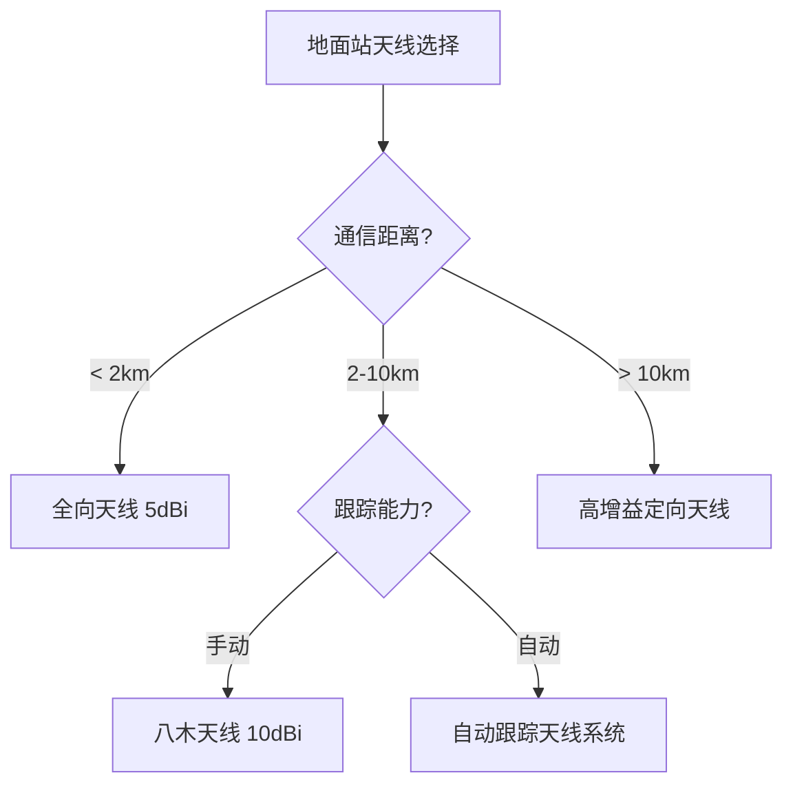
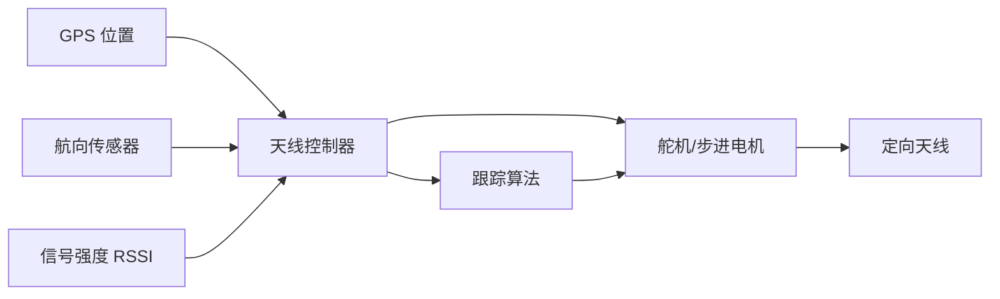
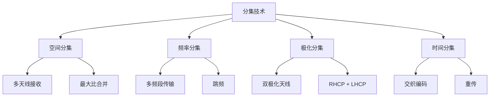

# 天线与链路优化

> 预计阅读：30 分钟 | 前置知识：天线基础、数据链架构

---

## 1. 天线选择策略

### 1.1 天线类型对比

| 天线类型 | 增益 | 波束宽度 | 极化 | 适用场景 |
|---------|------|---------|------|---------|
| 全向鞭状 | 2-5 dBi | 360° | 线极化 | 机载，近距 |
| 交叉偶极子 | 2-3 dBi | 360° | 圆极化 | FPV，多径环境 |
| 贴片天线 | 5-8 dBi | 60-120° | 线/圆极化 | 机载定向 |
| 八木天线 | 7-15 dBi | 30-60° | 线极化 | 地面站定向 |
| 螺旋天线 | 8-12 dBi | 30-60° | 圆极化 | 地面站定向 |
| 抛物面 | 20-40 dBi | 5-15° | 线/圆极化 | 超远距离 |

### 1.2 机载天线选择

```
机载天线考虑因素:

1. 重量: < 10g (小型无人机)
2. 尺寸: 紧凑，不影响气动
3. 增益: 2-5 dBi (全向覆盖)
4. 极化: 圆极化 (抗多径)
5. 安装: 远离电机和金属结构

推荐方案:
├── 数传: λ/4 鞭状天线 (2dBi)
├── 图传: 交叉偶极子 RHCP (2dBi)
└── GPS: 有源陶瓷贴片 (5dBi)
```

### 1.3 地面站天线选择



---

## 2. 定向天线与自动跟踪

### 2.1 自动跟踪系统架构



### 2.2 跟踪算法

```python
class AntennaTracker:
    """天线跟踪控制器"""
    
    def __init__(self, home_lat, home_lon):
        self.home_lat = home_lat
        self.home_lon = home_lon
        self.current_azimuth = 0
        self.current_elevation = 0
    
    def calculate_angles(self, uav_lat, uav_lon, uav_alt):
        """计算天线指向角度"""
        import math
        
        # 计算距离和方位角
        dlat = math.radians(uav_lat - self.home_lat)
        dlon = math.radians(uav_lon - self.home_lon)
        lat1 = math.radians(self.home_lat)
        lat2 = math.radians(uav_lat)
        
        # 方位角
        y = math.sin(dlon) * math.cos(lat2)
        x = (math.cos(lat1) * math.sin(lat2) -
             math.sin(lat1) * math.cos(lat2) * math.cos(dlon))
        azimuth = math.degrees(math.atan2(y, x))
        if azimuth < 0:
            azimuth += 360
        
        # 距离
        a = (math.sin(dlat/2)**2 +
             math.cos(lat1) * math.cos(lat2) * math.sin(dlon/2)**2)
        distance = 2 * 6371000 * math.asin(math.sqrt(a))
        
        # 仰角
        elevation = math.degrees(math.atan2(uav_alt, distance))
        
        return azimuth, elevation, distance
    
    def update(self, uav_lat, uav_lon, uav_alt):
        """更新天线指向"""
        az, el, dist = self.calculate_angles(
            uav_lat, uav_lon, uav_alt
        )
        
        # 平滑滤波
        alpha = 0.3
        self.current_azimuth = (
            alpha * az + (1 - alpha) * self.current_azimuth
        )
        self.current_elevation = (
            alpha * el + (1 - alpha) * self.current_elevation
        )
        
        return self.current_azimuth, self.current_elevation
```

### 2.3 舵机驱动

```python
# 舵机控制示例（PWM 信号）
import RPi.GPIO as GPIO

class ServoController:
    """舵机控制器"""
    
    def __init__(self, azimuth_pin, elevation_pin):
        self.az_pin = azimuth_pin
        self.el_pin = elevation_pin
        
        GPIO.setmode(GPIO.BCM)
        GPIO.setup(self.az_pin, GPIO.OUT)
        GPIO.setup(self.el_pin, GPIO.OUT)
        
        self.az_servo = GPIO.PWM(self.az_pin, 50)  # 50Hz
        self.el_servo = GPIO.PWM(self.el_pin, 50)
        
        self.az_servo.start(0)
        self.el_servo.start(0)
    
    def set_angle(self, servo, angle):
        """设置舵机角度 (0-180°)"""
        duty = 2.5 + (angle / 180.0) * 10.0
        servo.ChangeDutyCycle(duty)
    
    def set_azimuth(self, angle):
        """设置方位角 (0-360° → 0-180°)"""
        servo_angle = angle / 2.0  # 2:1 齿轮比
        self.set_angle(self.az_servo, servo_angle)
    
    def set_elevation(self, angle):
        """设置仰角 (0-90°)"""
        self.set_angle(self.el_servo, angle)
    
    def cleanup(self):
        """清理 GPIO"""
        self.az_servo.stop()
        self.el_servo.stop()
        GPIO.cleanup()
```

---

## 3. 分集接收技术

### 3.1 分集类型



### 3.2 空间分集

```
空间分集接收:

天线1 ──→ LNA ──→ 解调 ──→ ┐
                            ├─→ 合并器 ──→ 输出
天线2 ──→ LNA ──→ 解调 ──→ ┘

合并方式:
1. 选择合并: 选择 SNR 最高的信号
2. 最大比合并: 按 SNR 加权求和 (最优)
3. 等增益合并: 等权重求和 (简化)

最大比合并增益:
- 2 天线: 3dB
- 4 天线: 6dB
```

### 3.3 极化分集

```
极化分集天线:

发射端:                    接收端:
┌──────────┐              ┌──────────┐
│ RHCP     │─────────────→│ RHCP     │
│ 天线     │              │ 天线     │
└──────────┘              └──────────┘

┌──────────┐              ┌──────────┐
│ LHCP     │─────────────→│ LHCP     │
│ 天线     │              │ 天线     │
└──────────┘              └──────────┘

优势:
- 不增加天线数量
- 利用多径效应
- 抗极化失配
```

---

## 4. MIMO 技术

### 4.1 MIMO 基本概念

MIMO（Multiple-Input Multiple-Output）使用多根天线同时发送和接收。

```
2×2 MIMO 系统:

发射端:                    接收端:
┌──────────┐              ┌──────────┐
│ 天线1    │─────────────→│ 天线1    │
└──────────┘         ╲    └──────────┘
                      ╲
┌──────────┐           ╲  ┌──────────┐
│ 天线2    │─────────────→│ 天线2    │
└──────────┘              └──────────┘

增益:
- 空间复用: 2x 速率
- 空间分集: 3dB 增益
- 波束成形: 定向增益
```

### 4.2 MIMO 在无人机中的应用

| MIMO 模式 | 功能 | 适用场景 |
|-----------|------|---------|
| 空间复用 | 提高数据率 | 高清图传 |
| 空间分集 | 提高可靠性 | 远距离遥测 |
| 波束成形 | 定向增益 | 距离扩展 |

### 4.3 RFD900x MIMO

RFD900x 支持 2×2 MIMO，可实现：

```python
# RFD900x MIMO 配置
MIMO_CONFIG = {
    'MIMO_MODE': 'diversity',  # 分集模式
    'ANTENNA_SELECT': 'auto',  # 自动选择天线
    'TX_POWER': 30,            # 发射功率 (dBm)
    'DATA_RATE': 250,          # 数据速率 (kbps)
}
```

---

## 5. 链路优化技术

### 5.1 自适应功率控制

```python
class AdaptivePowerControl:
    """自适应功率控制"""
    
    def __init__(self, min_power=10, max_power=30):
        self.min_power = min_power  # dBm
        self.max_power = max_power  # dBm
        self.current_power = max_power
        self.target_rssi = -80      # dBm
        self.margin = 10            # dB
    
    def update(self, rssi, distance):
        """根据 RSSI 调整功率"""
        # 计算所需功率
        required_rssi = self.target_rssi + self.margin
        power_adjustment = required_rssi - rssi
        
        # 调整功率
        new_power = self.current_power + power_adjustment * 0.1
        new_power = max(self.min_power, min(self.max_power, new_power))
        
        self.current_power = new_power
        return self.current_power
```

### 5.2 自适应数据率

```python
class AdaptiveDataRate:
    """自适应数据率控制"""
    
    def __init__(self):
        self.modes = [
            {'rate': 250, 'snr_required': 15, 'name': '250kbps'},
            {'rate': 125, 'snr_required': 12, 'name': '125kbps'},
            {'rate': 64,  'snr_required': 9,  'name': '64kbps'},
            {'rate': 32,  'snr_required': 6,  'name': '32kbps'},
            {'rate': 2,   'snr_required': 3,  'name': '2kbps'},
        ]
        self.current_mode = 0
    
    def update(self, snr, loss_rate):
        """根据信道质量调整数据率"""
        # 丢包率过高，降低数据率
        if loss_rate > 5 and self.current_mode < len(self.modes) - 1:
            self.current_mode += 1
        # 信道质量好，提高数据率
        elif loss_rate < 1 and self.current_mode > 0:
            self.current_mode -= 1
        
        return self.modes[self.current_mode]
```

### 5.3 链路质量监测

```python
class LinkQualityMonitor:
    """链路质量监测器"""
    
    def __init__(self, window_size=100):
        self.window_size = window_size
        self.rssi_history = []
        self.loss_history = []
        self.snr_history = []
    
    def add_sample(self, rssi, snr, loss):
        """添加采样数据"""
        self.rssi_history.append(rssi)
        self.snr_history.append(snr)
        self.loss_history.append(loss)
        
        # 保持窗口大小
        if len(self.rssi_history) > self.window_size:
            self.rssi_history.pop(0)
            self.snr_history.pop(0)
            self.loss_history.pop(0)
    
    def get_quality(self):
        """获取链路质量指标"""
        if not self.rssi_history:
            return None
        
        return {
            'rssi_avg': sum(self.rssi_history) / len(self.rssi_history),
            'rssi_min': min(self.rssi_history),
            'snr_avg': sum(self.snr_history) / len(self.snr_history),
            'loss_rate': sum(self.loss_history) / len(self.loss_history) * 100,
            'quality_score': self._calculate_score()
        }
    
    def _calculate_score(self):
        """计算质量评分 (0-100)"""
        rssi_avg = sum(self.rssi_history) / len(self.rssi_history)
        snr_avg = sum(self.snr_history) / len(self.snr_history)
        loss_rate = sum(self.loss_history) / len(self.loss_history) * 100
        
        # 归一化评分
        rssi_score = max(0, min(100, (rssi_avg + 100) * 2))
        snr_score = max(0, min(100, snr_avg * 3))
        loss_score = max(0, 100 - loss_rate * 10)
        
        return (rssi_score + snr_score + loss_score) / 3
```

---

## 6. 实际优化案例

### 6.1 案例：10km 链路优化

```
场景: 900MHz 数传，目标距离 10km

初始配置:
- 发射功率: 20 dBm
- 天线: 全向 3 dBi
- 灵敏度: -118 dBm
- 距离: 5km (不满足需求)

优化步骤:
1. 增加发射功率: 20 → 30 dBm (+10dB)
   预期距离: 5km → 10km ✓

2. 地面站换定向天线: 3 → 12 dBi (+9dB)
   预期距离: 10km → 28km

3. 添加 LNA: 噪声系数 3 → 1 dB (+2dB)
   预期距离: 28km → 35km

最终配置:
- 发射功率: 30 dBm
- 机载天线: 全向 3 dBi
- 地面天线: 八木 12 dBi
- LNA: 0.8 dB NF
- 链路余量: 约 20 dB
```

### 6.2 案例：城市环境干扰规避

```
场景: 2.4GHz 图传在城市环境中受 Wi-Fi 干扰

问题:
- 2.4GHz 频段拥挤
- Wi-Fi 信号干扰严重
- 图传频繁断流

解决方案:
1. 频率规划:
   - 使用 5.8GHz 频段
   - 选择 Wi-Fi 未使用的信道

2. 跳频:
   - 启用跳频模式
   - 10 个以上跳频信道

3. 天线优化:
   - 使用定向天线减少干扰
   - 圆极化减少多径

4. 编码优化:
   - 使用更强的纠错编码
   - 降低视频码率

结果:
- 干扰减少 90%
- 图传稳定性显著提高
```

---

## 思考题

1. **为什么圆极化天线比线极化天线更适合无人机通信？请从极化失配和多径效应两个角度分析。**

2. **自动天线跟踪系统中，GPS 位置跟踪和 RSSI 跟踪各有什么优缺点？哪种更可靠？**

3. **比较选择合并、最大比合并和等增益合并三种分集合并方式的性能和复杂度。**

4. **设计一个支持 10km 距离的地面站天线系统，包括天线选择、跟踪方式和安装考虑。**

5. **自适应功率控制和自适应数据率两种优化策略各适用于什么场景？如何结合使用？**

<details>
<summary>参考答案</summary>

**1. 圆极化优势：**

极化失配：
- 线极化天线需要对齐，否则增益损失严重
- 圆极化天线之间无极化失配损耗

多径效应：
- 地面反射会导致极化翻转
- 圆极化天线可以抑制反射信号
- 减少多径衰落

**2. GPS 跟踪 vs RSSI 跟踪：**

GPS 跟踪：
- 优点：稳定，不依赖信号质量
- 缺点：需要 GPS 数据，有延迟

RSSI 跟踪：
- 优点：直接优化信号
- 缺点：信号弱时不可靠

建议：GPS 跟踪为主，RSSI 跟踪微调。

**3. 分集合并方式对比：**

| 方式 | 性能 | 复杂度 | 说明 |
|------|------|--------|------|
| 选择合并 | 差 | 低 | 选择最强信号 |
| 最大比合并 | 最优 | 高 | 按 SNR 加权 |
| 等增益合并 | 中 | 中 | 等权重相加 |

**4. 10km 地面站天线系统：**

- 天线：八木天线 12dBi 或螺旋天线 10dBi
- 跟动：GPS 跟踪 + 舵机驱动
- 安装：3m 支架，远离障碍物
- 馈线：低损耗同轴线（LMR-400）
- 极化：与机载天线匹配（RHCP）

**5. 自适应策略结合：**

- 功率控制：调整发射功率匹配距离
- 数据率：调整速率匹配信道质量
- 结合：先用功率控制，再用数据率调整
- 场景：距离变化用功率控制，干扰变化用数据率调整

</details>
