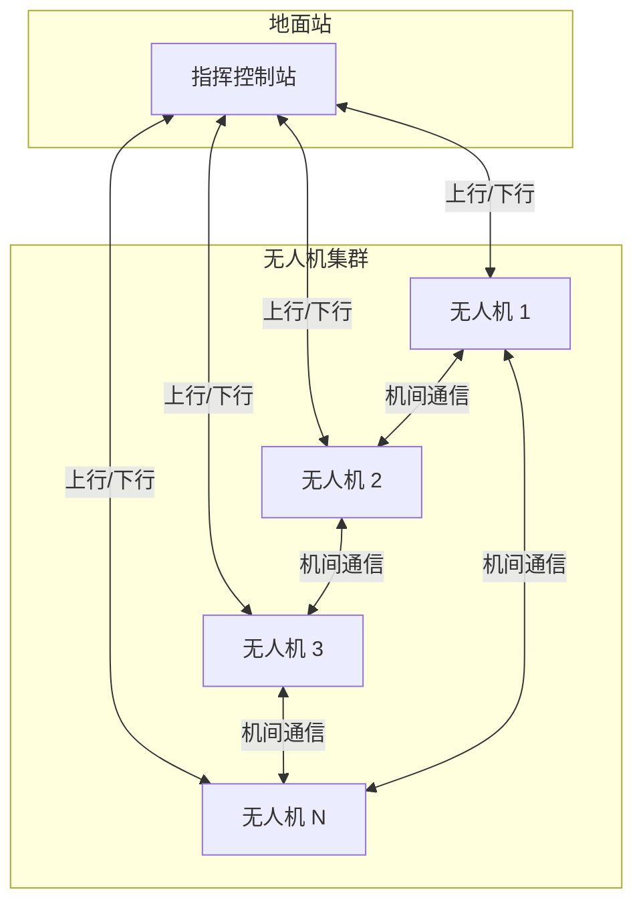
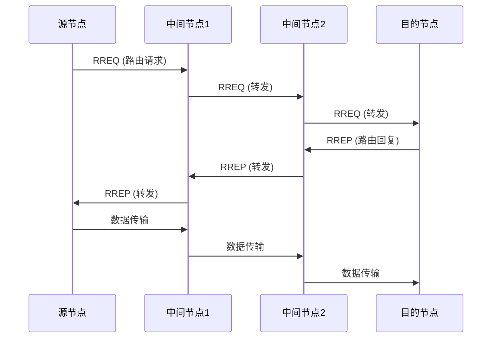

# 网络拓扑与多机通信

> 预计阅读：30 分钟 | 前置知识：数据链架构、通信协议栈

---

## 1. 多机通信概述

### 1.1 多机通信需求

无人机集群通信与单机通信有本质区别：

| 特性 | 单机通信 | 多机通信 |
|------|---------|---------|
| 拓扑 | 点对点 | 网状/星型 |
| 寻址 | 单一地址 | 多地址 |
| 带宽 | 固定 | 共享 |
| 延迟 | 确定 | 不确定 |
| 可靠性 | 高 | 可变 |

### 1.2 集群通信架构



---

## 2. 网络拓扑类型

### 2.1 星型拓扑

```
星型拓扑 (Star Topology):

              地面站
                │
        ┌───────┼───────┐
        │       │       │
        ↓       ↓       ↓
      无人机1  无人机2  无人机3

优点:
- 结构简单
- 易于管理
- 延迟确定

缺点:
- 单点故障（地面站）
- 地面站瓶颈
- 距离受限
```

### 2.2 网状拓扑

```
网状拓扑 (Mesh Topology):

      无人机1 ─────── 无人机2
          │   ╲       │   ╲
          │     ╲     │     ╲
          │       ╲   │       ╲
      无人机3 ─────── 无人机4
          │       ╱   │       ╱
          │     ╱     │     ╱
          │   ╱       │   ╱
      无人机5 ─────── 无人机6

优点:
- 无单点故障
- 自组织
- 覆盖范围大

缺点:
- 复杂度高
- 路由开销大
- 延迟不确定
```

### 2.3 混合拓扑

```
混合拓扑 (Hybrid Topology):

              指挥机
              ╱    ╲
             ╱      ╲
            ╱        ╲
       侦察机1    侦察机2
          │          │
          │          │
       打击机1    打击机2

优点:
- 结合星型和网状优点
- 层次化管理
- 灵活可扩展
```

---

## 3. 自组织网络协议

### 3.1 AODV 协议

AODV（Ad-hoc On-demand Distance Vector）是按需路由协议。



### 3.2 OLSR 协议

OLSR（Optimized Link State Routing）是表驱动路由协议。

```python
# OLSR MPR 选择算法
class OLSRNode:
    def __init__(self, node_id):
        self.node_id = node_id
        self.neighbors = set()
        self.two_hop_neighbors = set()
        self.mpr_set = set()
    
    def select_mpr(self):
        """选择 MPR 节点"""
        # 1. 选择覆盖最多两跳邻居的一跳邻居
        covered = set()
        candidates = list(self.neighbors)
        
        while len(covered) < len(self.two_hop_neighbors):
            # 选择覆盖最多未覆盖节点的候选
            best = None
            best_count = 0
            
            for candidate in candidates:
                if candidate in self.mpr_set:
                    continue
                count = len(
                    self.get_two_hop_via(candidate) - covered
                )
                if count > best_count:
                    best = candidate
                    best_count = count
            
            if best is None:
                break
            
            self.mpr_set.add(best)
            covered |= self.get_two_hop_via(best)
        
        return self.mpr_set
```

### 3.3 B.A.T.M.A.N. 协议

B.A.T.M.A.N.（Better Approach To Mobile Ad-hoc Networking）是去中心化路由协议。

```
B.A.T.M.A.N. 工作原理:

1. 每个节点定期广播 OGM (Originator Message)
2. 邻居节点接收并转发 OGM
3. 通过 OGM 计数评估链路质量
4. 选择最佳下一跳

路由表:
┌──────────┬──────────┬──────────┐
│ 目的节点 │ 下一跳   │ 链路质量 │
├──────────┼──────────┼──────────┤
│ 节点 A   │ 节点 B   │ 0.85     │
│ 节点 C   │ 节点 D   │ 0.72     │
│ 节点 E   │ 节点 B   │ 0.91     │
└──────────┴──────────┴──────────┘
```

---

## 4. 多址接入协议

### 4.1 TDMA 实现

```python
class TDMAScheduler:
    """TDMA 调度器"""
    
    def __init__(self, num_nodes, slot_duration_ms=10):
        self.num_nodes = num_nodes
        self.slot_duration = slot_duration_ms
        self.frame_duration = num_nodes * slot_duration_ms
        self.current_slot = 0
    
    def get_slot(self, node_id):
        """获取节点的时隙"""
        return node_id % self.num_nodes
    
    def is_my_slot(self, node_id, current_time_ms):
        """判断是否是节点的发送时隙"""
        frame_time = current_time_ms % self.frame_duration
        slot = frame_time // self.slot_duration
        return slot == self.get_slot(node_id)
    
    def get_next_slot_time(self, node_id, current_time_ms):
        """获取下一次发送时隙的时间"""
        frame_time = current_time_ms % self.frame_duration
        my_slot = self.get_slot(node_id)
        slot_time = my_slot * self.slot_duration
        
        if frame_time < slot_time:
            return current_time_ms + (slot_time - frame_time)
        else:
            return (current_time_ms + 
                    self.frame_duration - frame_time + slot_time)
```

### 4.2 CSMA/CA 实现

```python
class CSMACA:
    """CSMA/CA 实现"""
    
    def __init__(self, slot_time_us=20, cw_min=15, cw_max=1023):
        self.slot_time = slot_time_us
        self.cw_min = cw_min
        self.cw_max = cw_max
        self.cw = cw_min
        self.backoff = 0
    
    def start_backoff(self):
        """开始退避"""
        import random
        self.backoff = random.randint(0, self.cw)
    
    def decrement_backoff(self):
        """递减退避计数"""
        if self.backoff > 0:
            self.backoff -= 1
    
    def is_ready(self):
        """判断是否可以发送"""
        return self.backoff == 0
    
    def on_collision(self):
        """冲突处理"""
        self.cw = min(self.cw * 2, self.cw_max)
        self.start_backoff()
    
    def on_success(self):
        """发送成功"""
        self.cw = self.cw_min
        self.backoff = 0
```

### 4.3 协议对比

| 协议 | 优点 | 缺点 | 适用场景 |
|------|------|------|---------|
| TDMA | 延迟确定，无冲突 | 需要同步，时隙浪费 | 稳定拓扑 |
| CSMA/CA | 简单，灵活 | 冲突，延迟不确定 | 动态拓扑 |
| CDMA | 抗干扰，软容量 | 远近效应 | 高动态 |

---

## 5. 集群通信设计

### 5.1 通信架构设计

```python
class SwarmCommunication:
    """集群通信管理器"""
    
    def __init__(self, node_id, num_nodes):
        self.node_id = node_id
        self.num_nodes = num_nodes
        self.neighbors = {}
        self.routing_table = {}
        self.message_queue = []
    
    def broadcast(self, message):
        """广播消息"""
        packet = {
            'src': self.node_id,
            'dst': 0,  # 广播
            'type': 'broadcast',
            'data': message,
            'timestamp': time.time()
        }
        self.transmit(packet)
    
    def unicast(self, dst_id, message):
        """单播消息"""
        if dst_id in self.routing_table:
            next_hop = self.routing_table[dst_id]
            packet = {
                'src': self.node_id,
                'dst': dst_id,
                'next_hop': next_hop,
                'type': 'unicast',
                'data': message,
                'timestamp': time.time()
            }
            self.transmit(packet)
    
    def on_receive(self, packet):
        """接收消息处理"""
        if packet['dst'] == self.node_id or packet['dst'] == 0:
            # 消息到达目的地
            self.process_message(packet)
        
        if packet['dst'] != self.node_id and packet['dst'] != 0:
            # 转发消息
            if packet['dst'] in self.routing_table:
                packet['next_hop'] = self.routing_table[packet['dst']]
                self.transmit(packet)
    
    def update_routing(self):
        """更新路由表"""
        # 实现路由协议
        pass
```

### 5.2 编队通信

```python
class FormationCommunication:
    """编队通信协议"""
    
    def __init__(self, formation_id, role):
        self.formation_id = formation_id
        self.role = role  # 'leader', 'follower', 'relay'
        self.formation_data = {}
    
    def send_formation_update(self, position, velocity):
        """发送编队更新信息"""
        message = {
            'type': 'formation_update',
            'formation_id': self.formation_id,
            'node_id': self.node_id,
            'position': position,
            'velocity': velocity,
            'timestamp': time.time()
        }
        self.broadcast(message)
    
    def receive_formation_update(self, message):
        """接收编队更新信息"""
        self.formation_data[message['node_id']] = {
            'position': message['position'],
            'velocity': message['velocity'],
            'timestamp': message['timestamp']
        }
    
    def calculate_formation_error(self):
        """计算编队误差"""
        if self.role == 'leader':
            return None
        
        leader_data = self.formation_data.get(self.leader_id)
        if not leader_data:
            return None
        
        # 计算期望位置和实际位置的误差
        expected = self.get_expected_position()
        actual = self.get_actual_position()
        
        return {
            'x': expected['x'] - actual['x'],
            'y': expected['y'] - actual['y'],
            'z': expected['z'] - actual['z']
        }
```

---

## 6. 多机通信协议

### 6.1 MAVLink 多机支持

```python
# MAVLink 多机通信示例
from pymavlink import mavutil

class MultiUAVCommunication:
    """多机 MAVLink 通信"""
    
    def __init__(self, my_sys_id):
        self.my_sys_id = my_sys_id
        self.connections = {}
        self.uav_status = {}
    
    def connect_to_uav(self, uav_id, connection_string):
        """连接到其他无人机"""
        conn = mavutil.mavlink_connection(
            connection_string,
            source_system=self.my_sys_id
        )
        self.connections[uav_id] = conn
    
    def send_to_uav(self, uav_id, message_type, **kwargs):
        """发送消息到指定无人机"""
        if uav_id in self.connections:
            conn = self.connections[uav_id]
            # 根据消息类型发送
            if message_type == 'HEARTBEAT':
                conn.mav.heartbeat_send(
                    mavutil.mavlink.MAV_TYPE_QUADROTOR,
                    mavutil.mavlink.MAV_AUTOPILOT_ARDUPILOTMEGA,
                    0, 0, 0
                )
    
    def broadcast_status(self, position, velocity):
        """广播自身状态"""
        for uav_id, conn in self.connections.items():
            conn.mav.global_position_int_send(
                0,
                int(position['lat'] * 1e7),
                int(position['lon'] * 1e7),
                int(position['alt'] * 1000),
                int(position['relative_alt'] * 1000),
                int(velocity['vx'] * 100),
                int(velocity['vy'] * 100),
                int(velocity['vz'] * 100),
                int(position['heading'] * 100)
            )
    
    def update(self):
        """更新通信状态"""
        for uav_id, conn in self.connections.items():
            msg = conn.recv_match(blocking=False)
            if msg:
                self.process_message(uav_id, msg)
```

### 6.2 DDS 通信

```python
# DDS (Data Distribution Service) 用于集群通信
# 使用 CycloneDDS 或 FastDDS

import cyclonedds.idl as idl
from cyclonedds.domain import DomainParticipant
from cyclonedds.topic import Topic
from cyclonedds.pub import DataWriter
from cyclonedds.sub import DataReader

# 定义消息类型
@idl.struct
class UAVStatus:
    uav_id: idl.uint8
    latitude: idl.float64
    longitude: idl.float64
    altitude: idl.float32
    heading: idl.float32
    speed: idl.float32
    battery: idl.uint8

# 创建 DDS 实体
participant = DomainParticipant(0)
topic = Topic(participant, 'UAVStatus', UAVStatus)
writer = DataWriter(participant, topic)
reader = DataReader(participant, topic)

# 发送状态
status = UAVStatus(
    uav_id=1,
    latitude=30.1234567,
    longitude=120.1234567,
    altitude=100.0,
    heading=90.0,
    speed=5.0,
    battery=80
)
writer.write(status)

# 接收状态
for sample in reader.take(10):
    print(f"UAV {sample.uav_id}: {sample.latitude}, {sample.longitude}")
```

---

## 思考题

1. **比较星型、网状和混合拓扑在无人机集群中的优缺点。哪种最适合 10 架无人机的编队飞行？**

2. **AODV 和 OLSR 路由协议各适用于什么类型的无人机集群？请举例说明。**

3. **TDMA 和 CSMA/CA 在多机通信中的性能差异是什么？如何选择合适的 MAC 协议？**

4. **设计一个 5 架无人机的编队通信系统，包括拓扑结构、路由协议和消息格式。**

5. **在集群通信中，如何处理节点加入和离开的情况？**

<details>
<summary>参考答案</summary>

**1. 拓扑对比：**

星型：简单但单点故障，适合 < 5 架
网状：可靠但复杂，适合 5-20 架
混合：灵活，适合 10 架以上

10 架编队：混合拓扑（2-3 个子网，每网 3-4 架）

**2. 路由协议选择：**

AODV：适合动态拓扑（侦察、搜索任务）
OLSR：适合稳定拓扑（编队飞行）

**3. MAC 协议选择：**

TDMA：延迟确定，适合实时控制
CSMA/CA：灵活，适合突发数据

**4. 5 架编队通信设计：**

- 拓扑：星型（1 指挥机 + 4 跟随机）
- 路由：直接通信（距离近）
- 消息：MAVLink HEARTBEAT + GLOBAL_POSITION_INT

**5. 节点加入/离开处理：**

- 加入：广播加入请求，更新路由表
- 离开：检测心跳超时，更新路由表
- 机制：定期心跳，超时检测

</details>
