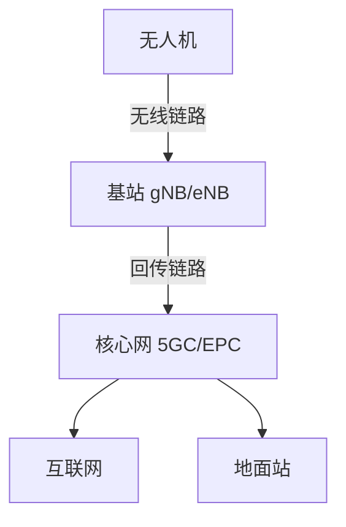
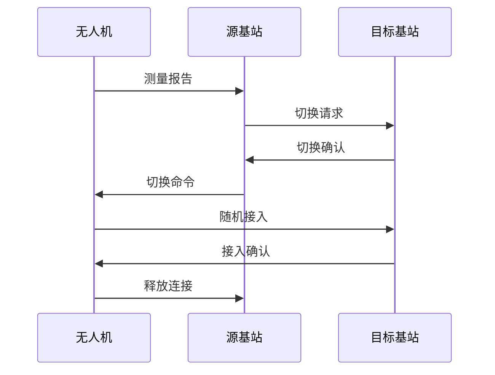

# 蜂窝网络与无人机

> 预计阅读：30 分钟 | 前置知识：无线通信基础

---

## 1. 蜂窝网络概述

### 1.1 蜂窝网络架构



### 1.2 蜂窝网络代际

| 代际 | 标准 | 峰值速率 | 延迟 | 频段 |
|------|------|---------|------|------|
| 2G | GSM | 14.4 kbps | 300ms | 900/1800 MHz |
| 3G | UMTS | 2 Mbps | 100ms | 2100 MHz |
| 4G | LTE | 1 Gbps | 10ms | 700-2600 MHz |
| 5G | NR | 20 Gbps | 1ms | Sub-6/mmWave |

---

## 2. 蜂窝覆盖与无人机

### 2.1 覆盖特点

```
地面覆盖 vs 空中覆盖:

地面覆盖:
  基站 ──→ 地面用户 (100-500m)
    │
    └──→ 室内用户 (穿透损耗)

空中覆盖:
  基站 ──→ 低空无人机 (100-300m)
    │
    └──→ 高空无人机 (>300m)
           │
           └──→ 可能看到多个基站 (干扰)
```

### 2.2 空中覆盖挑战

| 挑战 | 原因 | 影响 |
|------|------|------|
| 视距传播 | 高空无障碍物 | 信号强但干扰多 |
| 多基站可见 | 高空视野广 | 同频干扰严重 |
| 频繁切换 | 飞行移动 | 切换延迟和丢包 |
| 天线下倾角 | 基站天线朝地面 | 高空覆盖弱 |
| 功率控制 | 地面优化 | 空中功率不匹配 |

### 2.3 覆盖优化方案

```python
# 无人机蜂窝覆盖评估
def evaluate_coverage(uav_alt, bs_height, bs_tilt, frequency):
    """评估无人机蜂窝覆盖"""
    import math
    
    # 基站到无人机的仰角
    distance_horizontal = 1000  # 假设水平距离 1km
    elevation_angle = math.atan2(
        uav_alt - bs_height, 
        distance_horizontal
    ) * 180 / math.pi
    
    # 天线增益（考虑下倾角）
    # 假设天线波束宽度 65°
    beamwidth = 65
    angle_diff = abs(elevation_angle - bs_tilt)
    
    if angle_diff < beamwidth / 2:
        # 在波束内
        gain_reduction = 12 * (angle_diff / (beamwidth / 2)) ** 2
        coverage = "良好"
    else:
        # 在波束外
        gain_reduction = 20
        coverage = "弱"
    
    return {
        'elevation_angle': elevation_angle,
        'gain_reduction': gain_reduction,
        'coverage': coverage
    }
```

---

## 3. 无人机蜂窝通信场景

### 3.1 应用场景

| 场景 | 高度 | 需求 | 挑战 |
|------|------|------|------|
| 物流配送 | 100-300m | 高可靠 | 频繁切换 |
| 巡检巡检 | 50-150m | 稳定连接 | 遮挡 |
| 应急通信 | 100-500m | 大带宽 | 高空覆盖 |
| 农业植保 | 5-30m | 低延迟 | 低空覆盖 |
| 城市空中交通 | 300-1000m | 超可靠 | 多基站干扰 |

### 3.2 通信需求

```python
# 不同场景的通信需求
scenarios = {
    '物流配送': {
        'bandwidth': '10 Mbps',
        'latency': '< 100ms',
        'reliability': '99.9%',
        'distance': '10-30 km'
    },
    '巡检巡检': {
        'bandwidth': '20 Mbps',
        'latency': '< 50ms',
        'reliability': '99.99%',
        'distance': '5-15 km'
    },
    '应急通信': {
        'bandwidth': '50 Mbps',
        'latency': '< 20ms',
        'reliability': '99.999%',
        'distance': '5-10 km'
    }
}
```

---

## 4. 干扰管理

### 4.1 干扰类型

```
无人机蜂窝干扰:

1. 地对空干扰:
   地面用户 ──→ 基站 ──→ 无人机 (上行干扰)

2. 空对地干扰:
   无人机 ──→ 基站 ──→ 地面用户 (下行干扰)

3. 空对空干扰:
   无人机A ──→ 基站 ──→ 无人机B (多机干扰)
```

### 4.2 干扰缓解技术

| 技术 | 原理 | 效果 |
|------|------|------|
| 功率控制 | 调整发射功率 | 减少干扰 |
| 波束成形 | 定向发射 | 空间隔离 |
| 资源分配 | 频率/时隙分离 | 避免冲突 |
| 干扰消除 | 信号处理 | 消除干扰信号 |
| 协作通信 | 多基站协作 | 减少小区间干扰 |

```python
class InterferenceManager:
    """干扰管理器"""
    
    def __init__(self, uav_id, bs_list):
        self.uav_id = uav_id
        self.bs_list = bs_list
    
    def calculate_sinr(self, signal_power, interference_powers, noise_power):
        """计算信干噪比"""
        total_interference = sum(interference_powers)
        sinr = signal_power / (total_interference + noise_power)
        return 10 * math.log10(sinr)
    
    def power_control(self, target_sinr, current_sinr):
        """功率控制"""
        adjustment = target_sinr - current_sinr
        return adjustment
    
    def beamforming_gain(self, angle_to_uav, beamwidth):
        """波束成形增益"""
        if abs(angle_to_uav) < beamwidth / 2:
            return 10  # 主瓣增益
        else:
            return -20  # 旁瓣抑制
```

---

## 5. 频繁切换问题

### 5.1 切换过程



### 5.2 切换优化

| 优化技术 | 原理 | 效果 |
|---------|------|------|
| 条件切换 | 满足条件自动切换 | 减少延迟 |
| 双活切换 | 同时连接两个基站 | 无缝切换 |
| 预测切换 | 基于轨迹预测 | 提前准备 |
| 小区间协作 | 基站间协调 | 减少干扰 |

```python
class HandoverManager:
    """切换管理器"""
    
    def __init__(self):
        self.history = []
        self.prediction_model = None
    
    def predict_handover(self, uav_position, uav_velocity, bs_list):
        """预测切换时机"""
        # 基于轨迹预测
        future_position = {
            'lat': uav_position['lat'] + uav_velocity['vx'] * 10,
            'lon': uav_position['lon'] + uav_velocity['vy'] * 10,
            'alt': uav_position['alt']
        }
        
        # 评估未来位置的信号质量
        best_bs = None
        best_rsrp = -float('inf')
        
        for bs in bs_list:
            rsrp = self.calculate_rsrp(future_position, bs)
            if rsrp > best_rsrp:
                best_rsrp = rsrp
                best_bs = bs
        
        return best_bs, best_rsrp
    
    def calculate_rsrp(self, position, base_station):
        """计算参考信号接收功率"""
        import math
        
        # 距离计算
        dlat = position['lat'] - base_station['lat']
        dlon = position['lon'] - base_station['lon']
        dalt = position['alt'] - base_station['alt']
        
        distance = math.sqrt(dlat**2 + dlon**2 + dalt**2) * 111000
        
        # 路径损耗
        freq = 2000  # MHz
        fspl = 20 * math.log10(distance) + 20 * math.log10(freq) + 32.44
        
        # RSRP
        rsrp = base_station['power'] - fspl
        
        return rsrp
```

---

## 6. 3GPP 标准化

### 6.1 3GPP UAV 标准

| 标准 | 版本 | 内容 |
|------|------|------|
| TR 22.829 | R15 | UAV 通信需求 |
| TR 36.777 | R15 | LTE UAV 研究 |
| TS 22.125 | R16 | UAV 服务需求 |
| TR 22.829 | R16 | 5G UAV 增强 |

### 6.2 关键特性

```
3GPP UAV 通信特性:

1. 高空覆盖优化:
   - 天线下倾角调整
   - 专用覆盖层

2. 干扰管理:
   - UAV 功率限制
   - 波束成形

3. 移动性管理:
   - 快速切换
   - 条件切换

4. 安全:
   - 身份认证
   - 数据加密
```

---

## 思考题

1. **无人机在高空飞行时，为什么比地面用户面临更严重的干扰问题？**

2. **蜂窝网络的频繁切换对无人机通信有什么影响？如何优化？**

3. **比较专用数传电台和蜂窝网络在无人机通信中的优缺点。**

4. **如何评估某个区域的蜂窝覆盖是否满足无人机飞行需求？**

5. **3GPP 标准中，针对无人机通信有哪些特殊优化？**

<details>
<summary>参考答案</summary>

**1. 高空干扰原因：**

- 视距传播：高空无障碍物，信号传播远
- 多基站可见：可看到多个基站，同频干扰
- 天线下倾角：基站天线朝地面，高空覆盖弱但干扰强

**2. 频繁切换影响：**

- 延迟增加：切换过程需要时间
- 丢包：切换期间可能丢包
- 信令开销：频繁切换消耗资源

优化：条件切换、双活切换、预测切换

**3. 数传电台 vs 蜂窝网络：**

数传电台：专用、低延迟、距离有限
蜂窝网络：覆盖广、带宽大、依赖运营商

**4. 覆盖评估方法：**

- 信号强度测试
- 仿真工具评估
- 实地飞行测试
- 分析基站配置

**5. 3GPP UAV 优化：**

- 高空覆盖优化
- 干扰管理增强
- 移动性管理
- 安全增强

</details>
