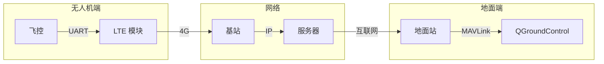

# 4G-LTE 通信链路

> 预计阅读：30 分钟 | 前置知识：蜂窝网络基础、MAVLink 协议

---

## 1. LTE 技术概述

### 1.1 LTE 关键特性

| 特性 | 说明 | 无人机应用价值 |
|------|------|--------------|
| 高带宽 | 上行 50-100 Mbps | 视频回传 |
| 低延迟 | 10-50ms | 实时控制 |
| 广覆盖 | 全国覆盖 | 超视距飞行 |
| 移动性 | 支持高速移动 | 无人机飞行 |
| QoS | 服务质量保证 | 关键数据优先 |

### 1.2 LTE 频段

| 频段 | 频率范围 | 带宽 | 特点 |
|------|---------|------|------|
| Band 1 | 2100 MHz | 60 MHz | FDD |
| Band 3 | 1800 MHz | 75 MHz | FDD |
| Band 8 | 900 MHz | 35 MHz | FDD，覆盖好 |
| Band 34 | 2010 MHz | 15 MHz | TDD |
| Band 38 | 2600 MHz | 50 MHz | TDD |
| Band 40 | 2300 MHz | 100 MHz | TDD，中国常用 |
| Band 41 | 2500 MHz | 194 MHz | TDD，中国常用 |

---

## 2. LTE 模块集成

### 2.1 常用 LTE 模块

| 模块 | 厂商 | 接口 | 特点 | 价格 |
|------|------|------|------|------|
| SIM7600 | SIMCOM | USB/UART | 成熟稳定 | ¥100-200 |
| EC20 | Quectel | USB/UART | 小型化 | ¥100-150 |
| SIM7000 | SIMCOM | UART | NB-IoT/Cat-M | ¥50-100 |
| RM500 | Quectel | USB | 5G/4G | ¥500-800 |
| A7670 | SIMCOM | UART | 低成本 | ¥30-50 |

### 2.2 硬件连接

```
LTE 模块连接:

Pixhawk 飞控
    │
    │ UART (TELEM2)
    │
    ↓
┌──────────────┐
│ LTE 模块     │
│ SIM7600      │
│              │
│ SIM 卡槽     │ ←── SIM 卡
│ USB 接口     │ ←── 连接计算机
│ 天线接口     │ ←── 4G 天线
│              │
└──────────────┘
```

### 2.3 模块配置

```python
# AT 命令配置 LTE 模块
import serial
import time

def configure_lte(port, baud=115200):
    """配置 LTE 模块"""
    ser = serial.Serial(port, baud, timeout=1)
    
    def send_at(command, timeout=1):
        """发送 AT 命令"""
        ser.write((command + '\r\n').encode())
        time.sleep(timeout)
        return ser.read(ser.inWaiting()).decode()
    
    # 检查模块
    response = send_at('AT')
    print(f"模块响应: {response}")
    
    # 查询 SIM 卡状态
    response = send_at('AT+CPIN?')
    print(f"SIM 卡状态: {response}")
    
    # 查询信号强度
    response = send_at('AT+CSQ')
    print(f"信号强度: {response}")
    
    # 查询网络注册状态
    response = send_at('AT+CREG?')
    print(f"网络注册: {response}")
    
    # 设置 APN
    send_at('AT+CGDCONT=1,"IP","cmnet"')  # 中国移动
    # send_at('AT+CGDCONT=1,"IP","3gnet"')  # 中国联通
    # send_at('AT+CGDCONT=1,"IP","ctnet"')  # 中国电信
    
    # 激活数据连接
    response = send_at('AT+CGACT=1,1')
    print(f"数据连接: {response}")
    
    # 获取 IP 地址
    response = send_at('AT+CGPADDR=1')
    print(f"IP 地址: {response}")
    
    ser.close()
    return True

# 使用示例
configure_lte('/dev/ttyUSB2')
```

---

## 3. MAVLink over LTE

### 3.1 系统架构



### 3.2 UDP 转发方案

```python
# 无人机端 UDP 转发器
import socket
from pymavlink import mavutil

class LTEForwarder:
    def __init__(self, lte_host, lte_port, local_port):
        self.lte_host = lte_host
        self.lte_port = lte_port
        self.local_port = local_port
        
        # 本地 socket（连接飞控）
        self.local_sock = socket.socket(socket.AF_INET, socket.SOCK_DGRAM)
        self.local_sock.bind(('0.0.0.0', local_port))
        self.local_sock.settimeout(0.1)
        
        # LTE socket（连接地面站）
        self.lte_sock = socket.socket(socket.AF_INET, socket.SOCK_DGRAM)
        
    def run(self):
        """主循环"""
        print(f"启动 LTE 转发器: 本地 {self.local_port} -> {self.lte_host}:{self.lte_port}")
        
        while True:
            # 从本地接收 MAVLink 数据
            try:
                data, addr = self.local_sock.recvfrom(1024)
                # 转发到 LTE
                self.lte_sock.sendto(data, (self.lte_host, self.lte_port))
            except socket.timeout:
                pass
            
            # 从 LTE 接收数据
            try:
                data, addr = self.lte_sock.recvfrom(1024)
                # 转发到本地
                self.local_sock.sendto(data, ('127.0.0.1', 14550))
            except socket.timeout:
                pass

# 使用示例
forwarder = LTEForwarder(
    lte_host='your-server.com',
    lte_port=14550,
    local_port=14551
)
forwarder.run()
```

### 3.3 服务器中继

```python
# 中继服务器
import socket
import threading

class RelayServer:
    def __init__(self, port=14550):
        self.port = port
        self.clients = {}  # 客户端地址映射
        
        self.sock = socket.socket(socket.AF_INET, socket.SOCK_DGRAM)
        self.sock.bind(('0.0.0.0', port))
        self.sock.settimeout(1.0)
        
    def run(self):
        """主循环"""
        print(f"中继服务器启动: 端口 {self.port}")
        
        while True:
            try:
                data, addr = self.sock.recvfrom(1024)
                self.handle_packet(data, addr)
            except socket.timeout:
                continue
    
    def handle_packet(self, data, addr):
        """处理数据包"""
        # 记录客户端
        client_id = f"{addr[0]}:{addr[1]}"
        self.clients[client_id] = addr
        
        # 转发给其他客户端
        for cid, caddr in self.clients.items():
            if cid != client_id:
                try:
                    self.sock.sendto(data, caddr)
                except Exception as e:
                    print(f"转发失败: {e}")

# 使用示例
server = RelayServer(port=14550)
server.run()
```

---

## 4. 延迟分析

### 4.1 LTE 延迟组成

```
端到端延迟组成:

飞控处理: 1-5ms
    ↓
串口传输: 1-10ms (取决于波特率)
    ↓
LTE 模块处理: 5-20ms
    ↓
空口传输: 10-30ms (取决于信号质量)
    ↓
基站处理: 5-10ms
    ↓
核心网传输: 5-20ms
    ↓
互联网传输: 10-50ms (取决于距离)
    ↓
服务器处理: 1-5ms
    ↓
总延迟: 40-150ms
```

### 4.2 延迟测量

```python
import time
import socket

def measure_latency(host, port, count=100):
    """测量网络延迟"""
    sock = socket.socket(socket.AF_INET, socket.SOCK_DGRAM)
    sock.settimeout(1.0)
    
    latencies = []
    
    for i in range(count):
        # 发送测试包
        send_time = time.time()
        test_data = f"PING {i} {send_time}".encode()
        sock.sendto(test_data, (host, port))
        
        # 等待响应
        try:
            data, addr = sock.recvfrom(1024)
            recv_time = time.time()
            latency = (recv_time - send_time) * 1000  # ms
            latencies.append(latency)
        except socket.timeout:
            latencies.append(None)
        
        time.sleep(0.1)
    
    # 统计
    valid_latencies = [l for l in latencies if l is not None]
    if valid_latencies:
        avg_latency = sum(valid_latencies) / len(valid_latencies)
        min_latency = min(valid_latencies)
        max_latency = max(valid_latencies)
        loss_rate = (count - len(valid_latencies)) / count * 100
        
        print(f"延迟统计:")
        print(f"  平均: {avg_latency:.1f}ms")
        print(f"  最小: {min_latency:.1f}ms")
        print(f"  最大: {max_latency:.1f}ms")
        print(f"  丢包率: {loss_rate:.1f}%")
    
    sock.close()

# 使用示例
measure_latency('your-server.com', 14550)
```

---

## 5. QGroundControl over LTE

### 5.1 配置步骤

```
QGroundControl LTE 连接配置:

1. 无人机端:
   - LTE 模块连接互联网
   - 运行 UDP 转发器
   - 转发器连接到中继服务器

2. 中继服务器:
   - 公网 IP 或域名
   - 运行 UDP 中继服务
   - 配置防火墙放行 UDP 端口

3. 地面站:
   - QGroundControl 添加 UDP 连接
   - 设置端口为中继服务器端口
   - 等待 MAVLink 心跳
```

### 5.2 QGroundControl 配置

```python
# QGroundControl 连接配置
# 在 QGC 中: 通信设置 -> 添加连接

# 连接参数
connection_params = {
    'type': 'UDP',
    'port': 14550,
    'target_host': 'your-server.com',
    'target_port': 14550
}

# 或使用命令行参数
# QGroundControl --udp-port 14550
```

---

## 6. 性能优化

### 6.1 带宽优化

```python
# 数据压缩
import zlib

def compress_mavlink(data):
    """压缩 MAVLink 数据"""
    return zlib.compress(data, level=6)

def decompress_mavlink(data):
    """解压缩 MAVLink 数据"""
    return zlib.decompress(data)

# 消息频率控制
def optimize_message_rate(messages, bandwidth_limit):
    """优化消息发送频率"""
    # 根据带宽限制调整频率
    current_bandwidth = calculate_bandwidth(messages)
    
    if current_bandwidth > bandwidth_limit:
        # 降低非关键消息频率
        for msg in messages:
            if msg['priority'] > 2:  # 低优先级
                msg['rate'] = max(1, msg['rate'] // 2)
    
    return messages
```

### 6.2 可靠性优化

```python
class ReliableUDP:
    """可靠 UDP 传输"""
    
    def __init__(self):
        self.seq_num = 0
        self.ack_received = {}
        self.retransmit_queue = []
    
    def send(self, data):
        """发送数据"""
        packet = {
            'seq': self.seq_num,
            'data': data,
            'timestamp': time.time()
        }
        self.seq_num += 1
        
        # 发送
        self.sock.sendto(json.dumps(packet).encode(), self.addr)
        
        # 等待 ACK
        self.ack_received[packet['seq']] = False
        
        # 超时重传
        threading.Timer(0.5, self.retransmit, args=[packet]).start()
    
    def retransmit(self, packet):
        """超时重传"""
        if not self.ack_received.get(packet['seq']):
            print(f"重传: seq={packet['seq']}")
            self.sock.sendto(json.dumps(packet).encode(), self.addr)
            # 再次超时
            threading.Timer(1.0, self.retransmit, args=[packet]).start()
```

---

## 思考题

1. **LTE 模块（如 SIM7600）与飞控的连接方式有哪些？各有什么优缺点？**

2. **MAVLink over LTE 的延迟通常在什么范围？对无人机控制有什么影响？**

3. **如何设计一个可靠的 LTE 通信链路，保证关键控制指令不丢失？**

4. **比较 LTE 和传统数传电台在超视距飞行中的适用性。**

5. **如何优化 LTE 链路的带宽使用，支持高清视频和遥测同时传输？**

<details>
<summary>参考答案</summary>

**1. LTE 模块连接方式：**

- USB：高速，需要驱动
- UART：简单，速率受限
- SPI：嵌入式友好

**2. LTE 延迟范围：**

- 典型：40-100ms
- 最好：20-40ms
- 最差：100-200ms

影响：控制指令延迟，需要预测控制

**3. 可靠链路设计：**

- 关键指令：TCP 或可靠 UDP
- 遥测数据：UDP 允许丢包
- 心跳检测：超时告警
- 冗余链路：主备切换

**4. LTE vs 数传电台：**

LTE：覆盖广、带宽大、延迟高、依赖运营商
数传电台：专用、低延迟、距离有限

**5. 带宽优化：**

- 数据压缩
- 消息优先级
- 自适应码率
- 关键帧优先

</details>
