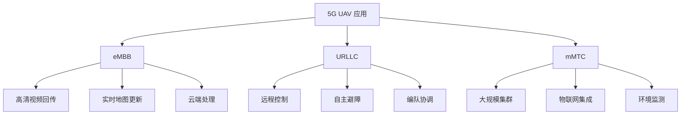
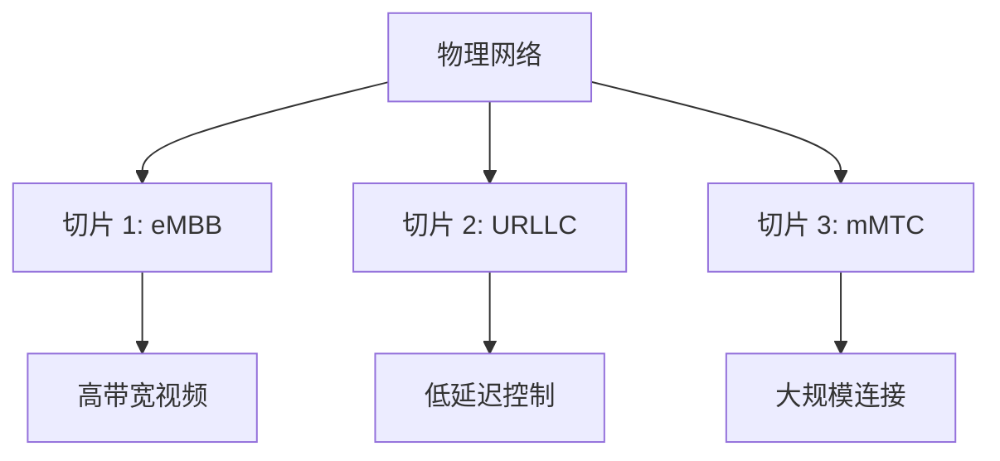

# 5G-NR 与 URLLC

> 预计阅读：30 分钟 | 前置知识：4G-LTE 基础、通信理论

---

## 1. 5G NR 概述

### 1.1 5G 三大场景

| 场景 | 全称 | 关键指标 | 无人机应用 |
|------|------|---------|----------|
| eMBB | 增强移动宽带 | 10 Gbps | 高清视频回传 |
| URLLC | 超可靠低延迟通信 | 1ms, 99.999% | 实时控制 |
| mMTC | 大规模机器通信 | 100 万设备/km² | 集群通信 |

### 1.2 5G NR 关键参数

| 参数 | Sub-6 GHz | mmWave |
|------|-----------|--------|
| 频率范围 | 450-6000 MHz | 24.25-52.6 GHz |
| 子载波间隔 | 15/30/60 kHz | 60/120 kHz |
| 最大带宽 | 100 MHz | 400 MHz |
| 峰值速率 | 2.5 Gbps | 20 Gbps |
| 延迟 | 4ms | 1ms |

---

## 2. 5G UAV 应用场景

### 2.1 场景分类



### 2.2 需求矩阵

| 应用 | 带宽 | 延迟 | 可靠性 | 连接数 |
|------|------|------|--------|--------|
| 视频巡检 | 50 Mbps | 100ms | 99% | 1 |
| 远程控制 | 1 Mbps | 10ms | 99.999% | 1 |
| 集群编队 | 10 Mbps | 5ms | 99.999% | 10-100 |
| 物流配送 | 10 Mbps | 50ms | 99.9% | 1 |
| 应急通信 | 100 Mbps | 20ms | 99.99% | 10 |

---

## 3. URLLC 技术

### 3.1 URLLC 关键技术

| 技术 | 原理 | 效果 |
|------|------|------|
| 短 TTI | 缩短传输时间间隔 | 降低延迟 |
| 灵活调度 | 动态资源分配 | 快速响应 |
| 多连接 | 同时连接多个基站 | 提高可靠性 |
| 包复制 | 多路径传输 | 减少丢包 |
| 预emptive scheduling | 抢占式调度 | 优先级保证 |

### 3.2 延迟分析

```
URLLC 延迟组成:

传输延迟: TTI / 2
    ↓
调度延迟: 0.5-1ms
    ↓
处理延迟: 0.5-1ms
    ↓
传播延迟: 距离 / 光速
    ↓
总延迟: 1-4ms

5G NR vs LTE 延迟对比:
┌──────────┬──────────┬──────────┐
│ 参数     │ LTE      │ 5G NR    │
├──────────┼──────────┼──────────┤
│ TTI      │ 1ms      │ 0.125ms  │
│ 调度延迟 │ 1ms      │ 0.5ms    │
│ 处理延迟 │ 1ms      │ 0.5ms    │
│ 总延迟   │ 4-10ms   │ 1-4ms    │
└──────────┴──────────┴──────────┘
```

### 3.3 可靠性保障

```python
# URLLC 可靠性计算
def calculate_urllc_reliability(
    ber,           # 误码率
    packet_size,   # 包大小 (bytes)
    diversity_order # 分集阶数
):
    """计算 URLLC 可靠性"""
    # 单链路包错误率
    bits_per_packet = packet_size * 8
    per_single = 1 - (1 - ber) ** bits_per_packet
    
    # 多链路分集
    per_diversity = per_single ** diversity_order
    
    # 可靠性
    reliability = 1 - per_diversity
    
    return reliability

# 示例：BER=1e-6, 100字节包, 2重分集
reliability = calculate_urllc_reliability(1e-6, 100, 2)
print(f"可靠性: {reliability:.9f}")  # 0.999999998
```

---

## 4. 网络切片

### 4.1 网络切片概念



### 4.2 UAV 切片配置

| 切片类型 | QoS 参数 | 适用场景 |
|---------|---------|---------|
| eMBB 切片 | 100Mbps, 50ms | 视频回传 |
| URLLC 切片 | 1Mbps, 1ms | 实时控制 |
| mMTC 切片 | 100kbps, 100ms | 集群通信 |

### 4.3 切片管理

```python
class NetworkSliceManager:
    """网络切片管理器"""
    
    def __init__(self):
        self.slices = {
            'embb': {
                'bandwidth': 100,  # Mbps
                'latency': 50,     # ms
                'reliability': 0.99,
                'priority': 3
            },
            'urllc': {
                'bandwidth': 1,    # Mbps
                'latency': 1,      # ms
                'reliability': 0.99999,
                'priority': 1
            },
            'mmtc': {
                'bandwidth': 0.1,  # Mbps
                'latency': 100,    # ms
                'reliability': 0.99,
                'priority': 5
            }
        }
    
    def select_slice(self, application_type):
        """根据应用选择切片"""
        if application_type == 'video':
            return self.slices['embb']
        elif application_type == 'control':
            return self.slices['urllc']
        elif application_type == 'telemetry':
            return self.slices['mmtc']
        else:
            return self.slices['embb']
    
    def allocate_resources(self, slice_type, requirements):
        """分配资源"""
        slice_config = self.slices[slice_type]
        
        # 检查是否满足需求
        if requirements['bandwidth'] > slice_config['bandwidth']:
            print(f"警告: 带宽需求 {requirements['bandwidth']}Mbps 超过切片限制")
        
        if requirements['latency'] < slice_config['latency']:
            print(f"警告: 延迟需求 {requirements['latency']}ms 低于切片能力")
        
        return slice_config
```

---

## 5. 波束成形

### 5.1 波束成形原理

```
波束成形示意:

传统天线:                    波束成形:
    ╲│╱                       ╲│╱
     │                         │
     │                         │
     │                         │
─────────────────        ─────────────────
  全向辐射                  定向波束

增益: 0 dBi                增益: 10-20 dBi
覆盖: 全向                  覆盖: 定向
```

### 5.2 UAV 波束跟踪

```python
class BeamTracker:
    """波束跟踪器"""
    
    def __init__(self, antenna_array):
        self.antenna = antenna_array
        self.beam_direction = {'azimuth': 0, 'elevation': 0}
    
    def track_uav(self, uav_position, uav_velocity):
        """跟踪无人机"""
        # 计算波束指向
        azimuth = math.atan2(
            uav_position['y'] - self.antenna['y'],
            uav_position['x'] - self.antenna['x']
        )
        
        distance = math.sqrt(
            (uav_position['x'] - self.antenna['x'])**2 +
            (uav_position['y'] - self.antenna['y'])**2
        )
        
        elevation = math.atan2(
            uav_position['z'] - self.antenna['z'],
            distance
        )
        
        # 预测未来位置（补偿延迟）
        prediction_time = 0.005  # 5ms 预测
        future_position = {
            'x': uav_position['x'] + uav_velocity['vx'] * prediction_time,
            'y': uav_position['y'] + uav_velocity['vy'] * prediction_time,
            'z': uav_position['z'] + uav_velocity['vz'] * prediction_time
        }
        
        # 更新波束方向
        self.beam_direction = {
            'azimuth': azimuth,
            'elevation': elevation
        }
        
        return self.beam_direction
```

---

## 6. 5G UAV 模组

### 6.1 模组选型

| 模组 | 厂商 | 接口 | 频段 | 特点 | 价格 |
|------|------|------|------|------|------|
| RM500Q | Quectel | USB | Sub-6/mmWave | 全频段 | ¥800-1200 |
| SIM8200 | SIMCOM | USB | Sub-6 | 成熟 | ¥600-900 |
| FM150 | Fibocom | USB/M.2 | Sub-6 | 小型化 | ¥500-800 |
| RG500Q | Quectel | USB | Sub-6 | 工业级 | ¥700-1000 |

### 6.2 集成方案

```
5G UAV 集成方案:

方案1: 伴侣电脑方案
┌──────────┐    UART    ┌──────────┐    USB    ┌──────────┐
│ 飞控     │───────────→│ 伴侣电脑 │───────────→│ 5G 模组  │
│ Pixhawk  │            │ RPi/Jetson│           │ RM500Q   │
└──────────┘            └──────────┘           └──────────┘

方案2: 直连方案
┌──────────┐    USB     ┌──────────┐
│ 飞控     │───────────→│ 5G 模组  │
│ CubeOrange│           │ SIM8200  │
└──────────┘            └──────────┘

方案3: 网关方案
┌──────────┐    UART    ┌──────────┐    5G     ┌──────────┐
│ 飞控     │───────────→│ 5G 网关  │───────────→│ 网络     │
│          │            │ (专用)   │           │          │
└──────────┘            └──────────┘           └──────────┘
```

---

## 7. 测试与验证

### 7.1 5G 性能测试

```python
def test_5g_performance(host, port):
    """5G 性能测试"""
    import socket
    import time
    
    # 延迟测试
    print("=== 延迟测试 ===")
    sock = socket.socket(socket.AF_INET, socket.SOCK_DGRAM)
    sock.settimeout(1.0)
    
    latencies = []
    for i in range(100):
        start = time.time()
        sock.sendto(f"PING {i}".encode(), (host, port))
        try:
            data, addr = sock.recvfrom(1024)
            latency = (time.time() - start) * 1000
            latencies.append(latency)
        except socket.timeout:
            pass
    
    if latencies:
        print(f"平均延迟: {sum(latencies)/len(latencies):.1f}ms")
        print(f"最小延迟: {min(latencies):.1f}ms")
        print(f"最大延迟: {max(latencies):.1f}ms")
    
    # 吞吐量测试
    print("\n=== 吞吐量测试 ===")
    test_data = b'0' * 1024  # 1KB
    start = time.time()
    sent = 0
    
    while time.time() - start < 10:  # 10秒测试
        try:
            sock.sendto(test_data, (host, port))
            sent += 1
        except:
            pass
    
    throughput = sent * 1024 * 8 / 10 / 1000000  # Mbps
    print(f"吞吐量: {throughput:.1f} Mbps")
    
    sock.close()
```

---

## 思考题

1. **5G URLLC 的 1ms 延迟是如何实现的？与 LTE 相比有哪些技术改进？**

2. **网络切片如何为无人机应用提供差异化的服务质量？**

3. **波束成形技术对无人机通信有什么意义？如何实现波束跟踪？**

4. **比较 Sub-6 GHz 和 mmWave 频段在无人机通信中的适用性。**

5. **设计一个基于 5G URLLC 的无人机远程控制系统，说明关键技术选型。**

<details>
<summary>参考答案</summary>

**1. 1ms 延迟实现：**

- 短 TTI：0.125ms（LTE 为 1ms）
- 灵活调度：无需等待固定调度时机
- 边缘计算：数据在基站侧处理
- 预分配资源：减少调度延迟

**2. 网络切片：**

- eMBB 切片：高带宽视频
- URLLC 切片：低延迟控制
- mMTC 切片：大规模连接
- 每个切片独立 QoS 保证

**3. 波束成形意义：**

- 提高信号强度（10-20dB 增益）
- 减少干扰（空间隔离）
- 扩大覆盖范围
- 跟踪移动无人机

**4. Sub-6 vs mmWave：**

Sub-6：覆盖好，穿透强，带宽适中
mmWave：带宽大，延迟低，覆盖差

**5. 5G 远程控制设计：**

- URLLC 切片保证延迟
- 多连接提高可靠性
- 边缘计算减少延迟
- 波束成形提高信号

</details>
