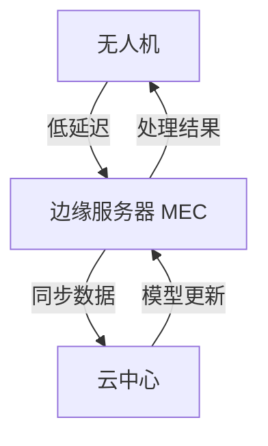
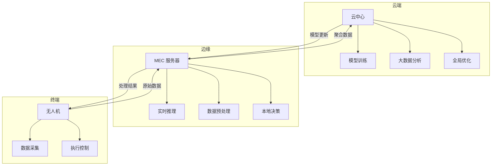

# 边缘计算与云协同

> 预计阅读：30 分钟 | 前置知识：5G NR 基础、云计算概念

---

## 1. 边缘计算概述

### 1.1 什么是 MEC

MEC（Multi-access Edge Computing）将计算能力部署在网络边缘，靠近用户和设备。



### 1.2 MEC vs 云计算

| 特性 | MEC 边缘计算 | 云计算 |
|------|-------------|--------|
| 位置 | 基站侧 | 远程数据中心 |
| 延迟 | 1-10ms | 50-200ms |
| 带宽 | 本地处理 | 需要上传 |
| 计算能力 | 有限 | 强大 |
| 成本 | 按需 | 按量 |
| 适用场景 | 实时处理 | 大数据分析 |

---

## 2. UAV 边缘计算应用场景

### 2.1 应用分类

| 应用 | 计算需求 | 延迟需求 | 处理位置 |
|------|---------|---------|---------|
| 实时避障 | 高 | < 10ms | MEC |
| 视频分析 | 高 | < 100ms | MEC |
| 路径规划 | 中 | < 500ms | MEC/云 |
| 地图构建 | 高 | < 1s | MEC |
| 数据存储 | 低 | 不敏感 | 云 |
| 模型训练 | 极高 | 不敏感 | 云 |

### 2.2 实时避障

```python
# MEC 边缘避障处理
class EdgeObstacleAvoidance:
    """边缘避障处理"""
    
    def __init__(self, mec_server):
        self.mec = mec_server
        self.obstacle_model = None
    
    def process_frame(self, frame):
        """处理视频帧"""
        # 在 MEC 上运行避障算法
        result = self.mec.inference(
            model='obstacle_detection',
            input=frame
        )
        
        # 解析结果
        obstacles = []
        for detection in result['detections']:
            obstacles.append({
                'type': detection['class'],
                'distance': detection['distance'],
                'angle': detection['angle'],
                'confidence': detection['confidence']
            })
        
        return obstacles
    
    def generate_avoidance_command(self, obstacles, uav_state):
        """生成避障指令"""
        if not obstacles:
            return None
        
        # 找到最近障碍物
        nearest = min(obstacles, key=lambda x: x['distance'])
        
        if nearest['distance'] < 5.0:  # 5m 内
            # 计算避障方向
            avoid_angle = nearest['angle'] + 90  # 向右规避
            
            return {
                'action': 'avoid',
                'velocity': 2.0,  # m/s
                'direction': avoid_angle
            }
        
        return None
```

### 2.3 视频分析

```python
class EdgeVideoAnalytics:
    """边缘视频分析"""
    
    def __init__(self, mec_server):
        self.mec = mec_server
    
    def analyze_video(self, video_stream):
        """分析视频流"""
        results = []
        
        for frame in video_stream:
            # 目标检测
            detections = self.mec.inference(
                model='object_detection',
                input=frame
            )
            
            # 目标跟踪
            tracked = self.mec.inference(
                model='object_tracking',
                input=detections
            )
            
            # 行为分析
            behavior = self.mec.inference(
                model='behavior_analysis',
                input=tracked
            )
            
            results.append({
                'frame_id': frame['id'],
                'detections': detections,
                'tracked': tracked,
                'behavior': behavior
            })
        
        return results
```

---

## 3. 云协同架构

### 3.1 云边协同架构



### 3.2 数据流设计

```python
class CloudEdgeCoordinator:
    """云边协同器"""
    
    def __init__(self):
        self.edge_queue = []
        self.cloud_queue = []
    
    def process_data(self, data, priority):
        """处理数据"""
        if priority == 'realtime':
            # 实时数据在边缘处理
            result = self.edge_process(data)
            return result
        elif priority == 'batch':
            # 批量数据上传云端
            self.cloud_queue.append(data)
            return None
    
    def edge_process(self, data):
        """边缘处理"""
        # 避障、实时控制等
        result = {
            'type': 'control',
            'command': 'avoid',
            'parameters': {}
        }
        return result
    
    def cloud_sync(self):
        """云端同步"""
        if self.cloud_queue:
            # 批量上传
            data = self.cloud_queue[:100]  # 每次100条
            self.cloud_queue = self.cloud_queue[100:]
            
            # 上传到云端
            self.upload_to_cloud(data)
            
            # 获取模型更新
            model_update = self.download_model()
            if model_update:
                self.update_edge_model(model_update)
```

---

## 4. 任务卸载

### 4.1 任务卸载决策

```python
class TaskOffloadingDecision:
    """任务卸载决策"""
    
    def __init__(self):
        self.local_compute = 1.0  # GFLOPS
        self.edge_compute = 10.0  # GFLOPS
        self.cloud_compute = 100.0  # GFLOPS
        
        self.local_energy = 0.5  # W
        self.edge_energy = 0.1   # W (传输)
        self.cloud_energy = 0.2  # W (传输)
    
    def decide(self, task):
        """决定任务执行位置"""
        # 计算本地执行时间
        local_time = task['computing'] / self.local_compute
        
        # 计算边缘执行时间
        edge_transmit = task['data_size'] / 10e6  # 10Mbps
        edge_compute = task['computing'] / self.edge_compute
        edge_time = edge_transmit + edge_compute
        
        # 计算云端执行时间
        cloud_transmit = task['data_size'] / 1e6  # 1Mbps
        cloud_compute = task['computing'] / self.cloud_compute
        cloud_time = cloud_transmit + cloud_compute
        
        # 决策
        if task['latency_requirement'] < edge_time:
            # 延迟要求极高，本地执行
            return 'local', local_time
        elif edge_time < cloud_time:
            # 边缘更快
            return 'edge', edge_time
        else:
            # 云端更快
            return 'cloud', cloud_time
```

### 4.2 卸载策略

| 策略 | 适用场景 | 优点 | 缺点 |
|------|---------|------|------|
| 全本地 | 实时控制 | 零延迟 | 计算受限 |
| 全卸载 | 大计算任务 | 计算强 | 延迟高 |
| 部分卸载 | 混合任务 | 平衡 | 复杂 |
| 动态卸载 | 变化环境 | 灵活 | 决策开销 |

---

## 5. 云端任务规划

### 5.1 云端路径规划

```python
class CloudPathPlanner:
    """云端路径规划"""
    
    def __init__(self, cloud_api):
        self.cloud = cloud_api
    
    def plan_path(self, start, end, obstacles, constraints):
        """规划路径"""
        # 上传地图和约束
        map_data = self.upload_map(obstacles)
        
        # 调用云端规划算法
        path = self.cloud.plan_path(
            start=start,
            end=end,
            map_id=map_data['id'],
            constraints=constraints
        )
        
        # 下载路径
        return path
    
    def optimize_fleet(self, uavs, tasks):
        """集群任务优化"""
        # 上传任务和无人机状态
        fleet_data = {
            'uavs': [u.get_status() for u in uavs],
            'tasks': tasks
        }
        
        # 云端优化
        assignment = self.cloud.optimize_assignment(fleet_data)
        
        return assignment
```

### 5.2 云端数据分析

```python
class CloudAnalytics:
    """云端数据分析"""
    
    def __init__(self, cloud_api):
        self.cloud = cloud_api
    
    def analyze_flight_data(self, flight_logs):
        """分析飞行数据"""
        # 上传日志
        log_id = self.cloud.upload_logs(flight_logs)
        
        # 执行分析
        analysis = self.cloud.analyze(
            log_id=log_id,
            analyses=[
                'performance',
                'battery_health',
                'anomaly_detection',
                'route_optimization'
            ]
        )
        
        return analysis
    
    def train_model(self, training_data):
        """训练模型"""
        # 上传训练数据
        dataset_id = self.cloud.upload_dataset(training_data)
        
        # 启动训练任务
        job_id = self.cloud.start_training(
            dataset_id=dataset_id,
            model_type='object_detection',
            epochs=100
        )
        
        # 等待训练完成
        model = self.cloud.wait_for_model(job_id)
        
        return model
```

---

## 6. 实际部署

### 6.1 部署架构

```
UAV MEC 部署架构:

┌─────────────────────────────────────────────────┐
│                    云中心                        │
│  ┌─────────┐  ┌─────────┐  ┌─────────┐        │
│  │ 数据存储 │  │ 模型训练 │  │ 全局调度 │        │
│  └─────────┘  └─────────┘  └─────────┘        │
└─────────────────────────────────────────────────┘
                      │
                      │ 5G 回传
                      │
┌─────────────────────────────────────────────────┐
│                MEC 边缘服务器                    │
│  ┌─────────┐  ┌─────────┐  ┌─────────┐        │
│  │ 实时推理 │  │ 数据缓存 │  │ 本地决策 │        │
│  └─────────┘  └─────────┘  └─────────┘        │
└─────────────────────────────────────────────────┘
                      │
                      │ 5G 空口
                      │
┌─────────────────────────────────────────────────┐
│                  无人机                          │
│  ┌─────────┐  ┌─────────┐  ┌─────────┐        │
│  │ 传感器  │  │ 控制器  │  │ 通信模块 │        │
│  └─────────┘  └─────────┘  └─────────┘        │
└─────────────────────────────────────────────────┘
```

### 6.2 部署检查清单

```
MEC 部署检查清单:

基础设施:
□ MEC 服务器硬件配置
□ 5G 基站连接
□ 网络带宽保证
□ 电源和散热

软件平台:
□ MEC 平台部署
□ 容器化环境
□ API 网关
□ 监控系统

应用部署:
□ 推理模型部署
□ 数据处理流水线
□ API 接口开发
□ 安全认证

测试验证:
□ 延迟测试
□ 吞吐量测试
□ 可靠性测试
□ 故障恢复测试
```

---

## 思考题

1. **MEC 边缘计算如何降低无人机应用的延迟？请举例说明。**

2. **哪些任务适合在边缘处理，哪些适合在云端处理？如何决策？**

3. **云边协同架构中，数据同步面临哪些挑战？如何解决？**

4. **任务卸载决策需要考虑哪些因素？如何优化卸载策略？**

5. **设计一个基于 MEC 的无人机实时避障系统，说明架构和关键技术。**

<details>
<summary>参考答案</summary>

**1. MEC 降低延迟：**

- 避免数据回传云端（节省 50-200ms）
- 本地处理实时数据
- 边缘缓存减少重复传输

**2. 任务分配：**

边缘：实时避障、视频预处理、本地控制
云端：模型训练、大数据分析、全局优化

**3. 数据同步挑战：**

- 网络不稳定：断点续传
- 数据一致性：版本控制
- 带宽限制：增量同步

**4. 卸载决策因素：**

- 计算复杂度
- 延迟要求
- 数据大小
- 网络状态
- 能量预算

**5. MEC 避障系统：**

- 传感器数据在边缘处理
- 目标检测模型部署在 MEC
- 避障算法在边缘运行
- 控制指令低延迟下发

</details>
