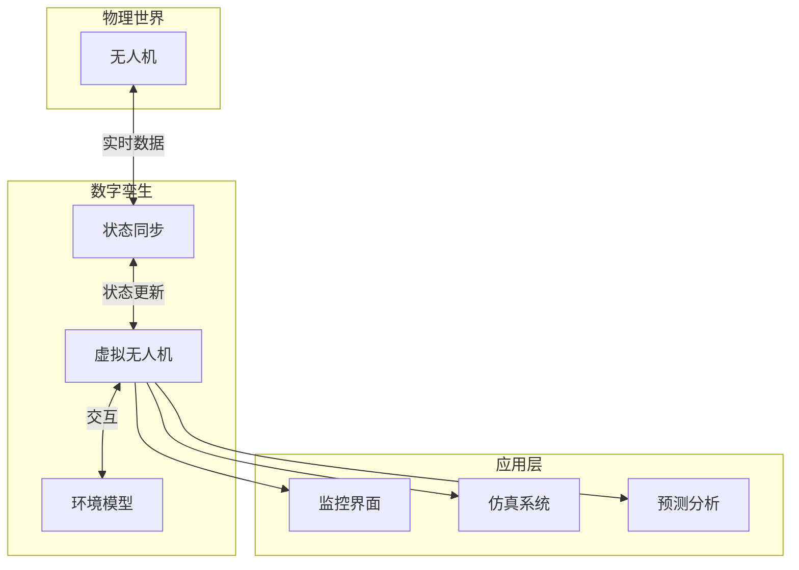
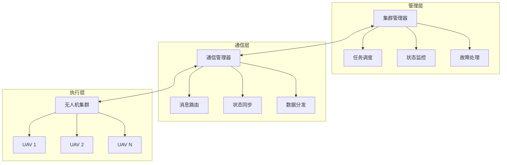

# 物联网与无人机集群

> 预计阅读：30 分钟 | 前置知识：5G NR 基础、MQTT/DDS 协议

---

## 1. 物联网通信协议

### 1.1 协议对比

| 协议 | 传输层 | 特点 | 适用场景 |
|------|--------|------|---------|
| MQTT | TCP | 轻量级发布/订阅 | 遥测数据 |
| DDS | UDP | 实时数据分发 | 实时控制 |
| AMQP | TCP | 企业级消息队列 | 任务调度 |
| CoAP | UDP | RESTful，低功耗 | 传感器数据 |

### 1.2 MQTT 协议

```python
# MQTT 无人机通信示例
import paho.mqtt.client as mqtt
import json

class UAVMQTTClient:
    def __init__(self, broker, port, uav_id):
        self.uav_id = uav_id
        self.client = mqtt.Client(f"uav_{uav_id}")
        self.client.on_connect = self.on_connect
        self.client.on_message = self.on_message
        
        self.client.connect(broker, port)
        self.client.loop_start()
    
    def on_connect(self, client, userdata, flags, rc):
        """连接回调"""
        print(f"已连接: {rc}")
        # 订阅命令主题
        client.subscribe(f"uav/{self.uav_id}/command")
        # 订阅集群主题
        client.subscribe("swarm/broadcast")
    
    def on_message(self, client, userdata, msg):
        """消息回调"""
        data = json.loads(msg.payload.decode())
        print(f"收到: {msg.topic} -> {data}")
        
        if 'command' in data:
            self.process_command(data['command'])
    
    def publish_telemetry(self, telemetry):
        """发布遥测数据"""
        topic = f"uav/{self.uav_id}/telemetry"
        self.client.publish(topic, json.dumps(telemetry))
    
    def publish_position(self, position):
        """发布位置信息"""
        topic = f"uav/{self.uav_id}/position"
        self.client.publish(topic, json.dumps(position))

# 使用示例
uav = UAVMQTTClient('broker.example.com', 1883, 'uav001')
uav.publish_telemetry({
    'altitude': 100,
    'speed': 10,
    'battery': 80
})
```

### 1.3 DDS 协议

```python
# DDS 无人机通信示例
import cyclonedds.idl as idl
from cyclonedds.domain import DomainParticipant
from cyclonedds.topic import Topic
from cyclonedds.pub import DataWriter
from cyclonedds.sub import DataReader

@idl.struct
class UAVStatus:
    uav_id: idl.uint8
    latitude: idl.float64
    longitude: idl.float64
    altitude: idl.float32
    heading: idl.float32
    speed: idl.float32
    battery: idl.uint8

@idl.struct
class SwarmCommand:
    command_type: idl.uint8
    target_id: idl.uint8
    parameters: idl.sequence[idl.float32]

# 创建 DDS 实体
participant = DomainParticipant(0)
status_topic = Topic(participant, 'UAVStatus', UAVStatus)
command_topic = Topic(participant, 'SwarmCommand', SwarmCommand)

status_writer = DataWriter(participant, status_topic)
command_reader = DataReader(participant, command_topic)
```

---

## 2. 数字孪生通信

### 2.1 数字孪生架构



### 2.2 数字孪生实现

```python
class DigitalTwin:
    """数字孪生"""
    
    def __init__(self, uav_id):
        self.uav_id = uav_id
        self.state = {
            'position': {'x': 0, 'y': 0, 'z': 0},
            'velocity': {'vx': 0, 'vy': 0, 'vz': 0},
            'attitude': {'roll': 0, 'pitch': 0, 'yaw': 0},
            'battery': 100,
            'status': 'idle'
        }
    
    def update(self, real_state):
        """更新状态"""
        self.state.update(real_state)
        self.predict()
    
    def predict(self):
        """预测未来状态"""
        dt = 0.1  # 100ms 预测
        
        # 简单物理模型
        self.state['position']['x'] += self.state['velocity']['vx'] * dt
        self.state['position']['y'] += self.state['velocity']['vy'] * dt
        self.state['position']['z'] += self.state['velocity']['vz'] * dt
    
    def simulate(self, command, duration):
        """仿真命令执行"""
        # 模拟执行结果
        result = {
            'success': True,
            'final_state': self.state.copy(),
            'warnings': []
        }
        return result
```

---

## 3. 集群管理系统

### 3.1 集群管理架构



### 3.2 集群管理器实现

```python
class SwarmManager:
    """集群管理器"""
    
    def __init__(self):
        self.uavs = {}
        self.tasks = []
        self.communication = None
    
    def register_uav(self, uav_id, capabilities):
        """注册无人机"""
        self.uavs[uav_id] = {
            'id': uav_id,
            'capabilities': capabilities,
            'status': 'idle',
            'position': None,
            'battery': 100
        }
    
    def assign_task(self, task, uav_id):
        """分配任务"""
        if uav_id in self.uavs:
            self.uavs[uav_id]['status'] = 'busy'
            self.uavs[uav_id]['current_task'] = task
            
            # 发送任务命令
            self.send_command(uav_id, {
                'type': 'task',
                'task': task
            })
    
    def monitor_swarm(self):
        """监控集群状态"""
        for uav_id, uav in self.uavs.items():
            # 检查心跳
            if self.is_heartbeat_timeout(uav_id):
                self.handle_uav_lost(uav_id)
            
            # 检查电池
            if uav['battery'] < 20:
                self.send_command(uav_id, {
                    'type': 'return_to_base'
                })
    
    def optimize_assignment(self, tasks):
        """优化任务分配"""
        # 简单的贪心算法
        assignment = {}
        
        for task in tasks:
            best_uav = None
            best_score = -float('inf')
            
            for uav_id, uav in self.uavs.items():
                if uav['status'] != 'idle':
                    continue
                
                score = self.calculate_score(uav, task)
                if score > best_score:
                    best_score = score
                    best_uav = uav_id
            
            if best_uav:
                assignment[task['id']] = best_uav
        
        return assignment
    
    def calculate_score(self, uav, task):
        """计算分配分数"""
        # 距离分数
        distance = self.calculate_distance(uav['position'], task['position'])
        distance_score = 1.0 / (1.0 + distance)
        
        # 电池分数
        battery_score = uav['battery'] / 100.0
        
        # 能力匹配分数
        capability_score = self.match_capabilities(uav['capabilities'], task['requirements'])
        
        return distance_score * 0.4 + battery_score * 0.3 + capability_score * 0.3
```

---

## 4. 集群通信协议

### 4.1 集群消息格式

```python
# 集群消息定义
SWARM_MESSAGES = {
    'HEARTBEAT': {
        'id': 1,
        'fields': ['uav_id', 'position', 'battery', 'status']
    },
    'STATUS_UPDATE': {
        'id': 2,
        'fields': ['uav_id', 'velocity', 'heading', 'task_progress']
    },
    'TASK_ASSIGN': {
        'id': 3,
        'fields': ['task_id', 'target_uav', 'task_type', 'parameters']
    },
    'FORMATION_COMMAND': {
        'id': 4,
        'fields': ['formation_type', 'leader_id', 'offsets']
    },
    'EMERGENCY': {
        'id': 5,
        'fields': ['uav_id', 'emergency_type', 'position']
    }
}
```

### 4.2 编队通信

```python
class FormationCommunication:
    """编队通信"""
    
    def __init__(self, formation_id, role):
        self.formation_id = formation_id
        self.role = role  # 'leader', 'follower', 'relay'
        self.members = {}
    
    def send_formation_update(self, state):
        """发送编队更新"""
        message = {
            'type': 'formation_update',
            'formation_id': self.formation_id,
            'uav_id': self.uav_id,
            'state': state,
            'timestamp': time.time()
        }
        self.broadcast(message)
    
    def receive_formation_update(self, message):
        """接收编队更新"""
        self.members[message['uav_id']] = {
            'state': message['state'],
            'timestamp': message['timestamp']
        }
    
    def calculate_formation_position(self):
        """计算编队位置"""
        if self.role == 'follower':
            leader = self.members.get(self.leader_id)
            if leader:
                # 计算期望位置
                offset = self.get_formation_offset()
                expected = {
                    'x': leader['state']['x'] + offset['x'],
                    'y': leader['state']['y'] + offset['y'],
                    'z': leader['state']['z'] + offset['z']
                }
                return expected
        return None
```

---

## 5. 安全与隐私

### 5.1 集群安全威胁

| 威胁 | 影响 | 防御措施 |
|------|------|---------|
| 消息伪造 | 失控 | 数字签名 |
| 消息篡改 | 数据错误 | 消息认证码 |
| 重放攻击 | 重复执行 | 时间戳/序列号 |
| 拒绝服务 | 通信中断 | 流量控制 |
| 窃听 | 信息泄露 | 加密 |

### 5.2 安全通信实现

```python
class SecureSwarmCommunication:
    """安全集群通信"""
    
    def __init__(self, key):
        self.key = key
        self.sequence_numbers = {}
    
    def sign_message(self, message):
        """签名消息"""
        import hmac
        import hashlib
        
        # 添加序列号和时间戳
        message['seq'] = self.get_next_sequence()
        message['timestamp'] = time.time()
        
        # 计算签名
        data = json.dumps(message, sort_keys=True).encode()
        signature = hmac.new(self.key, data, hashlib.sha256).hexdigest()
        
        message['signature'] = signature
        return message
    
    def verify_message(self, message):
        """验证消息"""
        import hmac
        import hashlib
        
        # 检查时间戳
        if abs(time.time() - message['timestamp']) > 10:
            return False
        
        # 检查序列号
        if not self.check_sequence(message['uav_id'], message['seq']):
            return False
        
        # 验证签名
        signature = message.pop('signature')
        data = json.dumps(message, sort_keys=True).encode()
        expected = hmac.new(self.key, data, hashlib.sha256).hexdigest()
        
        return hmac.compare_digest(signature, expected)
```

---

## 思考题

1. **MQTT 和 DDS 在无人机集群通信中各有什么优势？如何选择？**

2. **数字孪生技术如何提升无人机集群的管理效率？**

3. **集群通信面临哪些安全威胁？如何设计安全的通信协议？**

4. **设计一个支持 10 架无人机的集群通信系统，说明架构和协议选择。**

5. **物联网协议（如 MQTT）如何与 MAVLink 协议结合使用？**

<details>
<summary>参考答案</summary>

**1. MQTT vs DDS：**

MQTT：轻量、易用、适合遥测
DDS：实时、可靠、适合控制

选择：遥测用 MQTT，控制用 DDS

**2. 数字孪生价值：**

- 实时监控
- 仿真预测
- 故障诊断
- 优化决策

**3. 集群安全威胁：**

- 消息伪造
- 消息篡改
- 重放攻击
- 拒绝服务

**4. 10 架集群设计：**

- 拓扑：混合（星型+网状）
- 协议：MQTT + DDS
- 安全：消息签名

**5. MQTT + MAVLink 结合：**

- MAVLink 封装为 MQTT 消息
- MQTT 负责传输
- MAVLink 负责协议

</details>
